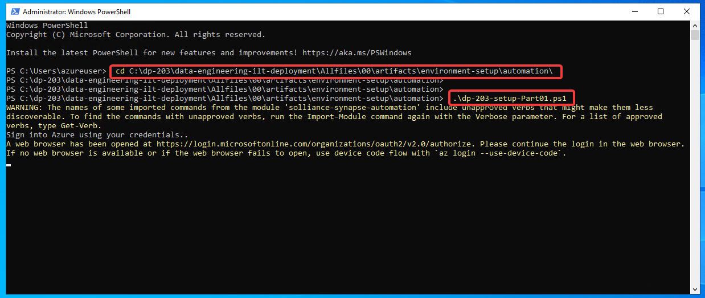
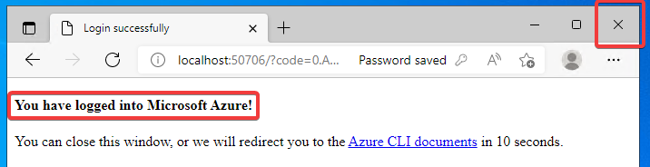

PowerShellを起動します。


以下のコマンドを投入し、GitHubから必要なファイルが取得します。

```
mkdir c:\dp-203

cd c:\dp-203

git clone https://github.com/microsoftlearning/dp-203-data-engineer.git data-engineering-ilt-deployment
```

ダウンロードされたスクリプトの `Allfiles/00/artifacts/environment-setup/automation/dp-203-setup-Part01.ps1` を開き、110行目を以下のように書き換えます。

```
$preferred_list = "eastus", "japaneast"
```


以下のコマンドを投入し、ローカルのPowerShellスクリプトを実行できるようにします。

```
Set-ExecutionPolicy Unrestricted
```


以下のコマンドを投入し、スクリプトを実行します。

```
cd C:\dp-203\data-engineering-ilt-deployment\Allfiles\00\artifacts\environment-setup\automation\

.\dp-203-setup-Part01.ps1
```



Webブラウザーが開き、サインインが求められます。トレーニング開始時に作成したMicrosoftアカウントのID（メールアドレス）を入力します。


パスワードを入力します。


サインインが完了します。このWebブラウザーは閉じてもかまいません。



しばらく待つと、以下のように、データベースのパスワードの入力が求められます。


表示に従い、適当なパスワードを決めます。


決めたパスワードを入力します。


`Try to create a SQL Database` ... という表示が出ます。そのまま、しばらく待ちます。5分程度かかります。


さらに、リソースの作成が進行します。そのまま、しばらく待ちます。10分程度かかります。


途中、`WARNING` が出る場合がありますが、これは無視してかまいません。


最後まで問題なくリソースの作成が完了すると以下のような表示になります。


# トラブルシューティング

もし、途中で上記以外のエラーが発生した場合は、Azure portalに移動し、`data-engineering-synapse-` で始まるリソースグループだけ を削除します。


リソースグループの削除には10分ほどかかります。画面上部「更新」を押して、一覧表示を更新して、状況を確認します。

リソースグループの削除が完了すると、`cloud-shell-...` と `NetworkWatcherRG` 以外の、スクリプトによって作成されたリソースグループが削除された状態となります。


以下のコマンドの投入して、再度、リソースの作成を行います。

```
cd C:\dp-203\data-engineering-ilt-deployment\Allfiles\00\artifacts\environment-setup\automation\

.\dp-203-setup-Part01.ps1
```


