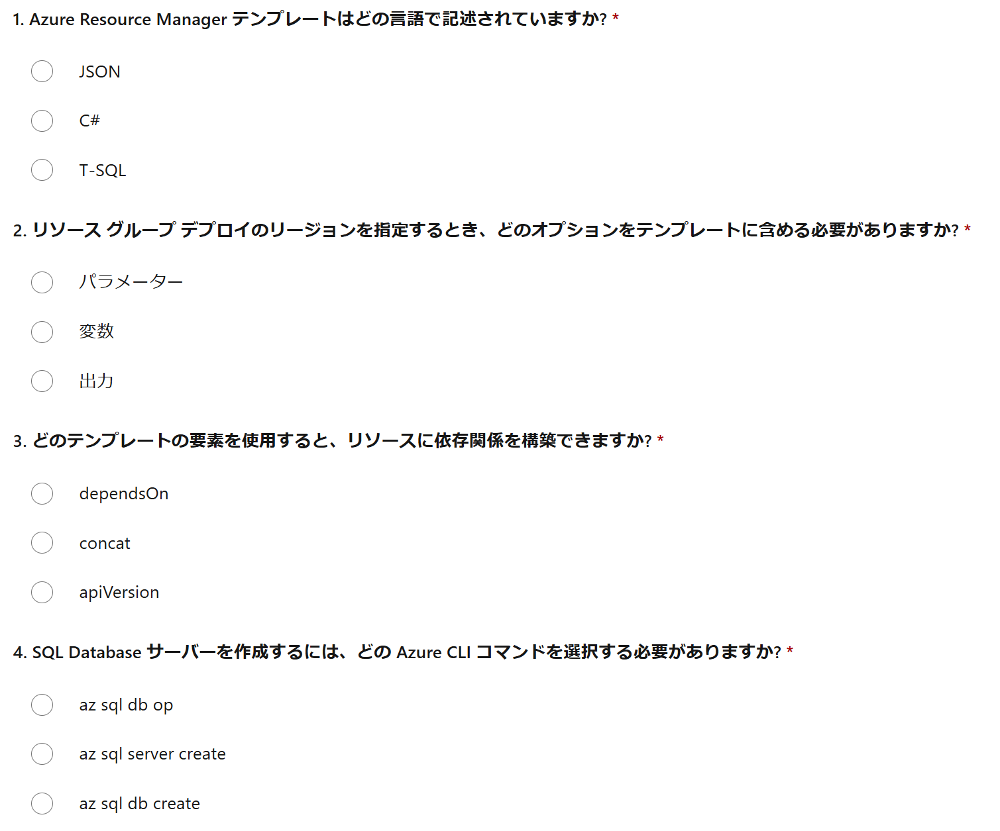
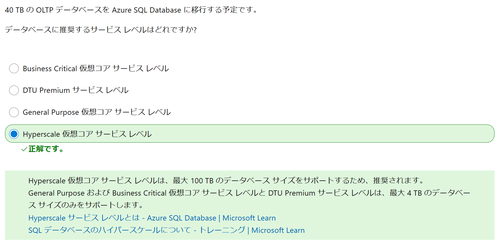

# DP-300 試験対策

DP-300の試験・資格と学習方法をご紹介。

■認定試験のメリットは？ 合格すると何が嬉しいの？

参考: [Microsoft認定試験のメリット](https://www.trainocate.co.jp/upload/flyer/flyer_108.pdf) / [認定プロセスの概要](https://learn.microsoft.com/ja-jp/certifications/certification-process-overview)

- エンジニアとしての信頼感が向上
- 査定・評価が向上
- 自信が持てる
- 転職にも有利

■「認定試験」と「認定資格」

「認定試験」に合格すると「認定資格」が得られる。

```
認定試験: DP-300: Microsoft Azure SQL ソリューションの管理

↓合格

認定資格: Microsoft Certified: Azure Database Administrator Associate
```

■「トレーニングジャーニー」を確認しよう！（無料、公式、英語）

「クラウドITプロフェッショナル向け」「データ&AIプロフェッショナル向け」「開発者向け」などの「トレーニングジャーニー」（学習の道のり）を確認できる。

「何をどの順で学べばよいか」を把握できる。

日本語版: https://aka.ms/ESIAzureTrainingJourney_JP


■Microsoft Learn ラーニングパス内の「知識チェック」を活用しよう！（無料）

試験の詳細ページ（ https://learn.microsoft.com/ja-jp/certifications/exams/DP-300 ）の下部に、「ラーニングパス」へのリンクがある。

各ラーニングパスには1つ～複数の「モジュール」が含まれている。

ほとんどのモジュールには「知識チェック」が含まれている。これを使用して、各モジュールで学んだ知識を確認できる。

```
ラーニングパス
└モジュール
  ├ユニット1
  ├ユニット2
  ├ユニット3
  ├...
  ├知識チェック
  └まとめ
```

正解・解説表示あり。

例:
https://learn.microsoft.com/ja-jp/training/modules/configure-automatic-deployment-azure-sql-database/7-knowledge-check?ns-enrollment-type=learningpath&ns-enrollment-id=learn.wwl.automate-tasks-sql-server


■「プラクティス評価」を活用して学習しよう！（無料）

https://learn.microsoft.com/ja-jp/certifications/practice-assessments-for-microsoft-certifications

主なAzure認定試験の模擬問題にチャレンジできる。正解・解説表示あり。英語だが、Webブラウザーの翻訳機能を使用して日本語化が可能。

DP-300 プラクティス評価:
https://learn.microsoft.com/ja-jp/credentials/certifications/azure-database-administrator-associate/practice/assessment?assessment-type=practice&assessmentId=58&practice-assessment-type=certification&source=docs



■Udemyのeラーニング教材を活用しよう（非公式、有料）

いろいろな団体や講師がDP-300の教材を作成している。

https://www.udemy.com/topic/microsoft-DP-300/

品質・価格はさまざま。利用者数、評価、内容のボリュームなどをよく確認して購入。

たまにセールを実施している場合がある。13,800円 → 2,000円 (86% OFF) など、かなり大幅な割引が行われる場合もある。


■「試験サンドボックス」で本番の画面構成に慣れておこう！（無料）

https://go.microsoft.com/fwlink/?linkid=2226877

認定試験を受ける前に、その外観と雰囲気を体験することができる。
試験中に使用するのと同じユーザー インターフェイスで、画面構成、画面遷移、出題パターン（多岐選択・穴埋め・並び替えなど）を確認できる。

■本番の試験に申し込もう！（有料、割引あり）

本トレーニング（ESI）の参加者の方は割引が利用できます。詳しくは以下資料の「認定資格試験の申し込み」をご覧ください。
https://aka.ms/lxp-userguide

新宿・銀座・秋葉原などの試験会場に出向いて受験する方法と、自宅などで場所を確保し、ノートPCを使用して受験する方法が選べる。

- 試験会場での受験:
  - メリット:
    - 機材や場所について準備する必要がない
      - 必要なものはすべて会場で準備される
      - マシントラブルの対処は会場でやってもらえる
    - 試験時間中、試験に集中できる
  - デメリット:
    - 試験会場への移動が必要（時間と交通費がもったいない）
    - 時期によっては予約が取りにくい場合がある
- 自宅での受験:
  - メリット:
    - 試験会場への移動が必要ない
      - 試験開始ギリギリまで学習できる
    - 予約が取りやすい
  - デメリット:
    - 機材（ノートPC）の準備が必要
    - マシントラブル発生時の対処は自分で行う必要がある
    - 受験する部屋の確保が必要
      - 試験中は他人が立ち入らないようにする必要がある

■合格したらアピールしよう！

- 履歴書・名刺などに記載
- LinkedInなどに「デジタルバッジ」を公開
  - やり方は合格時に送られてくるメールに記載
- ご所属の組織に報告
  - 組織の資格所有者数の増加に貢献

■認定資格を維持しよう！（無料）

https://learn.microsoft.com/ja-jp/credentials/certifications/renew-your-microsoft-certification

取得した「認定資格」には有効期限が設定されている。

有効期限が切れる6ヶ月前に、期限を「更新」を行うためのリンクがメールで送られてくるので、忘れずに更新しましょう。

更新の際、簡単なWeb試験（無料）に合格する必要がある。もし不合格でも何度もチャレンジできる。

Web試験に合格すると、有効期限日から 1 年、認定資格が延長される。