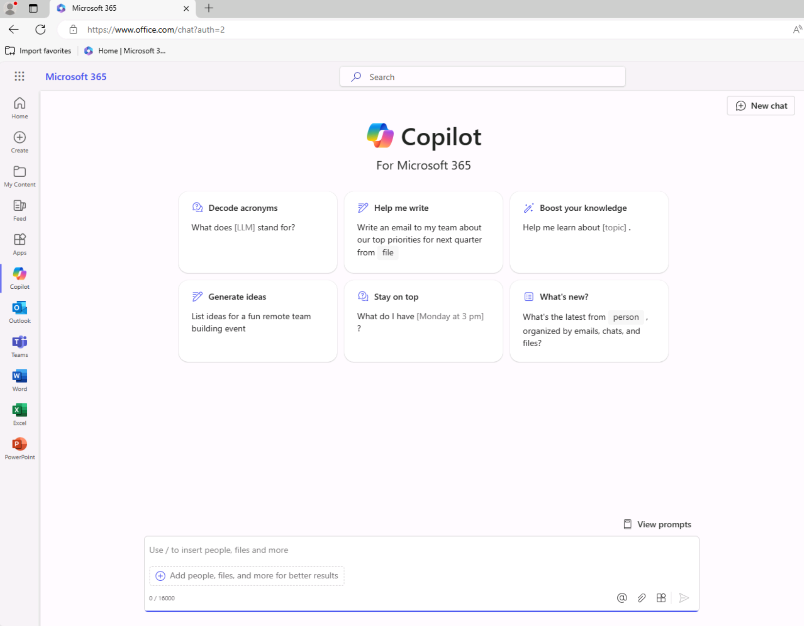
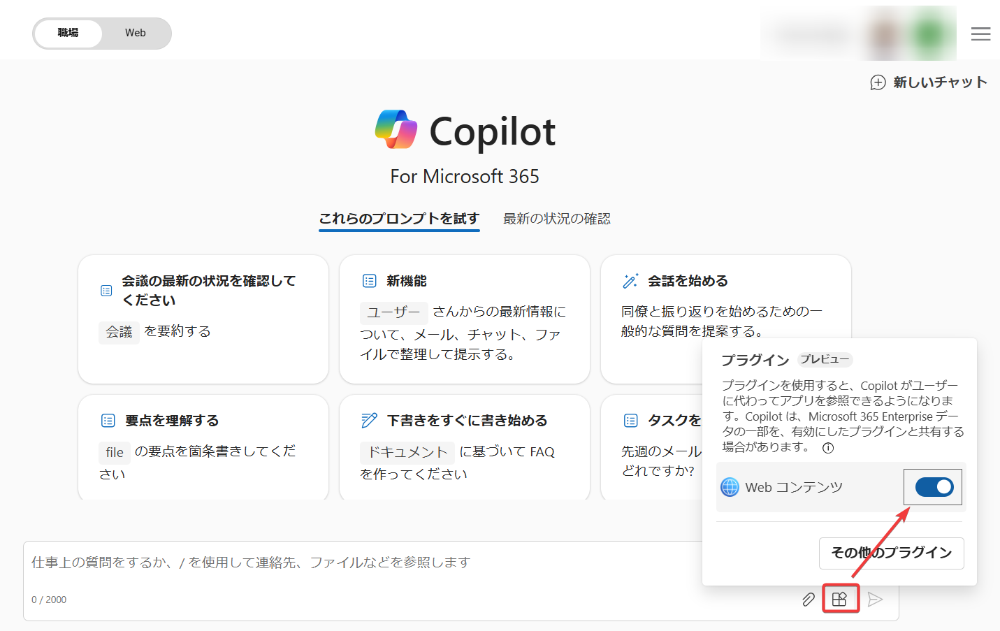

# Copilot for Microsoft 365 の概要

https://learn.microsoft.com/ja-jp/training/modules/introduction-microsoft-365-copilot/

## Copilot for Microsoft 365 とは？

Copilot for Microsoft 365 （コパイロット: 副操縦士）は、Word、Excel、PowerPoint、Teams、OutlookなどのMicrosoft 365アプリに統合されたAIアシスタント。ユーザーのさまざまな作業を支援する。ユーザーは、チャット形式でコパイロットに指示を出すことができる。

具体的には、以下のような作業を実行できる。

|概要|コパイロットで実行できること|ユーザーのメリット|
|-|-|-|
|要約|コパイロットに、Wordドキュメント、PowerPointスライド、Outlookメールなどの要約を生成させることができる。|ドキュメントの概要をすばやく把握できる。|
|コンテンツ生成|コパイロットに、Wordドキュメントの下書きや、PowerPointスライド、挿絵などを生成させることができる。|ドキュメントをすばやく作成できる。|
|コンテンツの編集|コパイロットに、Wordドキュメントの文章、Outlookメールの文章などを書き直させることができる。|文章をすばやく改善できる。|
|分析|コパイロットに、Excelの表データを分析させて、重要なデータに書式を設定させることができる。|データの重要な特徴をすばやく理解できる。|
|質問|コパイロットに、Teamsやメールの連絡、組織内で最近作成・更新されたファイルなどについて質問し、回答させることができる。|受信したメールやTeamsメッセージ、組織内のファイルなどから、知りたい情報をすばやく引き出すことができる。|

※WordやExcelなどのアプリに組み込まれたコパイロットの他に、`https://www.office.com/chat/` などからアクセスできるチャット形式のインターフェースもあり、これも「Copilot for Microsoft 365」と呼ばれる。（正式名称: 「[Microsoft Copilot with Graph-grounded chat](https://learn.microsoft.com/en-us/copilot/microsoft-365/microsoft-365-copilot-overview#how-does-microsoft-copilot-for-microsoft-365-work)」）

※本コースでは解説しないが、Microsoft Loop、Microsoft OneNote、Microsoft Whiteboard、Microsoft Formsでもコパイロットが使用できる。https://learn.microsoft.com/ja-jp/copilot/microsoft-365/microsoft-365-copilot-overview#copilot-integration-with-graph-and-microsoft-365-apps

## プロンプトとは？

ユーザーがコパイロットに与える指示の文。日本語や英語などの自然言語で指示を与えることができるため、コンピューターの操作に詳しくない一般のユーザーでもプロンプトは簡単に作成できる。

## （企業ユーザー向け）Copilot for Microsoft 365 を利用するためのライセンスは？

企業ユーザーが、「Copilot for Microsoft 365」を使用したい場合、「Microsoft 365のライセンス」に加え、 「Copilot for Microsoft 365 のライセンス」が必要。

ユーザー/月 または ユーザー/年 でライセンス料金が必要。

参考: 2024年7月現在、$30 ユーザー/月 または $360 ユーザー/年。最新の価格や利用できる機能などについては公式ページを参照。

「Copilot for Microsoft 365」公式ページ:
https://www.microsoft.com/ja-jp/microsoft-365/business/copilot-for-microsoft-365

「Copilot for Microsoft 365」ライセンスの割り当て:
https://learn.microsoft.com/ja-jp/copilot/microsoft-365/microsoft-365-copilot-enable-users

「Copilot for Microsoft 365」を使用するために必要なMicrosoft 365のライセンス:
https://learn.microsoft.com/ja-jp/copilot/microsoft-365/microsoft-365-copilot-setup#before-you-begin

## （個人ユーザー向け）Word/Excel/PowerPoint等でコパイロットを使うためのライセンスは？

個人ユーザーが、Word/Excel/PowerPoint等のMicrosoft 365アプリでコパイロットを使用したい場合は、「Microsoft Copilot Proサブスクリプション」の契約が必要。なお、Microsoft 365アプリ自体は無料版でもよい。

参考: 2024年7月現在、$20 ユーザー/月。最新の価格や利用できる機能などについては公式ページを参照。

公式ページ: 
https://www.microsoft.com/ja-jp/store/b/copilotpro

##  Copilot for Microsoft 365 はどのような仕組みで動いているのか？

https://learn.microsoft.com/ja-jp/training/modules/introduction-microsoft-365-copilot/4-explore-core-components-copilot

コパイロットは以下のようなコンポーネントの組み合わせによって実現されている。

- 大規模言語モデル（Large Language Model, LLM）: GPT-3.5 や GPT-4 などのモデルを使用して回答やコンテンツを生成。
- 自然言語処理（Natural Language Processing, NLP）: プロンプト（日本語や英語などによる命令や指示）を理解・解釈する技術。
- Microsoft Graph: Word、Excel、PowerPoint、Outlook、Teamsなどのデータや機能にアクセスするためのAPI。
- Microsoft 365 アプリ: Word、Excel、PowerPoint、Outlook、Teamsなどのアプリ。それぞれのアプリに、そのアプリ向けに最適化されたコパイロットが組み込まれている。Web版のアプリ、デスクトップ版のアプリ、どちらでも、コパイロットが使用できる。

## 「責任あるAI（Responsive AI）」とは？

利用者が安心・信頼してAI技術を活用できるように、マイクロソフト は、倫理と責任を重視して、コパイロットを含む AI技術 を開発・運用している。

具体的には、公正性、信頼性、安全性、プライバシーの保護などを目標としている。

この、マイクロソフトのAIの開発・運用の方針のことを「責任あるAI（Responsive AI）」と呼んでいる。

詳しくは以下のページを参照。
https://learn.microsoft.com/ja-jp/training/modules/introduction-microsoft-365-copilot/5-examine-microsoft-responsible-ai

## モバイルデバイスからのコパイロットの利用

iOS/Android用の「Microsoft Copilot for Mobile」アプリを使用すると、スマホやタブレットなどのモバイル端末上のアプリから「Copilot for Microsoft 365」を使用できる。

https://support.microsoft.com/ja-jp/topic/microsoft-copilot-for-mobile-%E3%82%92%E4%BD%BF%E7%94%A8%E3%81%97%E3%81%A6%E3%83%93%E3%82%B8%E3%83%8D%E3%82%B9%E3%81%AE%E7%94%9F%E7%94%A3%E6%80%A7%E3%82%92%E5%90%91%E4%B8%8A%E3%81%95%E3%81%9B%E3%82%8B-24bd7d62-f3c7-47d8-8cce-ee78edc018d4

また、iOS/Android用のEdge、Teamsアプリを利用して、そこから「Copilot for Microsoft 365」を使用することもできる。

## コパイロットについての補足

- コパイロットが生成したコンテンツは不正確である場合があるため、ユーザーが注意して結果を利用する必要がある。
- アプリの操作をコパイロットで完全に自動化することはできない。コパイロットはあくまで、人間の指示を受けて、作業を補助するものという位置づけ。一部のアプリの操作をユーザーに代わって手伝うことはできるが、アプリ全体を完全に制御したり、アプリの操作を完全に自動化したりする仕組みではない。VBAマクロ、プログラミング言語、あるいはRPAのような自動化のためのしくみではない。
- コパイロットに対するAPIは存在しないため、外部のコードやシステムからコパイロットへプロンプトを投入する、コパイロットの回答を外部のコードやシステムで受信する、といった操作を行うことはできない。
- アプリのコパイロットごとに実行できる作業は異なる。たとえばWordのコパイロットとExcelのコパイロットでは、できることは異なる。Wordのコパイロットは文章の下書きの生成、文章の書き直しなどを実行できる。Excelのコパイロットは、表データの分析やグラフ化、数式の入力などを実行できる。言い換えれば、各アプリのコパイロットはそれぞれのアプリごとに最適化されている。
- 「Webコンテンツ」プラグインを有効化することで、Bing検索エンジンを使用したWeb検索を使用した回答を行うことが可能。つまり、Web上のデータに基づく回答が可能。 [詳細については公式ページを参照。](https://learn.microsoft.com/ja-jp/copilot/microsoft-365/manage-public-web-access)

## Azure OpenAI Serviceとの関連

Copilot for Microsoft 365は、内部的には、Azure OpenAI Serviceを使用している。ただし、Copilot for Microsoft 365の利用者や組織が、Azure OpenAI ServiceのリソースやAzureサブスクリプションを準備・運用する必要はない。

利用者のMicrosoft 365 データが Azure OpenAI Service によって収集または保存されることはなく、LLM（大規模言語モデル）のトレーニングに使用されることもない。

https://learn.microsoft.com/ja-jp/copilot/microsoft-365/microsoft-365-copilot-privacy#how-does-microsoft-copilot-for-microsoft-365-use-your-proprietary-organizational-data

