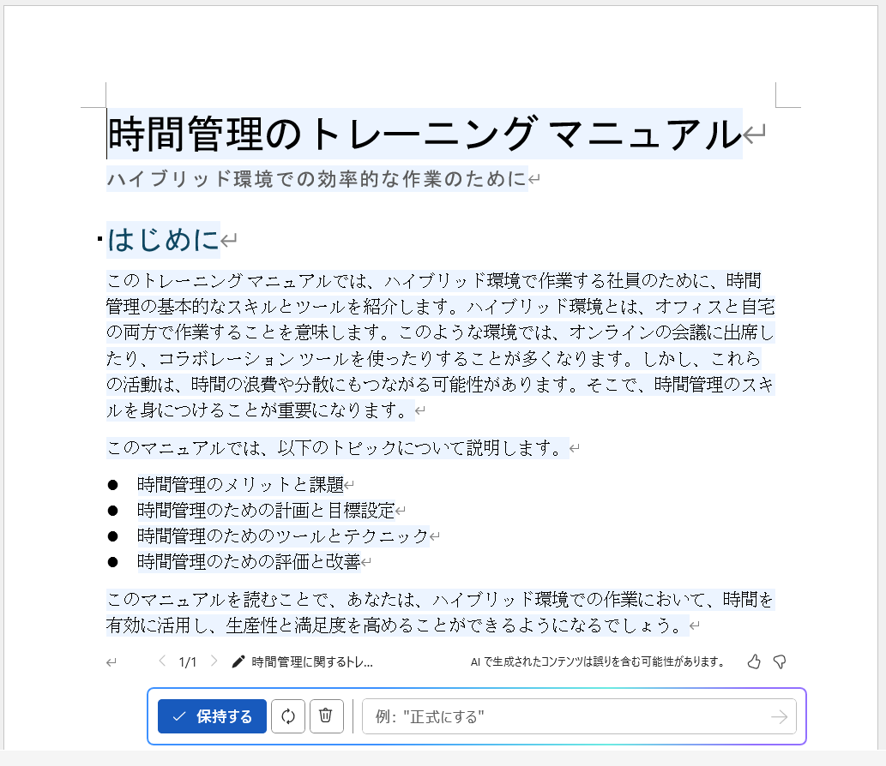

# Copilot for Microsoft 365 を最適化し、拡張する

https://learn.microsoft.com/ja-jp/training/modules/optimize-and-extend-microsoft-365-copilot/

## AI（コパイロット）を活用した働き方 - なぜAI（コパイロット）が必要なのか？

https://learn.microsoft.com/ja-jp/training/modules/optimize-and-extend-microsoft-365-copilot/2-examine-working-with-ai

※原題「Examine **the art and science** of working with AI」: 「AIを活用した働き方の **理論と実践** を確認する」

1. AIと仕事の関係: AIは人間の仕事を支援し、能力を高めるパートナーのような存在である。Microsoft Copilot for Microsoft 365は、日常業務を効率化する、仕事のパートナーである。

2. なぜAIが必要か: 現代の仕事量と速度は増加している。例えば、多くの人が一日に250以上のメールを受け取り、18回も検索を行っている。AIはこれを手助けし、重要な仕事に集中できるようにする。

3. 新しい仕事の習慣: AIを仕事で活用するやり方を学ぶ必要がある。AIは、会議中の未解決の質問を見つけたり、プレゼンのタイトルを考える手助けをすることができる。

4. AIの「間違い」も役立つ: AIは必ずしも完璧ではないが、その「間違い」も人間の創造力を刺激することができる。AIに何かを提案してもらい、それを基に、人間は自分のアイデアを発展させることができる。

5. 仕事の重荷を軽減: AIは人間の仕事を単に簡単にするだけでなく、より充実したものにしてくれる。例えば、AIが会議の内容を整理したり、メールを効率よく処理したりすることで、人間はより重要な仕事に集中できる。

6. AIと人間の関係: AIは様々な形で人間をサポートする。短期的な「ブースト」を与えるステロイドのような役割から、長期的な能力向上を助けるコーチのような役割まで、AIの利用方法は多岐にわたる。

## Copilot for Microsoft 365 のベストプラクティス

https://learn.microsoft.com/ja-jp/training/modules/optimize-and-extend-microsoft-365-copilot/3-best-practices-copilot

1. 明確で簡潔な指示を出す: Copilotの性能を最大限に引き出すためには、明確で具体的な指示を出すことが重要である。例えば、「新しいContoso 3Dプリンターについてのメールを作成して」という曖昧な指示よりも、「来週発売の新しいContoso 3Dプリンターの特徴の詳しい説明と、製品ページへのリンクを含めたメールを作成して」といった具体的な指示の方が、より正確な結果が得られる。

2. 結果を検証する: Copilotは有益な提案を行うことを目指しているが、その出力結果を必ず確認し、自分の意図に合っているかを検証することが必要である。人間の目でチェックすることで、品質が保証される。

3. 定期的にフィードバックを提供する: Copilotの性能向上のために、ユーザーからのフィードバックが重要である。期待通りの結果が得られなかった場合は、Microsoftにフィードバックを提供することで、Copilotの精度と性能が向上する。

4. 過度に依存しない: Copilotはあくまで補助ツールであり、完全に依存するのは避けるべきである。自分の判断や専門知識を補完する形で利用することで、バランスの取れた最適な結果が得られる。

5. 創造性を引き出す: Copilotはルーチン作業だけでなく、創造的なアイデアの出発点としても活用できる。様々な指示を試すことで、新しい視点やインスピレーションを得ることができる。

6. プライバシーとセキュリティを優先する: Copilotは高いセキュリティに基づき設計されているが、不必要に機密情報や関係者外秘のデータを入力しないようにする。

7. 最新情報を常に把握する: Copilotは継続的に進化しているため、定期的なアップデートや新機能の導入に注意を払うことが重要である。新しい機能を活用し、ワークフローを最適化することで、最大限の効果を引き出すことができる。

## 効果的なプロンプト（目標、コンテキスト、期待、ソース）

以下の4つの情報をプロンプトに含めるとよい。

- 目標: Copilotにしてほしいことを記述する。
- コンテキスト: ユーザーが何をしようとしているのかを記述する。
- 期待: Copilotが出力する文章の調子などを指定する。「カジュアルに」「フォーマルに」「親しみやすい感じで」など
- ソース: Copilotが回答を生成するために使用してほしいデータを指定する。

実際の例
- 目標: 時間管理に関するトレーニング マニュアルの草案を作成してください。
- コンテキスト: 対象読者には、ハイブリッド環境で作業し、オンラインの会議に出席する社員です。
- 期待: 文書のトーンは、親しみやすく、示唆に富んだものにする必要があります。
- ソース: 情報源として OneDrive上の Time Management of Costoto.docx を参照してください。

実際には以下のようにプロンプトを書く（目標、コンテキスト、期待、ソースといった言葉はプロンプト内に書かなくてもよい）。

```
時間管理に関するトレーニング マニュアルの草案を作成してください。対象読者には、ハイブリッド環境で作業し、オンラインの会議に出席する社員です。文書のトーンは、親しみやすく、示唆に富んだものにする必要があります。情報源として OneDrive上の Time Management of Costoto.docx を参照してください。
```

上記のプロンプトに対する実際のコパイロットの出力の例（Word）



## プロンプトのベストプラクティス

https://learn.microsoft.com/en-us/training/modules/optimize-and-extend-microsoft-365-copilot/5-review-prompting-best-practices

※抜粋

1. 異なるスタイルを試す: 例えば、出力のトーン（中立的、カジュアル、プロフェッショナル）を指定したり、専門家ではない一般人にも理解できるようなわかりやすい表現を使うように指示する。

2. 曖昧さ、過度な複雑を避ける: これらはCopilot の回答の質を低下させる可能性がある。

3. Copilot の限界を理解する: 複雑なタスクは分解し、何段階かに分けて指示を出す。

4. 繰り返し試す: 初回のプロンプトで満足のいく回答が得られなくても、プロンプトを修正して再試行することで、より良い回答が得られる場合がある。

## 参考: プラグイン

https://blogs.windows.com/japan/2023/05/26/microsoft-365-copilot-plug-in-boosts-all-developers/

コパイロットにプラグインを追加することで、外部サービスとの連携が可能となる。

[Microsoft 365 Copilotの早期アクセスプログラム](https://aka.ms/plugins-dev-waitlist) に参加すると、Atlassian、Adobe、ServiceNow、Thomson Reuters、Moveworks、Muralなどのパートナー企業製プラグイン50種類以上にアクセスできるようになる。

さらに、Teamsのメッセージ拡張機能やPower PlatformコネクタとMicrosoft 365 Copilotの連携も進めており、今後数か月で多くの基幹業務プラグインやサードパーティ製プラグインが追加される予定である。

## 参考: Graphコネクタ

https://learn.microsoft.com/ja-jp/graph/connecting-external-content-connectors-overview

Microsoft Graphは、Microsoft 365などのデータや機能にアクセスするためのAPIである。コパイロットは内部的にGraph APIを使用している。

```
Microsoft 365 Copilot
↓↑
Microsoft Graph API
↓↑
Microsoft 365
```

Microsoft Graphを拡張する「Graphコネクタ」を使用することで、外部サービスから Microsoft Graph にデータを取り込むことができる。取り込んだデータはMicrosoft 365 Copilotなどで使用できる。

```
Microsoft 365 Copilot
↓↑
Microsoft Graph API
↓↑              ↓↑
Microsoft 365   Graphコネクタ
                ↓↑
                外部サービス（サードパーティのアプリ）
```
