# Microsoft Copilot for Microsoft Word

## Word で Copilot を使用してドキュメントを作成および集計する

https://learn.microsoft.com/ja-jp/training/modules/explore-possibilities-microsoft-365-copilot/2-compose-summarize-documents-copilot

### 下書き

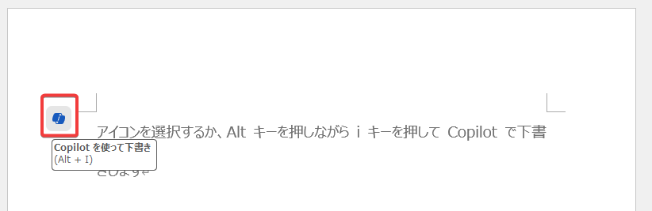

- 「Copilotを使って下書き」（Draft with copilot）をクリック。

---

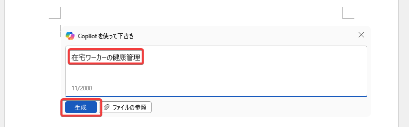

- 下書き（生成する文章）の概要を入力。
- オプションの「ファイルの参照」で、生成時に参照されるファイルを3つまで選択可能。

---
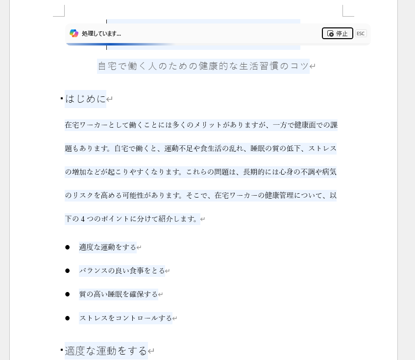

- 文章が生成される。

---
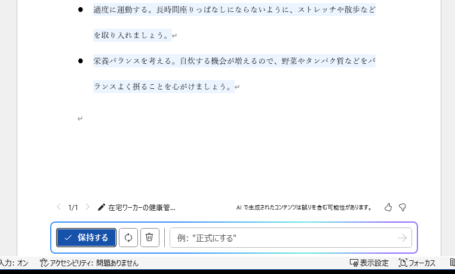

- 文章の生成が終わると、画面下部に、生成された文章に対する指示を行うウィンドウが表示される。
- 生成された文章でOKであれば「保持する」をクリック。文章が確定される。
- 同じプロンプトでもう一度文章を生成する場合は「再生成」ボタンをクリック。同じプロンプトでも毎回異なる文章が生成される。
- プロンプトを修正したい場合は「鉛筆マーク」をクリックし、プロンプトを修正。文章が再生成される。
- 生成された文章について修正を指示したい場合は「例:」のテキストボックスに修正の指示を入力。指示に基づいて文章が修正される。

## Word の Copilot を使用して重要な情報を簡素化して抽出する

https://learn.microsoft.com/ja-jp/training/modules/summarize-simplify-information-with-microsoft-copilot-microsoft-365/2-simplify-extract-key-information-copilot-word

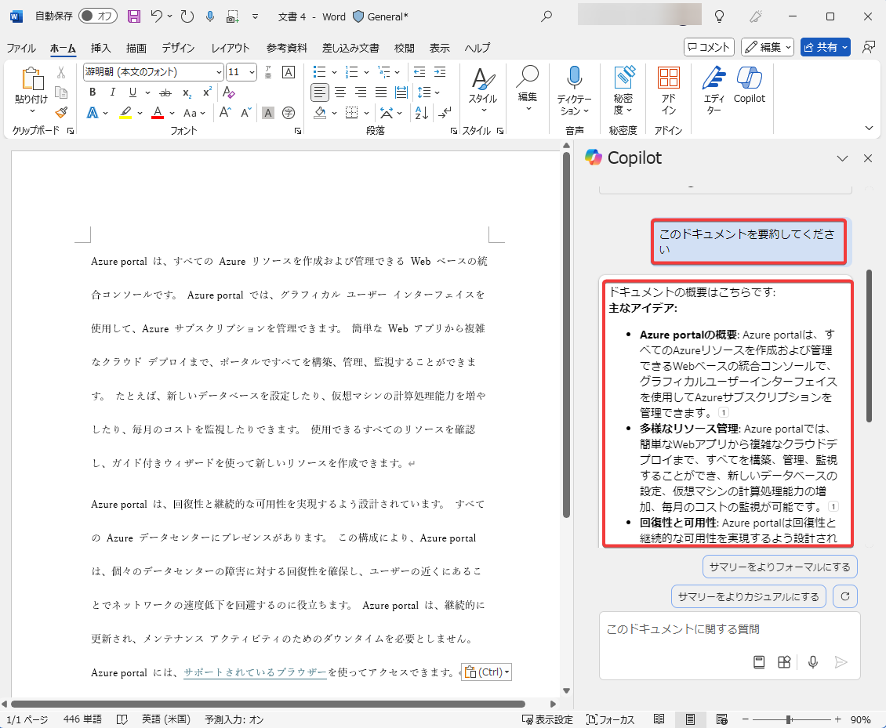

- 画面右上の「Copilot」ボタンをクリック。画面右側に「Copilot」ペインが表示される。
- 「このドキュメントを要約してください」と入力
- 要約が生成される。

## Word の Microsoft Copilot を使用してカバー レター、マーケティング プラン、概要の下書きを作成する

https://learn.microsoft.com/ja-jp/training/modules/create-draft-content-with-microsoft-copilot-microsoft-365/2-draft-content-microsoft-copilot-word

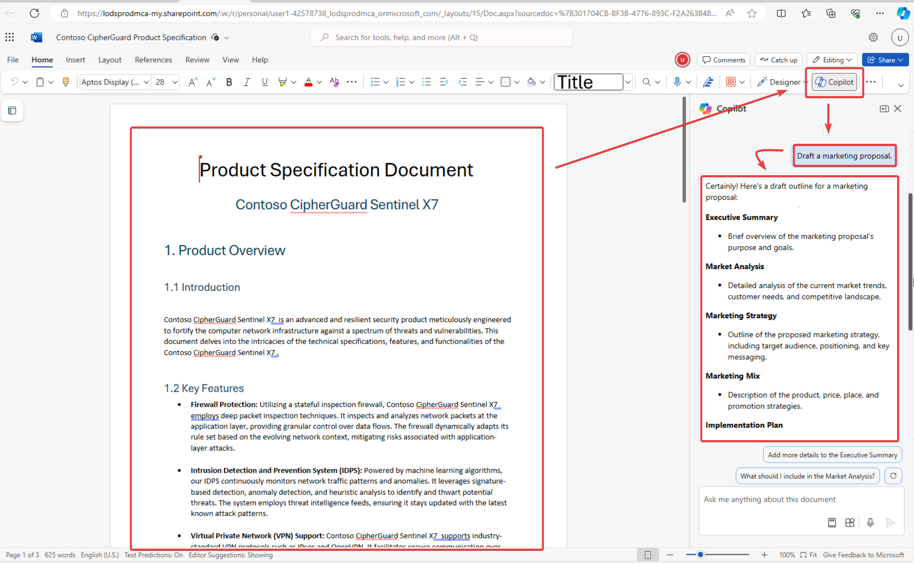
- Wordドキュメントを開く
- 画面右上の「Copilot」ボタンをクリック。画面右側に「Copilot」ペインが表示される。
- 「マーケティングプランを生成する」といったプロンプトを入力して送信する。
- 「Copilot」ペイン内に下書きが生成される。これをコピーして本文に貼り付けることができる。

---

### よいプロンプトのポイント

目標、コンテキスト、ソース、期待の4つを含める。

- 目標:
  - マーケティングプランの下書きを作成します。
- コンテキスト:
  - このプランは～～という製品のキャンペーンで使用するものです。
- ソース:
  - 情報源として「～～（ファイル）」を使用してください。
- 期待:
  - ページ数の指定
  - 調子の指定（「説得力がある言葉を使って」「フォーマルに」など）

例:

Contoso の最新製品: CipherGuard のマーケティングプランの下書きを作成します。 「製品の仕様と要件.docx」を使用して、マーケティング キャンペーンの 3 つのアイデアを生成する必要があります。 製品の簡単な概要、各アイデアの長所と短所、ROI 予測を含めてください。 ドキュメントは 2 ページ以内にし、ポジティブで説得力のある言葉を使用してください。

## Word で Microsoft Copilot を使用してコンテンツを書き込み、整理、変換する

https://learn.microsoft.com/ja-jp/training/modules/edit-transform-content-with-microsoft-copilot-microsoft-365/2-write-organize-transform-content-copilot-word

### トーンの書き換え

選択部分をCopilotに書き直させることができる。

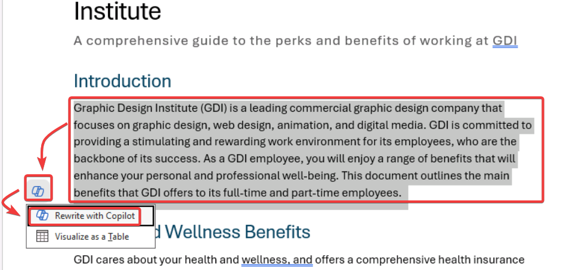

- 書き換えしたい部分を選択
- Copilotアイコンをクリック
- 書き換え (Rewrite with Copilot) を選択

---
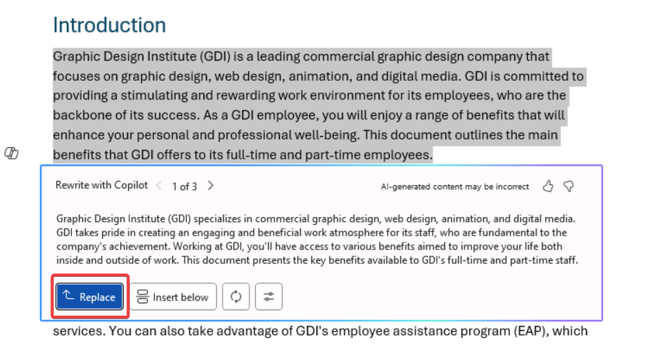

- 書き換え案が生成される
- 置き換える（Replace）をクリックして置換

---

### 表にする

選択部分を表に変換することができる。

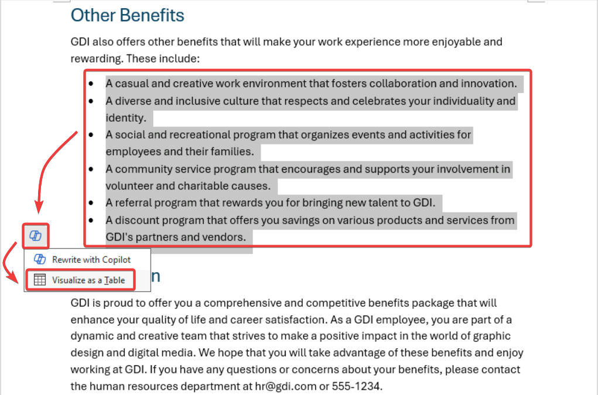

- 表にしたい部分を選択
- Copilotアイコンをクリック
- 表として視覚化 (Visualize as a Table)を選択

## Word で Microsoft Copilot にヘルプと推奨事項を確認する

https://learn.microsoft.com/ja-jp/training/modules/ask-analyze-content-with-microsoft-copilot-microsoft-365/2-ask-copilot-recommendations-help-word

### ドキュメントについて質問する

開いているドキュメントについて質問ができる。

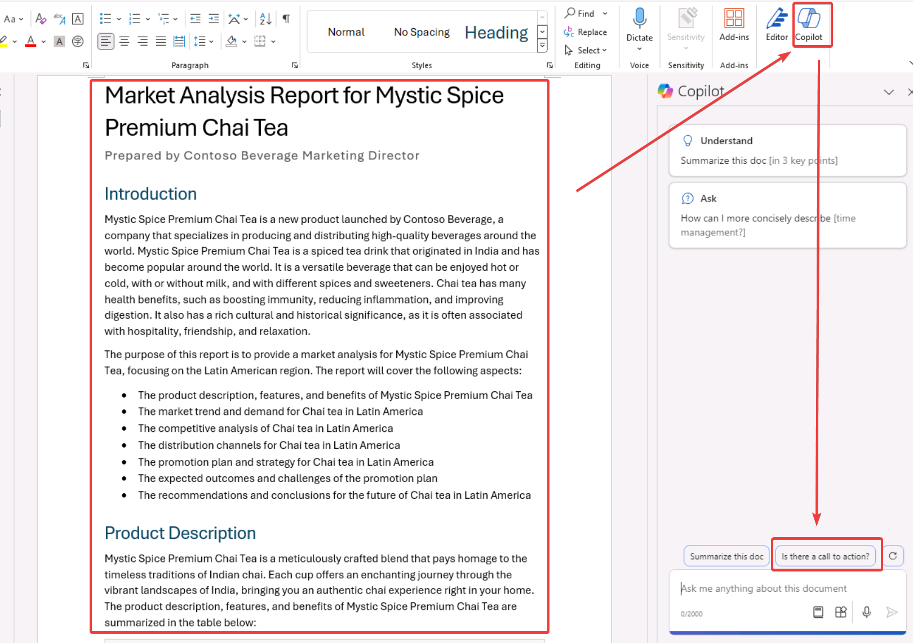

- ドキュメントを開く
- Copilotペインを開く
- 「行動を促すフレーズはありますか？」(Is there a call to action?)をクリック

---

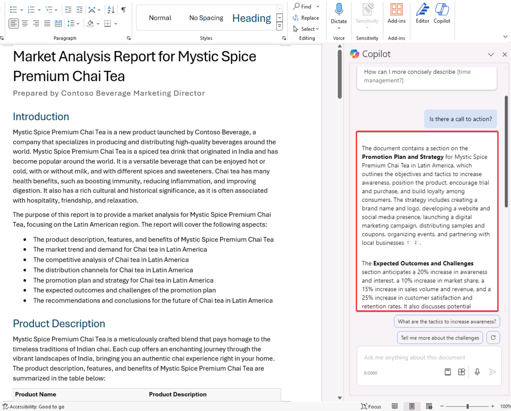

- 結果（次に実行すべきアクションのリスト）が表示される

---

### 自由回答形式の質問をする

開いているドキュメントとは特に関係のない質問などを入力することもできる。

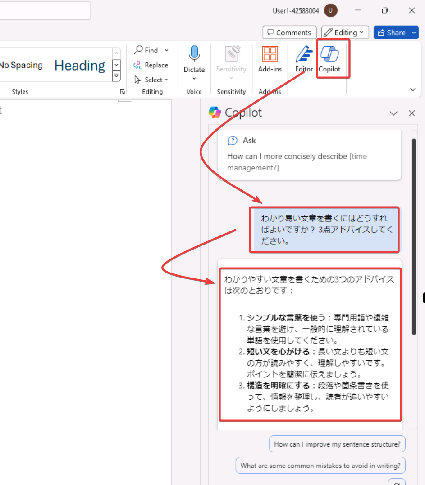

- Copilotボタンをクリック。
- 質問を入力。
- 質問に対する回答が生成される。
