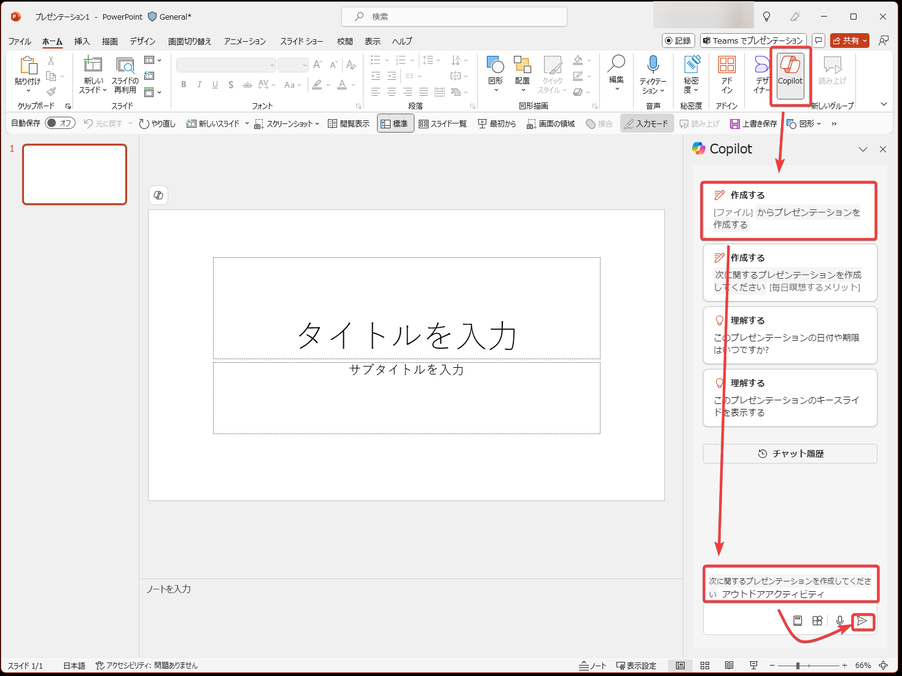
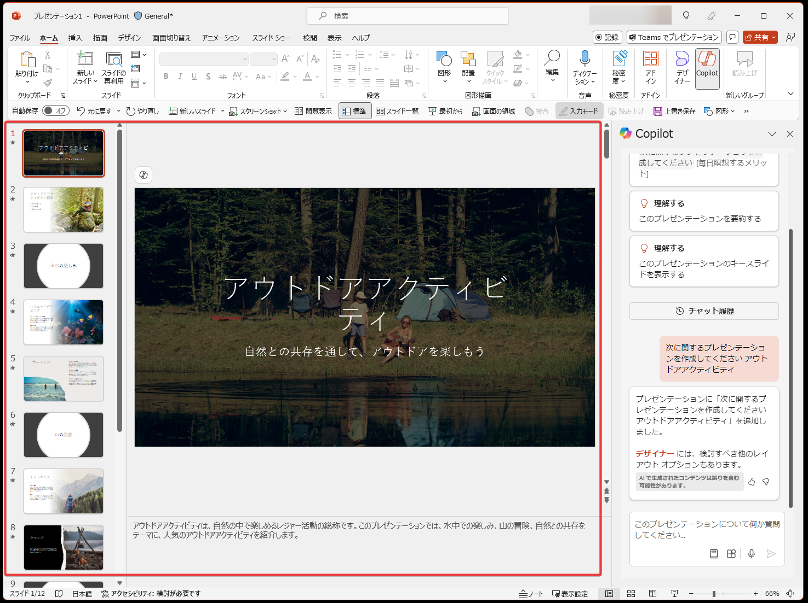
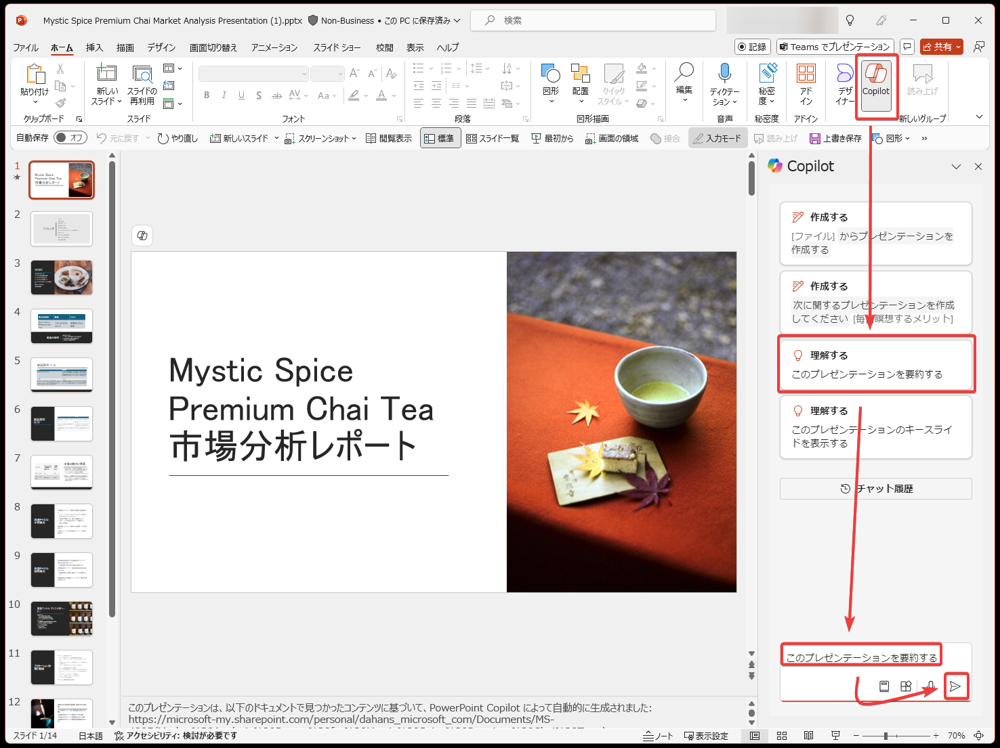
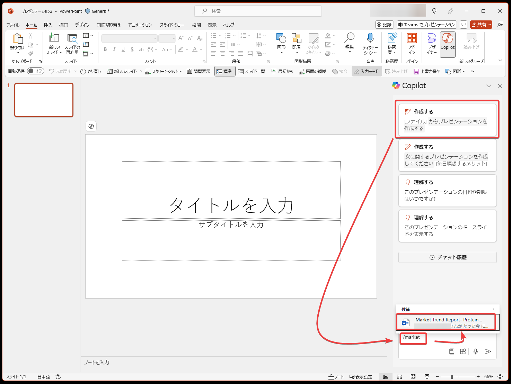
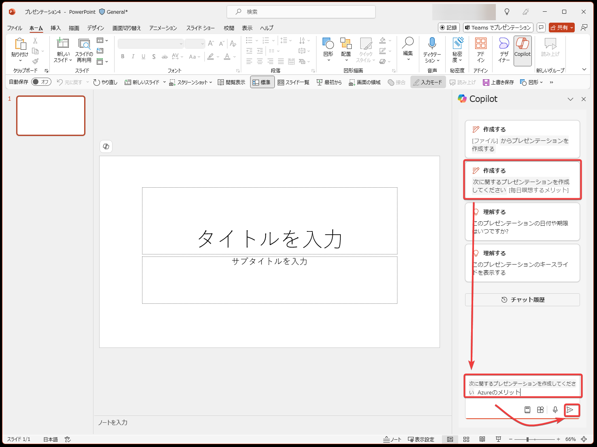
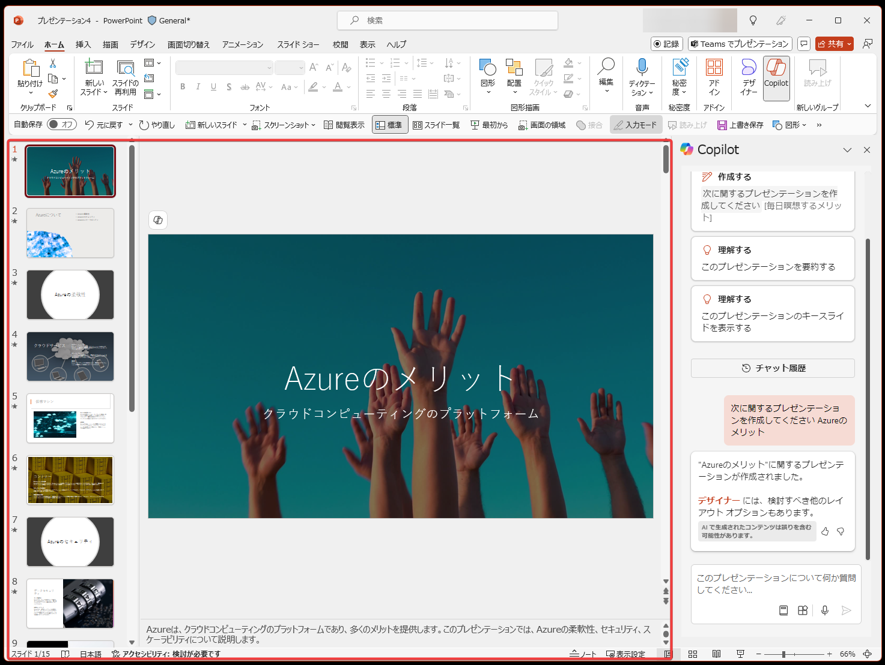
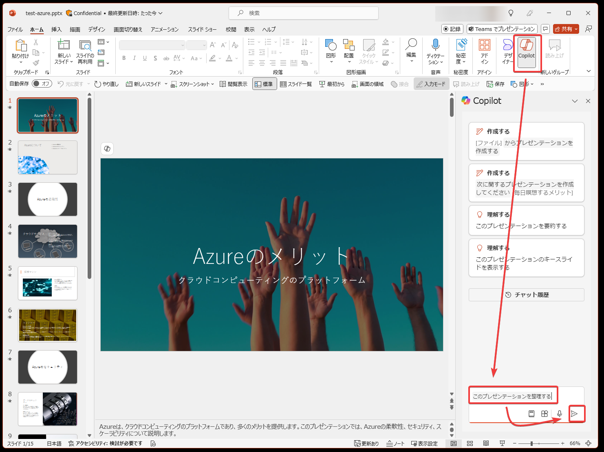

# Microsoft Copilot for Microsoft PowerPoint

## PowerPoint で Copilot を使用して魅力的なプレゼンテーションをデザインする

https://learn.microsoft.com/ja-jp/training/modules/explore-possibilities-microsoft-365-copilot/4-design-presentations-copilot

## PowerPoint の Copilot を使用して重要な情報を特定し、要約する

https://learn.microsoft.com/ja-jp/training/modules/summarize-simplify-information-with-microsoft-copilot-microsoft-365/3-identify-key-information-summarize-powerpoint

よいプロンプトのポイント: 目標、コンテキスト、ソース、期待の4つを含める。

- 目標:
  - この PowerPoint プレゼンテーションを要約します。
- コンテキスト:
  - この要約はマネージャーに提出します。
  - クライアントと会議する前の主なポイントの概要を含めます。
- ソース:
  - 情報源として「このプレゼンテーションのスライド5からスライド10まで」を使用してください。
- 期待:
  - 使用なポイントを箇条書きにします。
  - プロフェッショナルな口調にしてください。

例:

この PowerPoint プレゼンテーションのスライド 5 から 10 を上司用に要約し、クライアントと会議する前の主要なポイントの概要を説明します。 主要なポイントを箇条書きに書式設定し、プロフェッショナルな口調にしてください。

## PowerPoint の Microsoft Copilot を使用して新しいスライド、議題、To Do リストを作成する

https://learn.microsoft.com/ja-jp/training/modules/create-draft-content-with-microsoft-copilot-microsoft-365/3-build-new-slides-agendas-to-do-lists-microsoft-copilot-powerpoint

### WordからPowerPointプレゼンテーションを作成する

## PowerPoint で Microsoft Copilot を使用して、画像やスライドを追加し、プレゼンテーションを整理する

https://learn.microsoft.com/ja-jp/training/modules/edit-transform-content-with-microsoft-copilot-microsoft-365/3-add-images-slides-organize-presentation-copilot-powerpoint

## PowerPoint で Microsoft Copilot を使用して、設計と組織のヒントを取得する

https://learn.microsoft.com/ja-jp/training/modules/ask-analyze-content-with-microsoft-copilot-microsoft-365/3-get-design-tips-microsoft-copilot-powerpoint

