# Microsoft Copilot for Microsoft Excel

## 準備: 自動保存を有効にする

Excelでコパイロットを使用するには、「自動保存」を有効にする必要がある。
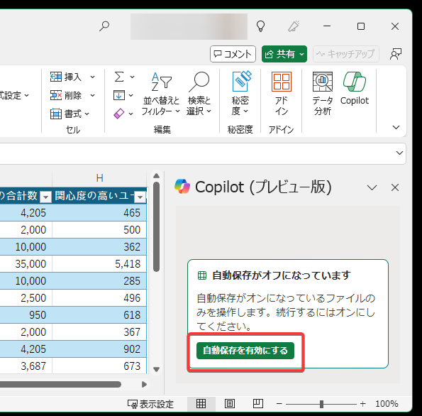

「自動保存を有効にする」をクリックし、保存先のOneDriveを選択する。

## 準備: テーブルを作成する

Excelでコパイロットを使用するには、データを「テーブル」に変換する必要がある。

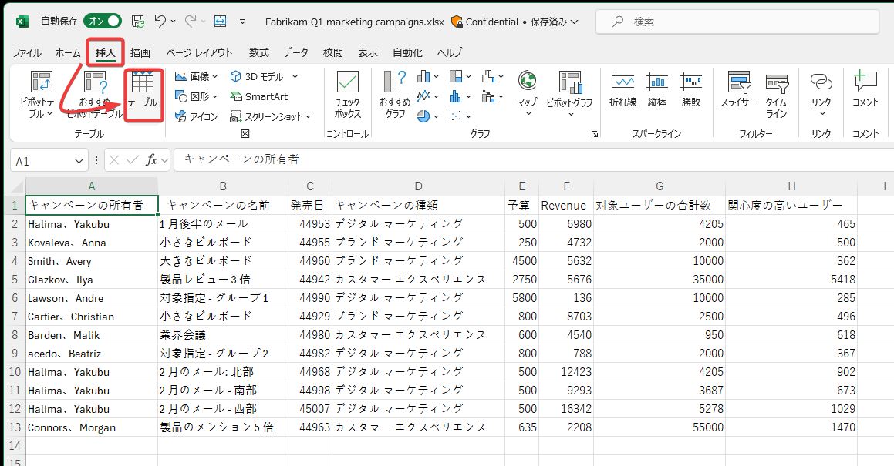

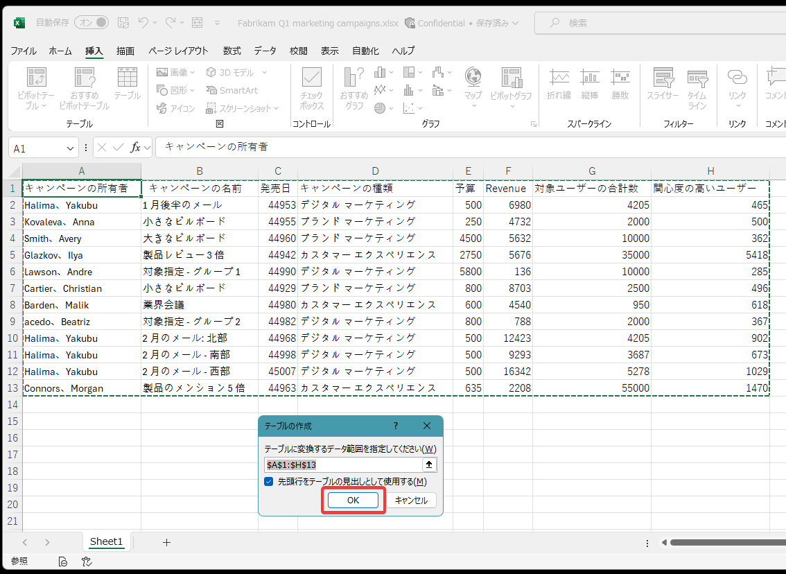

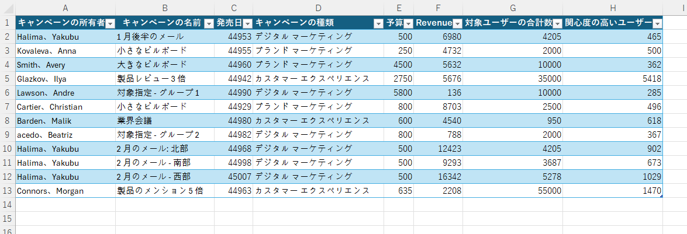

## Excel の Copilot を使用してデータを分析および変換する

https://learn.microsoft.com/ja-jp/training/modules/explore-possibilities-microsoft-365-copilot/5-analyze-transform-data-copilot

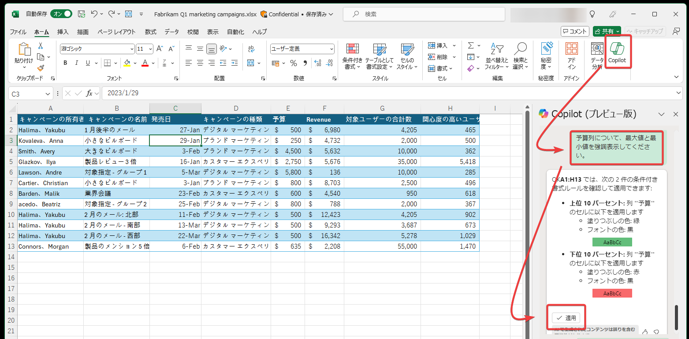

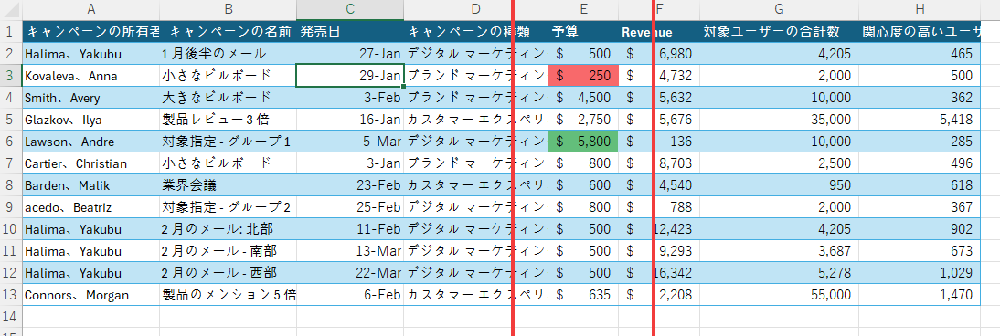

## Excel の Copilot で傾向を特定し、データを視覚化する

https://learn.microsoft.com/ja-jp/training/modules/summarize-simplify-information-with-microsoft-copilot-microsoft-365/4-spot-trends-visualize-data-copilot-excel

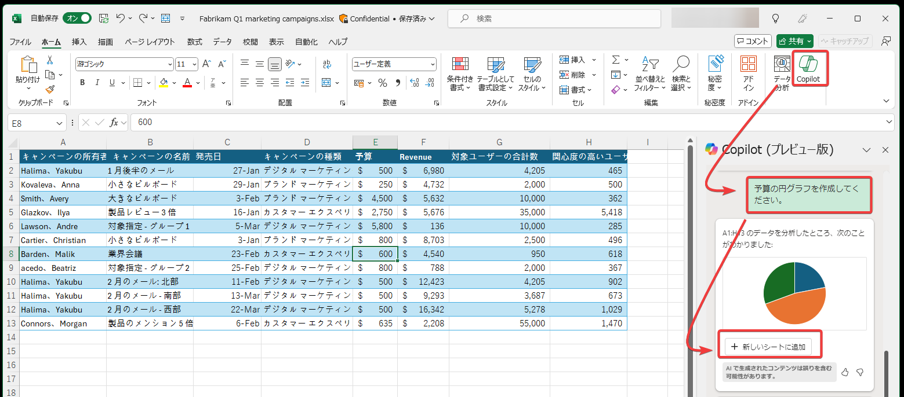

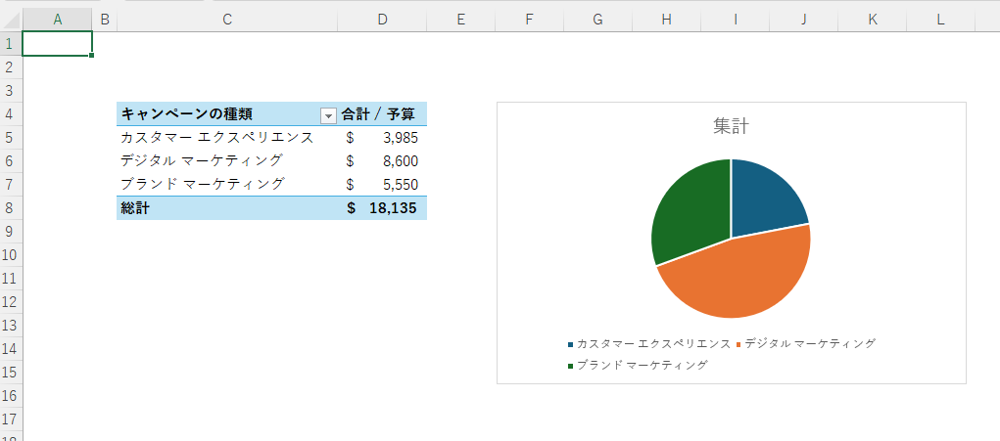

## Excel で Microsoft Copilot を使用してデータの書式設定、並べ替え、フィルター処理、強調表示を行う

https://learn.microsoft.com/ja-jp/training/modules/edit-transform-content-with-microsoft-copilot-microsoft-365/4-format-sort-filter-highlight-data-copilot-excel

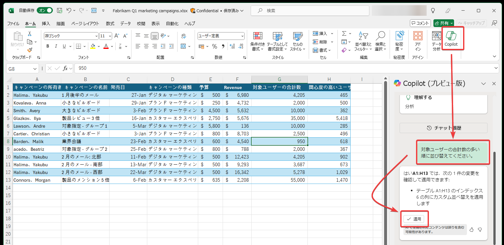

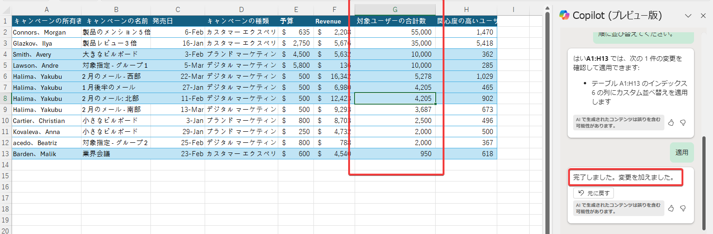

## Excel の Copilot を使用したテーブルの分析と操作

https://learn.microsoft.com/ja-jp/training/modules/ask-analyze-content-with-microsoft-copilot-microsoft-365/4-analyze-work-tables-using-copilot-excel

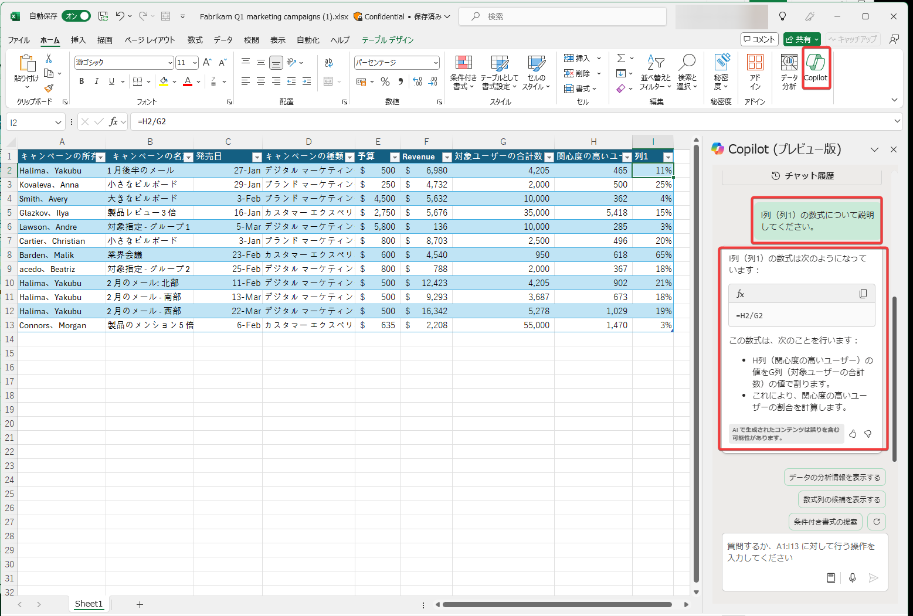