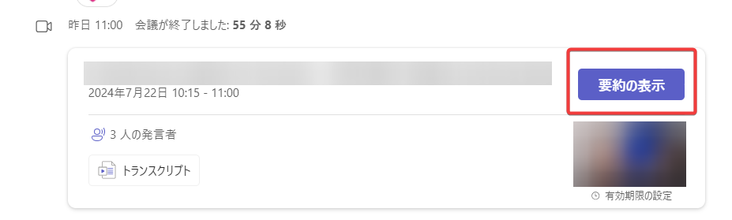
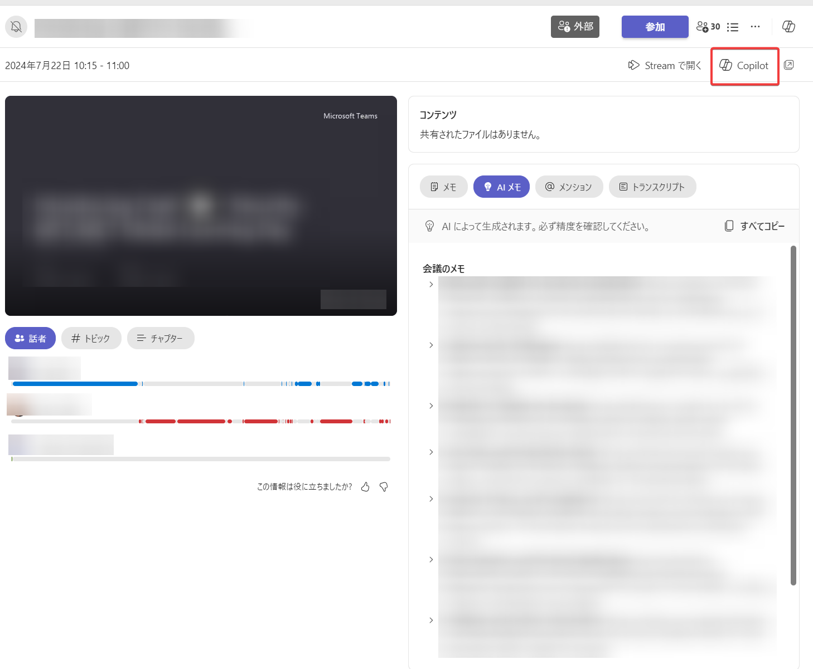
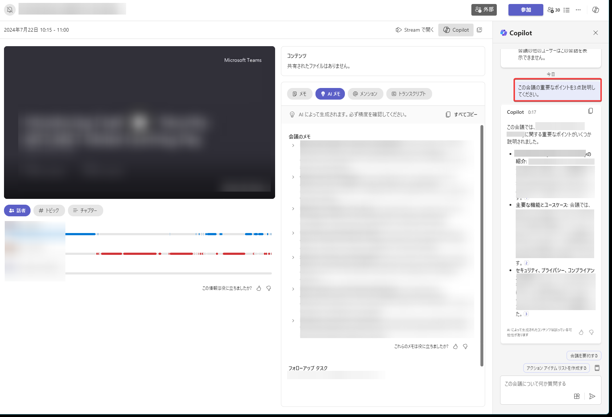
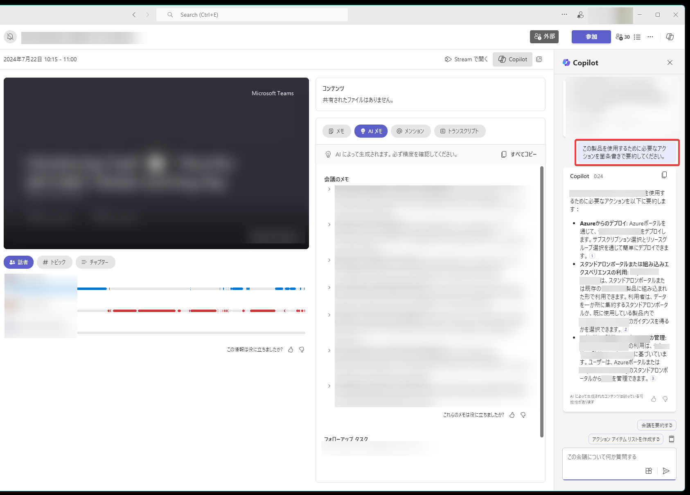
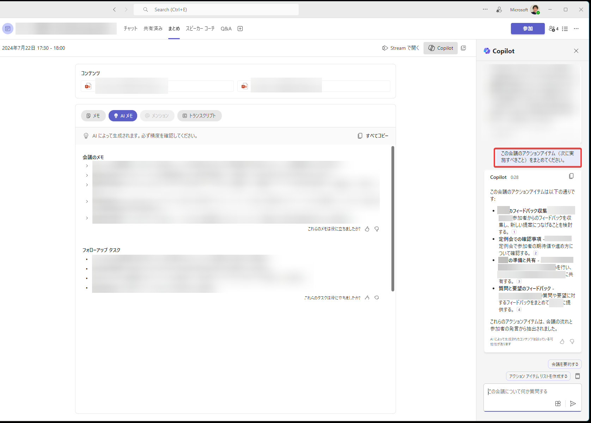

# Microsoft Copilot for Microsoft Teams

## Teams の Copilot を使用して生産性を高める

https://learn.microsoft.com/ja-jp/training/modules/explore-possibilities-microsoft-365-copilot/6-elevate-productivity-copilot-teams

Teams会議から情報を取得することができる。

## Teams 会議からの重要な決定とアクションを強調表示する

https://learn.microsoft.com/ja-jp/training/modules/summarize-simplify-information-with-microsoft-copilot-microsoft-365/5-highlight-key-decisions-action-items-teams-meetings

## Teams での会議とメッセージについて Copilot とチャットする

https://learn.microsoft.com/ja-jp/training/modules/ask-analyze-content-with-microsoft-copilot-microsoft-365/6-chat-copilot-about-meetings-messages-teams-outlook

