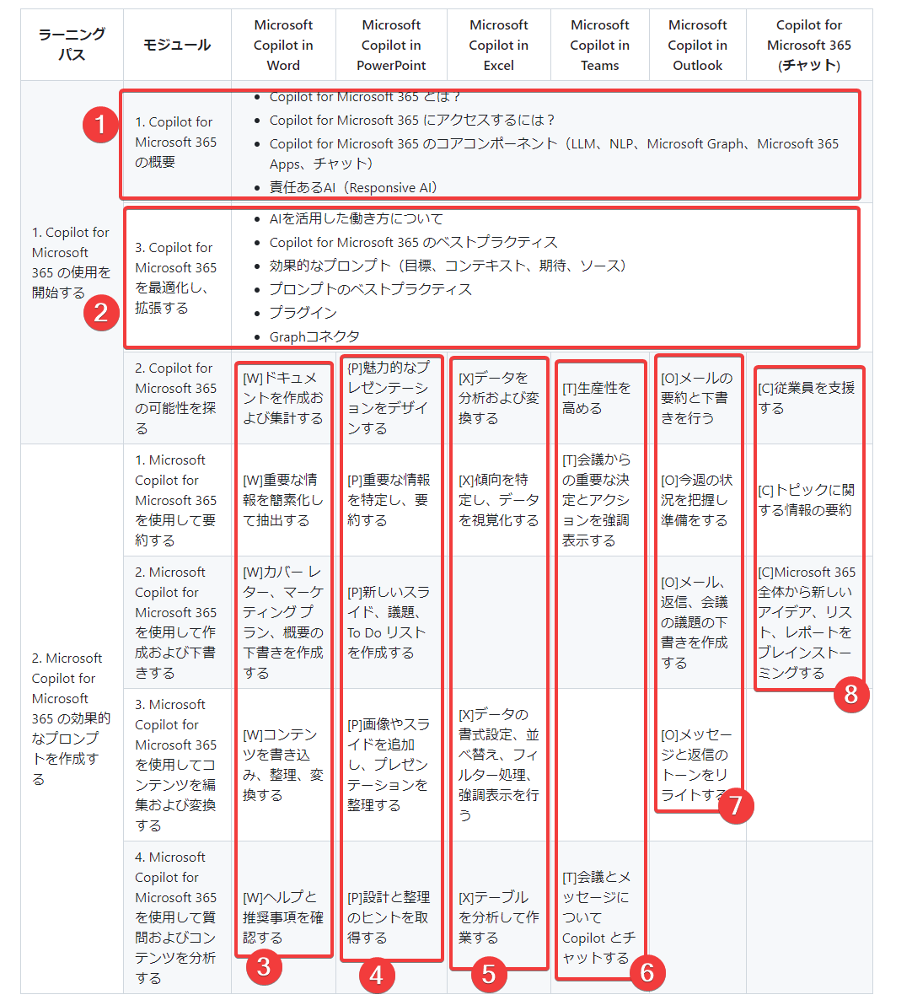

# MS-4005: Microsoft Copilot for Microsoft 365 に対して効果的なプロンプトを作成する

Microsoft Copilot for Microsoft 365の概要を学びます。また、Microsoft 365 のアプリ（Word, Excel, PowerPoint, Teams, Outlook）で、Copilotを使用し、コンテンツの作成、簡略化、変換、編集を行う方法を学びます。

※このコースは「半日コース（9:30 - 12:00）」となります。ご参考: [CTCさん](https://www.school.ctc-g.co.jp/course/P807.html)・[エディフィストさん](https://www.edifist.co.jp/course/MSCMS4005AM) も半日コースとして実施。

※このコースに対応する認定試験 / Applied Skills アセスメントはありません。

※このコースのラボ（演習）の環境・手順書は **英語版のみ利用可能** です。日本語版の提供はありません。

## 講義

- 講師自己紹介
- オープニング（開始時のご案内）
- 講義 / ラボ(講師デモ)
- [全体のまとめ](matome.md)
- クロージング（終了時のご案内）
- 満足度アンケート

## テキストの構成

https://learn.microsoft.com/ja-jp/training/courses/ms-4005

<!--

-->
<table class="training">
  <tr>
    <th>ラーニング パス</th>
    <th>モジュール</th>
    <th class="word">Microsoft Copilot in Word</th>
    <th class="ppt">Microsoft Copilot in PowerPoint</th>
    <th class="xls">Microsoft Copilot in Excel</th>
    <th class="teams">Microsoft Copilot in Teams</th>
    <th class="outlook">Microsoft Copilot in Outlook</th>
    <th class="chat">Copilot for Microsoft 365 (チャット)</th>
  </tr>
  <tr>
    <td rowspan=3>1. Copilot for Microsoft 365 の使用を開始する</td>
    <td class="general">1. Copilot for Microsoft 365 の概要</td>
    <td colspan=6 class="general">
      <ul>
        <li>Copilot for Microsoft 365 とは？
        <li>Copilot for Microsoft 365 にアクセスするには？
        <li>Copilot for Microsoft 365 のコアコンポーネント（LLM、NLP、Microsoft Graph、Microsoft 365 Apps、チャット）
        <li>責任あるAI（Responsive AI）
      </ul>
    </td>
  </tr>
  <tr>
    <td>2. Copilot for Microsoft 365 の可能性を探る
    <td class="word">[W]ドキュメントを作成および集計する
    <td class="ppt">[P]魅力的なプレゼンテーションをデザインする
    <td class="xls">[X]データを分析および変換する
    <td class="teams">[T]生産性を高める
    <td class="outlook">[O]メールの要約と下書きを行う
    <td class="chat">[C]従業員を支援する
  </tr>
  <tr>
    <td class="general">3. Copilot for Microsoft 365 を最適化し、拡張する
    <td colspan=6 class="general">
      <ul>
        <li>AIを活用した働き方について
        <li>Copilot for Microsoft 365 のベストプラクティス
        <li>効果的なプロンプト（目標、コンテキスト、期待、ソース）
        <li>プロンプトのベストプラクティス
        <li>プラグイン
        <li>Graphコネクタ
      </ul>
    </td>
  </tr>
  <tr>
    <td rowspan=4>2. Microsoft Copilot for Microsoft 365 の効果的なプロンプトを作成する</td>
    <td>1. Microsoft Copilot for Microsoft 365 を使用して要約する
    <td class="word">[W]重要な情報を簡素化して抽出する
    <td class="ppt">[P]重要な情報を特定し、要約する
    <td class="xls">[X]傾向を特定し、データを視覚化する
    <td class="teams">[T]会議からの重要な決定とアクションを強調表示する
    <td class="outlook">[O]今週の状況を把握し準備をする
    <td class="chat">[C]トピックに関する情報の要約
  </tr>
  <tr>
    <td>2. Microsoft Copilot for Microsoft 365 を使用して作成および下書きする
    <td class="word">[W]カバー レター、マーケティング プラン、概要の下書きを作成する
    <td class="ppt">[P]新しいスライド、議題、To Do リストを作成する
    <td>
    <td>
    <td class="outlook">[O]メール、返信、会議の議題の下書きを作成する
    <td class="chat">[C]Microsoft 365 全体から新しいアイデア、リスト、レポートをブレインストーミングする
  </tr>
  <tr>
    <td>3. Microsoft Copilot for Microsoft 365 を使用してコンテンツを編集および変換する
    <td class="word">[W]コンテンツを書き込み、整理、変換する
    <td class="ppt">[P]画像やスライドを追加し、プレゼンテーションを整理する
    <td class="xls">[X]データの書式設定、並べ替え、フィルター処理、強調表示を行う
    <td>
    <td class="outlook">[O]メッセージと返信のトーンをリライトする
    <td>
  </tr>
  <tr>
    <td>4. Microsoft Copilot for Microsoft 365 を使用して質問およびコンテンツを分析する
    <td class="word">[W]ヘルプと推奨事項を確認する
    <td class="ppt">[P]設計と整理のヒントを取得する
    <td class="xls">[X]テーブルを分析して作業する
    <td class="teams">[T]会議とメッセージについて Copilot とチャットする
    <td class="outlook">
    <td>
  </tr>
</table>

<!--
<ul>
  <li class="general">[Copilot for Microsoft 365 の概要、最適化、拡張](01-overview.md)
  <li class="word">[Word の Copilot](02-word.md)
  <li class="ppt">[PowerPoint の Copilot](03-powerpoint.md)
  <li class="xls">[Excel の Copilot](04-excel.md)
  <li class="teams">[Teams の Copilot](05-teams.md)
  <li class="outlook">[Outlook の Copilot](06-outlook.md)
  <li class="chat">[Chat の Copilot](07-chat.md)
</ul>
-->

## 本講義での解説順

本講義では、理解しやすいように、以下のように順序を調整して解説する。

- まず、Copilot for Microsoft 365 全体の解説を行う。
  - [ ① Copilot for Microsoft 365 の概要](01-overview.md)
  - [ ② Copilot for Microsoft 365 を最適化し、拡張する](02-extend.md)
- 次に、各アプリのコパイロットの解説を行う。
  - [ ③ Copilot for Microsoft Word](03-word.md)
  - [ ④ Copilot for Microsoft PowerPoint](04-powerpoint.md)
  - [ ⑤ Copilot for Microsoft Excel](05-excel.md)
  - [ ⑥ Copilot for Microsoft Teams](06-teams.md)
  - [ ⑦ Copilot for Microsoft Outlook](07-outlook.md)
  - [ ⑧ Copilot for Microsoft 365 (チャット)](08-chat.md)

## ラボ（演習）

※このコースのラボ（演習）の環境・手順書は **英語版のみ利用可能** です。日本語版の提供はありません。

Craft effective prompts for Microsoft Copilot for Microsoft 365

- [手順書](https://github.com/MicrosoftLearning/MS-4005-Craft-effective-prompts-for-Microsoft-Copilot-for-Microsoft-365/tree/master/Instructions/Labs)
- [ラボ環境](https://esi.learnondemand.net/)
  - [ラボ環境の利用方法](../ラボ環境の利用方法.pdf)

- ラボは、「ラーニングパス2. Microsoft Copilot for Microsoft 365の効果的なプロンプトを作成する」の4モジュールに対応する内容となっています。
- ラボを起動すると最大で8時間利用できます。ただし操作をしていない状態が10分ほど続くとラボが終了してしまいます。
