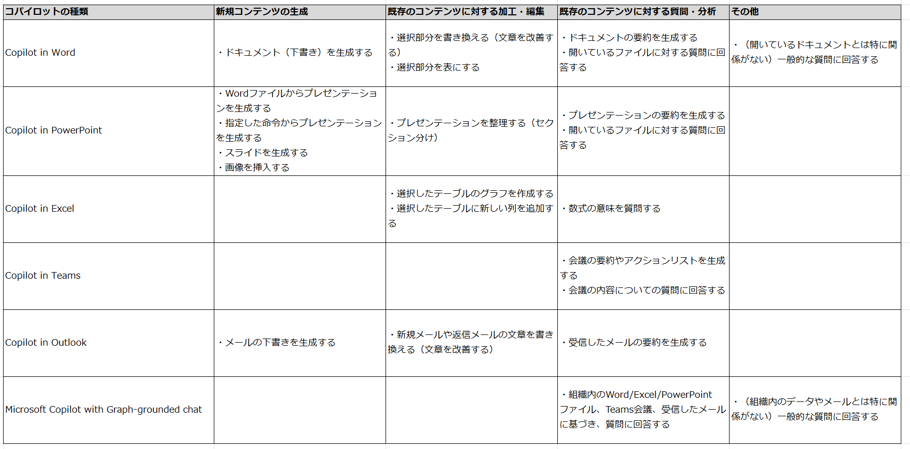

# 全体のまとめ

このコースでは以下のような内容を学びました。

## Microsoft Copilot for Microsoft 365の概要

- Microsoft Copilot for Microsoft 365 では 以下のようなコパイロットを使用できる
  - Copilot for Word
  - Copilot for PowerPoint
  - Copilot for Excel
  - Copilot for Teams
  - Copilot for Outlook
  - Microsoft Copilot with Graph-based chat
- 生成AIを活用して仕事を効率化できる
- コンテンツの生成、編集、質問、分析などを実行できる
- 使用するためには Microsoft Copilot for Microsoft 365 ライセンスが必要
- プラグインやGraphコネクタを使用して拡張できる

## 各コパイロットで実施できること

## 参考: Copilot Lab

https://copilot.cloud.microsoft/ja-JP/prompts

- コパイロットに関する入門動画
- [プロンプトの例](https://copilot.cloud.microsoft/ja-JP/prompts/all)