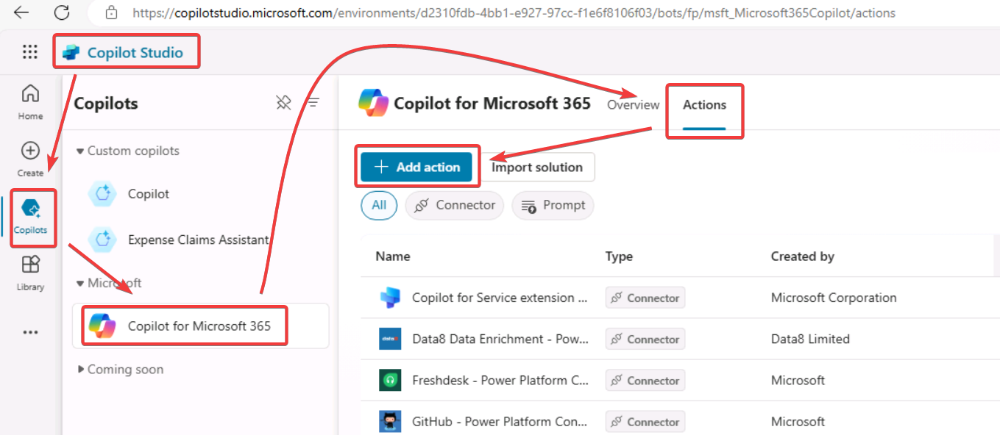

# アクション

https://learn.microsoft.com/ja-jp/microsoft-copilot-studio/advanced-plugin-actions

1 つ以上のアクションを追加することで、コパイロットの機能を拡張できます。 アクションは、コパイロットが 生成アクション を使用してユーザーに自動的に応答するために使用されます。

また、トピック 内から明示的に呼び出すこともできます。

## アクションの追加

または

そしてアクションの種類を選択

- Connector
  - コネクタを使用すると、Salesforce、Zendesk、MailChimp、GitHub などの一般的なエンタープライズ システムからデータにアクセスできるようになります
- Conversational
- Prompt
  - Microsoft Copilot でユーザーのプロンプトに応答して実行されるプロンプトを定義します。
- Flow
  - Power Automate Flow アクションを使用すると、Microsoft Copilot チャット内から呼び出すことができるカスタム自動化フローを構成できます。

Promptアクションの作成例

