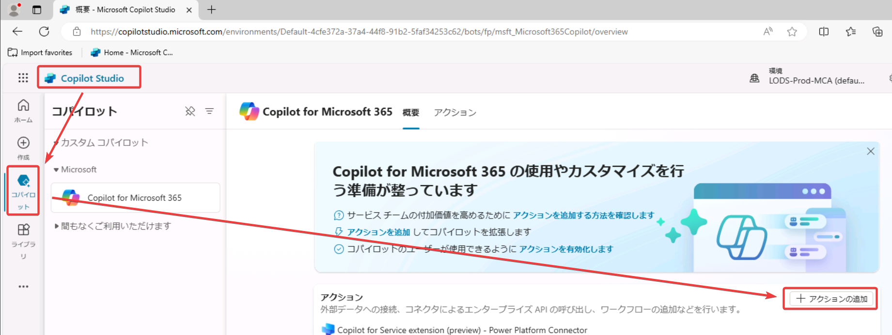
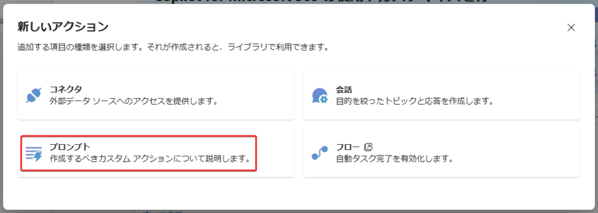
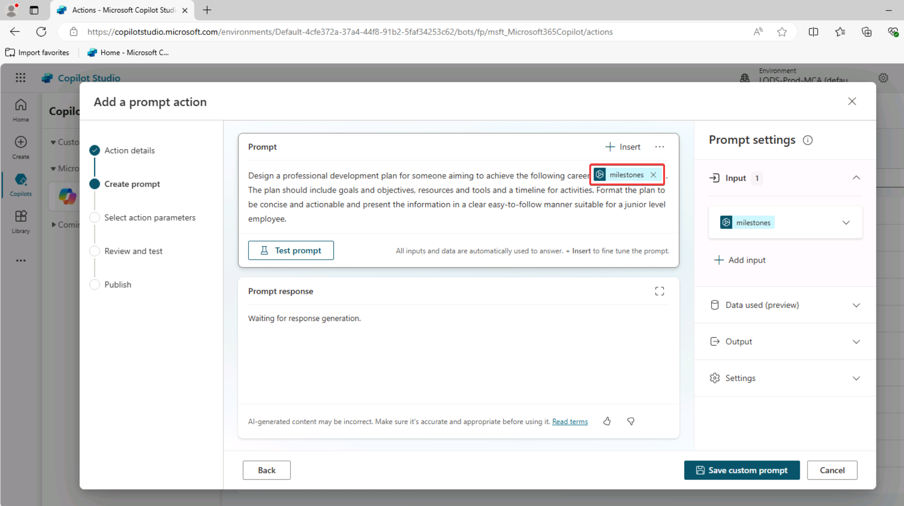
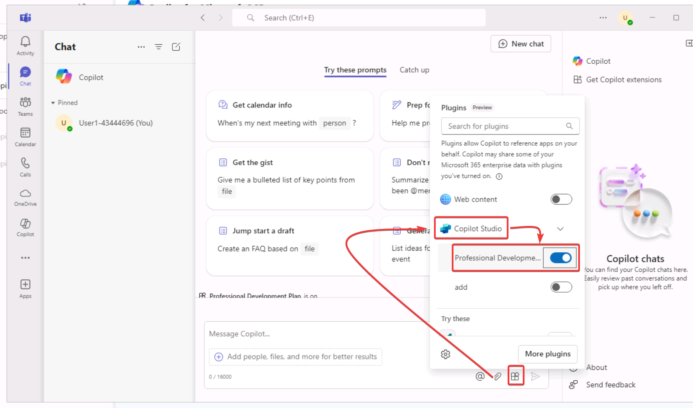

# プロンプトアクション

https://github.com/MicrosoftLearning/MS-4009-Extend-Microsoft-Copilot-for-Microsoft-365-with-Copilot-Studio/blob/master/Instructions/Labs/Prompt-actions/Exercise-create-prompt-action.md


または







publish

15分ほど待つ

デスクトップ版Teamsアプリを起動




```
You are meeting room reservation specialist.
The user want to reserve [meeting_room_name].
If user want to reserve "room1" then answer "Please mail to room1reserve@contoso.com and follow the response mail".
Otherwise answer "Ask facility."

Output answer only.
```