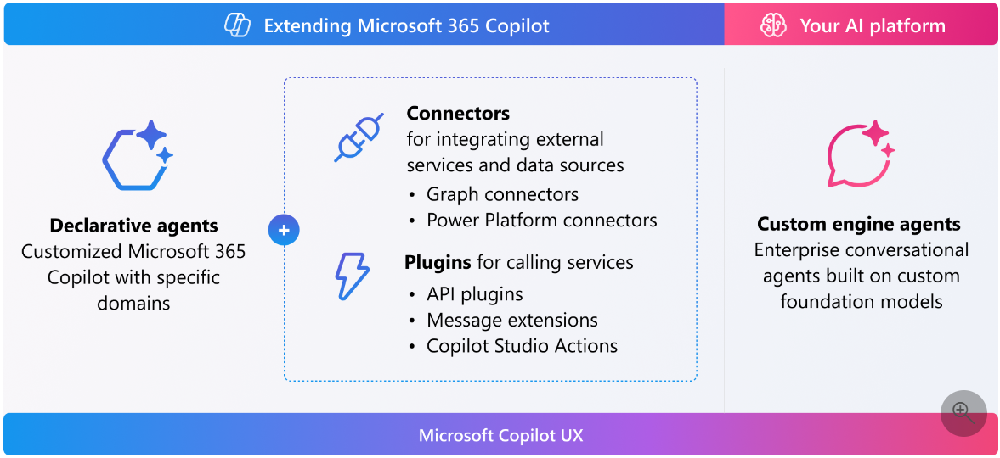
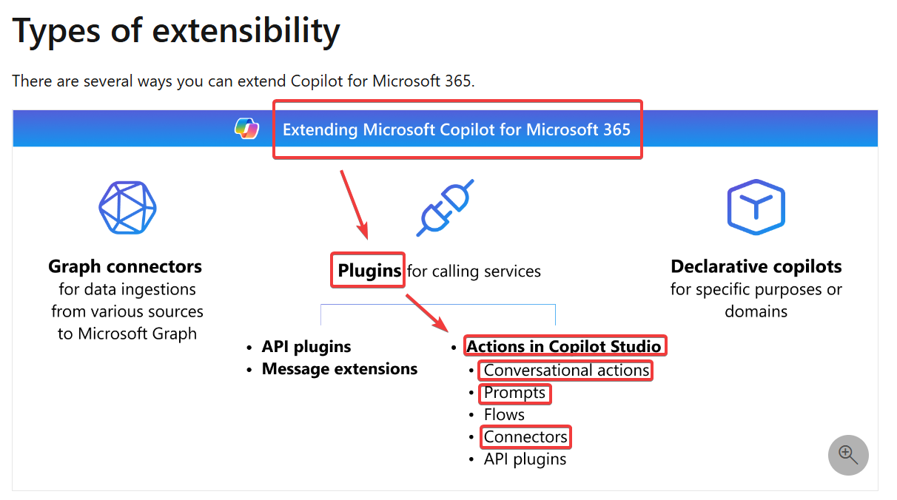

# モジュール1 Microsoft Copilot の機能拡張の基礎

https://learn.microsoft.com/ja-jp/training/modules/microsoft-copilot-extensibility-fundamentals/

<!--
## ドキュメント:
https://learn.microsoft.com/en-us/microsoft-365-copilot/extensibility/
-->

## 「Microsoft 365 Copilot」と「Copilot エージェント」

- 「Microsoft 365 Copilot」
  - Word, Excel, PowerPoint, Teamsなどに組み込まれたコパイロット
  - Microsoft 365とともに、すぐに使用できる
  - 特にカスタマイズされていない
- 「Copilot エージェント」
  - 「Microsoft 365 Copilot」を拡張したもの
  - 特定のスコープに特化した知識やスキルを持つ
    - 例: 「出張エージェント」
      - 出張に関する質問に答える
      - 出張の手配を支援（自動化）する
  - 開発者が「Microsoft Copilot Studio」などを使用して作成する

## 「Copilot エージェント」はどこで使用できるのか？

BizChat（Microsoft Teams内のCopilotの画面）などで使用できる。

## 参考: 拡張の方法

- コネクタ
  - [Graphコネクタ](https://learn.microsoft.com/ja-jp/microsoft-365-copilot/extensibility/#graph-connectors)
  - [Power Platformコネクタ](https://learn.microsoft.com/ja-jp/microsoft-365-copilot/extensibility/#power-platform-connectors)
- [プラグイン](https://learn.microsoft.com/ja-jp/microsoft-365-copilot/extensibility/#plugins)
  - [APIプラグイン](https://learn.microsoft.com/ja-jp/microsoft-365-copilot/extensibility/overview-api-plugins)
  - [メッセージ拡張機能](https://learn.microsoft.com/ja-jp/microsoft-365-copilot/extensibility/overview-message-extension-bot)
  - [Copilot Studioの「アクション」](https://learn.microsoft.com/ja-jp/microsoft-copilot-studio/copilot-plugins-overview#extend-a-microsoft-copilot-with-an-action)
    - [会話アクション](https://learn.microsoft.com/ja-jp/microsoft-copilot-studio/copilot-conversational-plugins)
    - [プロンプトアクション](https://learn.microsoft.com/ja-jp/microsoft-copilot-studio/microsoft-copilot-extend-action-prompt)
    - [コネクタアクション](https://learn.microsoft.com/ja-jp/microsoft-copilot-studio/microsoft-copilot-extend-action-connector)

※本コースでは、Copilot Studioの「アクション」のみ説明する。

<!--
## 参考: 以前の拡張性の図

## プラグインの種類

https://learn.microsoft.com/ja-JP/microsoft-365-copilot/extensibility/#plugins

- 組み込みのプラグイン
  - Microsoft から出荷される
  - すぐに利用できる
- カスタムのプラグイン（アクション）
  - Microsoft Copilot Studio で開発する
  - 次のモジュール（モジュール02）で解説

-->
