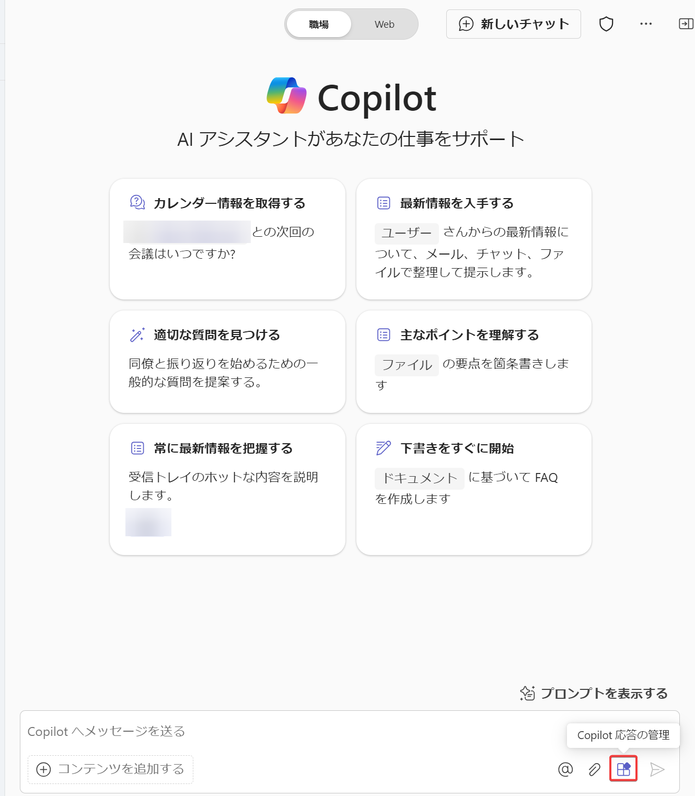
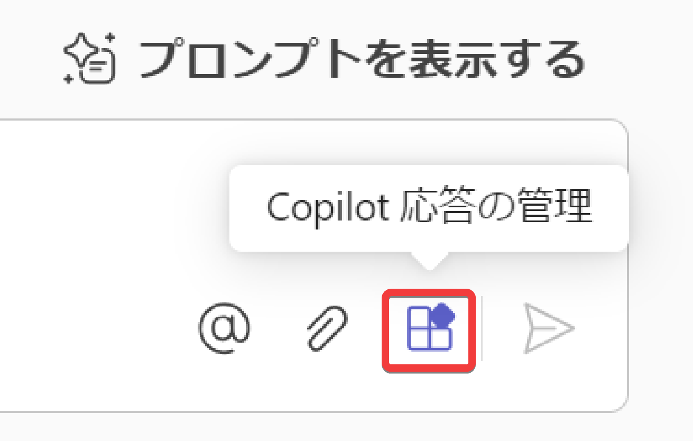
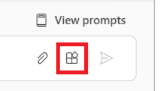
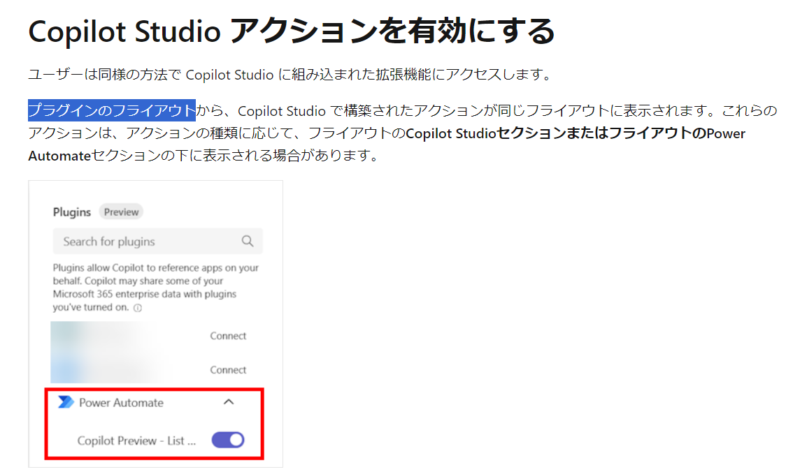
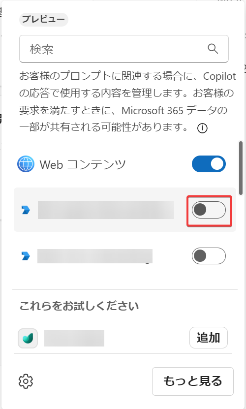

# モジュール2 Copilot Studio アクションの概要

https://learn.microsoft.com/ja-jp/training/modules/get-started-copilot-studio-actions/

## Copilot Studio アクション

「Copilot Studio アクション」は、「Microsoft 365 Copilot」を拡張して「Copilot エージェント」を作成する方法の一つ。

Microsoft Copilot Studioを使用して、独自のアクションを開発できる。

- プロンプトアクション 
  - あらかじめ登録しておいた「プロンプト」を使用して、GPTにコンテンツを生成させるアクション
  - モジュール3で詳しく解説
- コネクタアクション
  - Power PlatformやLogic Appで使用できる「コネクタ」を使用するアクション
  - モジュール4で詳しく解説
- 会話アクション
  - モジュール5で詳しく解説

## アクションの利用方法

<!--
「Copilot Studio アクション」は、Copilot for Microsoft 365 に付属する組み込みアクションと同様に動作する。
-->

Microsoft 365 の Copilot の画面（BizChat）に移動する。

メッセージ作成メニューの「Copilot応答の管理」ボタンをクリックする。

<!--

※ここではまだ、新しい用語「アクション」ではなく、古い用語「プラグイン」が使用されている。

-->

使用したいアクションのスイッチをオンにする。

※この、アクションの有効・無効を切り替えるポップアップのことを「フライアウト」（Flyout）という。https://learn.microsoft.com/ja-jp/windows/apps/design/controls/dialogs-and-flyouts/flyouts

## オーケストレーター

https://learn.microsoft.com/ja-jp/microsoft-365-copilot/extensibility/orchestrator?tabs=tasks

ユーザーがプロンプトを入力した際に、「Microsoft Copilot オーケストレーター」が、利用可能なアクションのセットの中から、適切なアクションを決定する。

なお、このとき、「Microsoft Copilot オーケストレーター」は、アクションの「説明」に従ってアクションを選択する。したがって、適切なアクションが選択されるようにするためには、アクションの「説明」をきちんと書くことが重要である。

https://learn.microsoft.com/ja-jp/microsoft-365-copilot/extensibility/orchestrator?tabs=tasks#plugin-optimization

