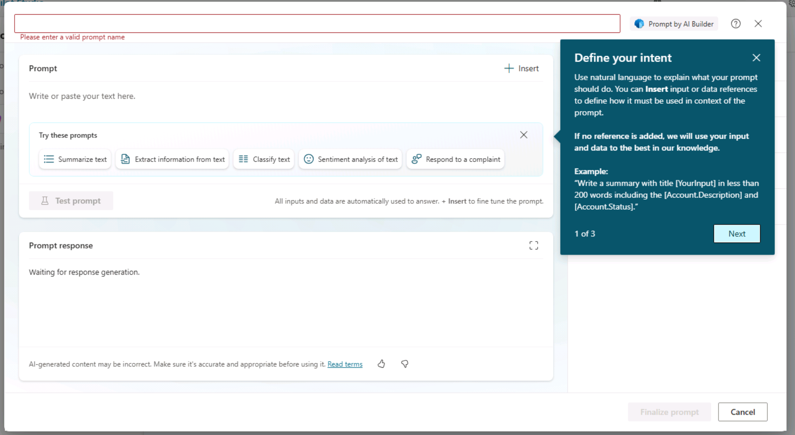

# モジュール3 「プロンプト アクション」を作成する

プロンプト アクションで Microsoft Copilot を拡張する:
https://learn.microsoft.com/ja-jp/microsoft-copilot-studio/microsoft-copilot-extend-action-prompt

<!--
Microsoft Learn トレーニングモジュール（英語のみ）:
https://learn.microsoft.com/ja-jp/training/modules/create-prompt-actions-microsoft-copilot-m365-copilot-studio/
-->

プロンプトを使用すると、メーカーは、Generative Pre-trained Transformer (GPT) モデルに特定の動作をさせたり、特定のタスクを実行させたりすることができます。

- 情報を分類する- 大きなテキストを入力し、それに定義済みのラベルを割り当てます。
- エンティティの抽出- 大きなテキストがあり、そのテキストからクライアントの名前、連絡先担当者、または電話番号を抽出します。
- 回答の下書き- 顧客に問題があり、可能な解決策を提案するためにどのように返信すればよいかについて支援が必要です。
- コンテンツを要約する

## AI Builder

https://learn.microsoft.com/ja-jp/ai-builder/overview

- 名前
- プロンプト
- インプット
- データ
- アウトプット
- 設定
  - モデル: GPT 3.5 / GPT-4o
  - Temperature: 0～1
