# Copilot Studio で Microsoft Copilot for Microsoft 365 のコネクタ アクションを作成する

https://learn.microsoft.com/ja-jp/training/modules/create-connector-actions-microsoft-copilot-microsoft-365-copilot-studio/1-introduction

## コネクタとは

コネクタは、Copilot の拡張性を高めるための強力なツールです。外部のサービスやアプリケーションを使用して、コパイロットの知識を増強できます。

Microsoft エコシステム内外の一般的なエンタープライズ サービス向けに、すぐに使用できるコネクタが 1,200 種類以上あります。

カスタム コネクタを作成して、独自のデータ ソースに接続することもできます。

Copilot Studio を使用すると、独自のカスタム コパイロットでこれらのコネクタを使用したり、Copilot for Microsoft 365 や Copilot for Sales などのファースト パーティ コパイロットを拡張したりできます。

## コネクタの種類

標準コネクタ- SharePoint など、すべての Copilot Studio プランに含まれています。https://learn.microsoft.com/en-us/connectors/connector-reference/connector-reference-standard-connectors

プレミアム コネクタ- 特定の Copilot Studio プランで利用できます。https://learn.microsoft.com/en-us/connectors/connector-reference/connector-reference-premium-connectors

カスタム コネクタ- 既存のコネクタでカバーされていないサービス用の公開 API に接続するために作成できます。ユーザーが Copilot for Microsoft 365 を通じてコネクタ アクションを使用するには、コネクタを認定コネクタとして公開する必要があります。https://learn.microsoft.com/en-us/connectors/custom-connectors/

## コネクタアクションの作成

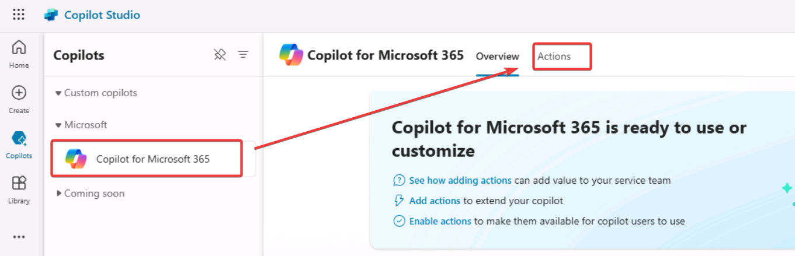

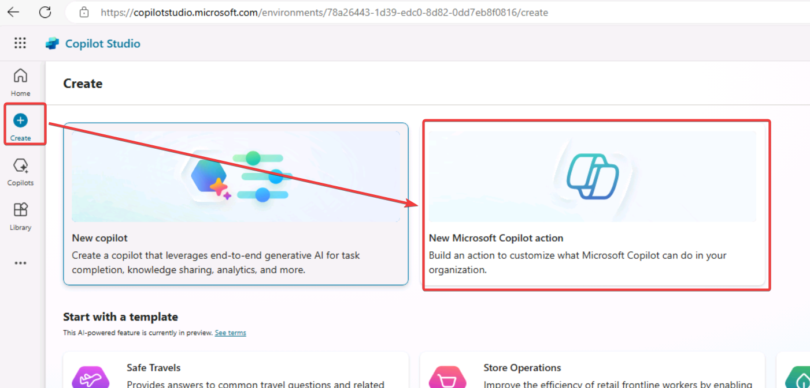

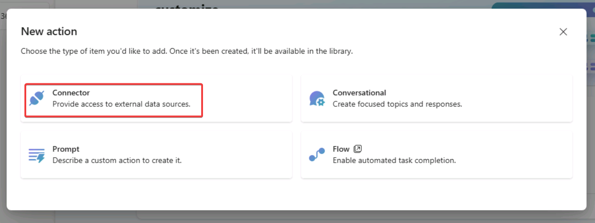

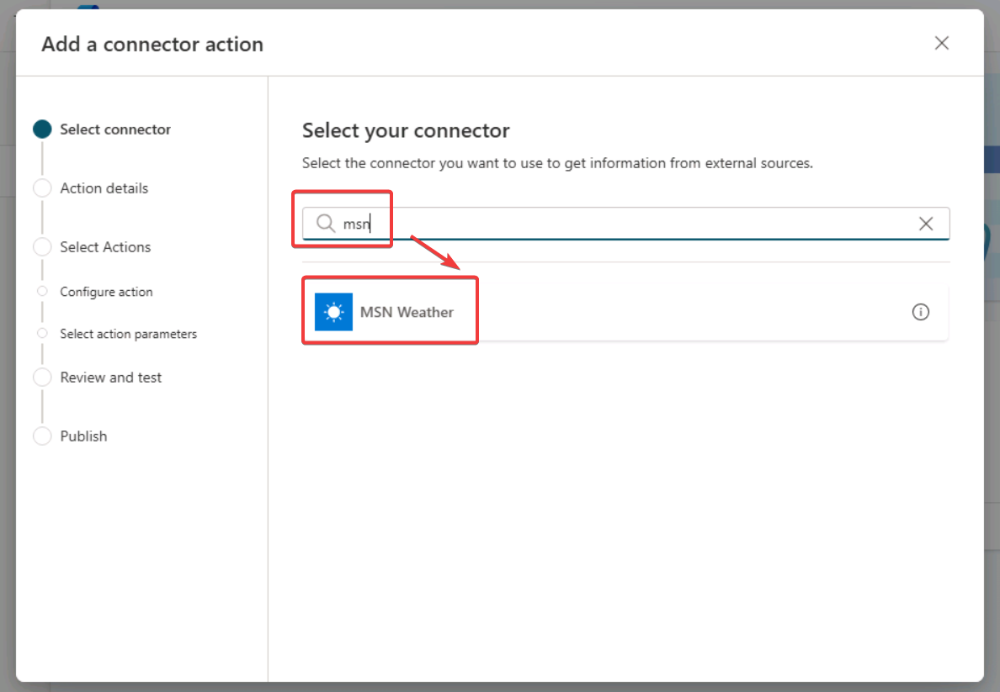

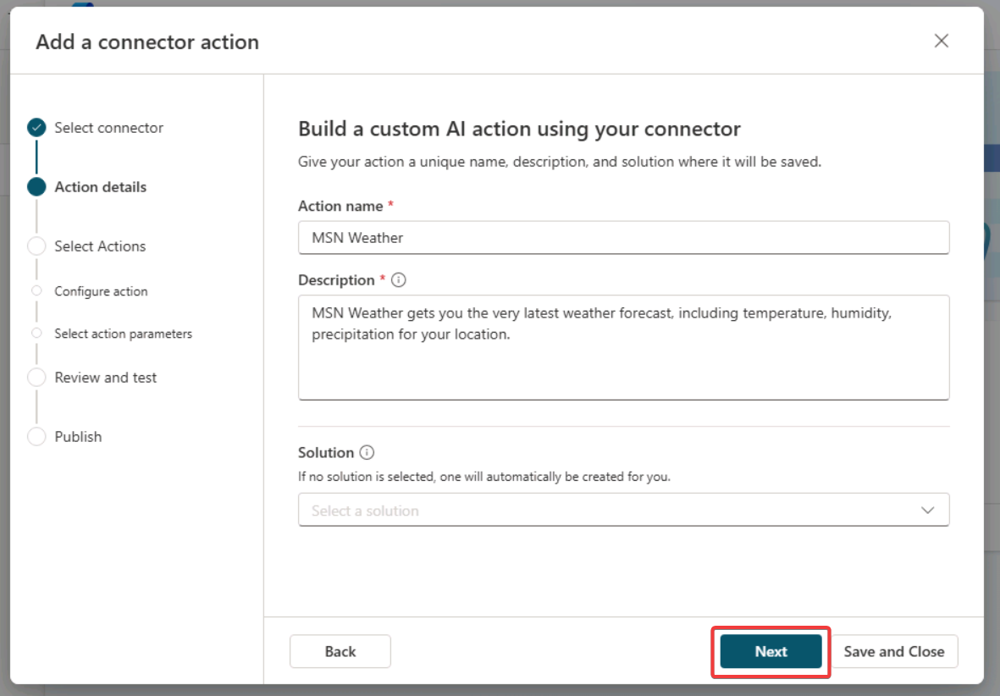

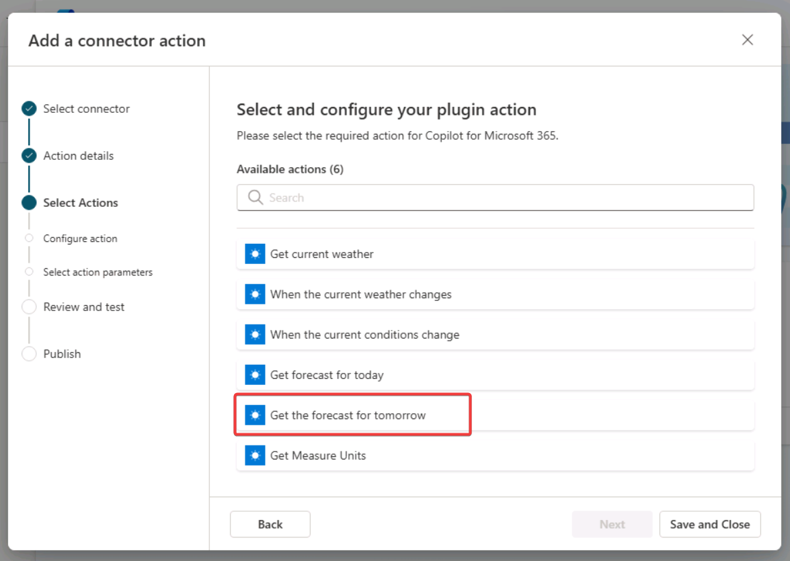

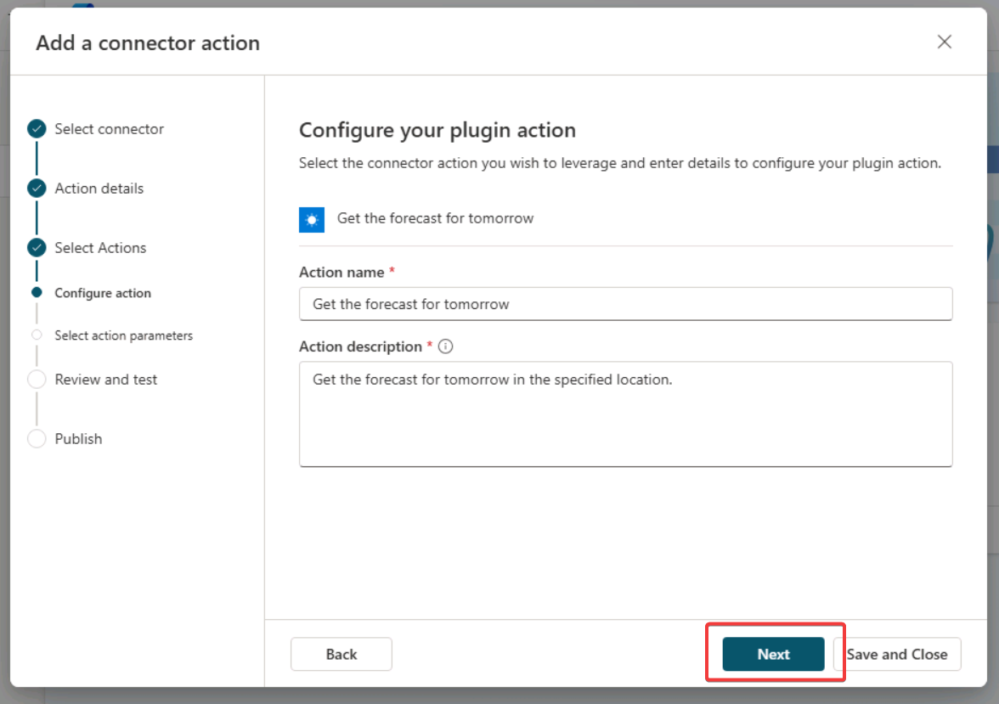

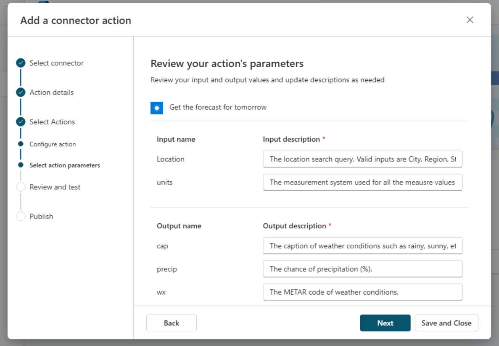

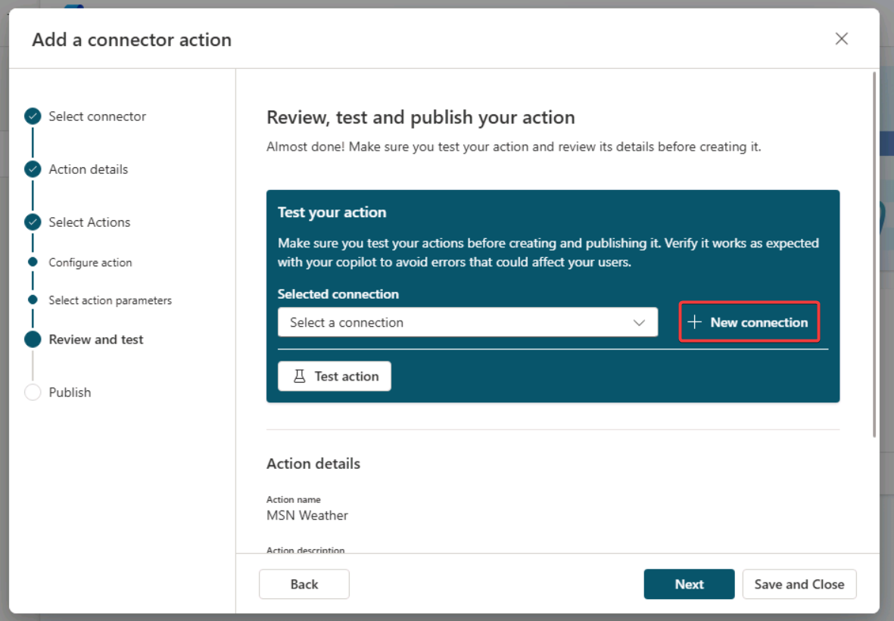

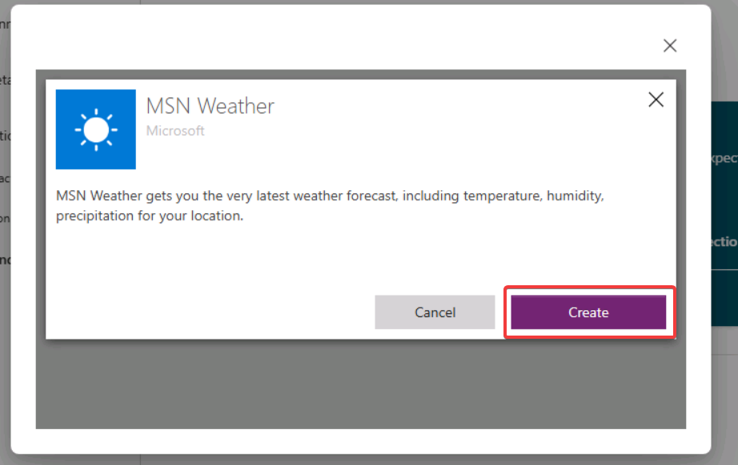

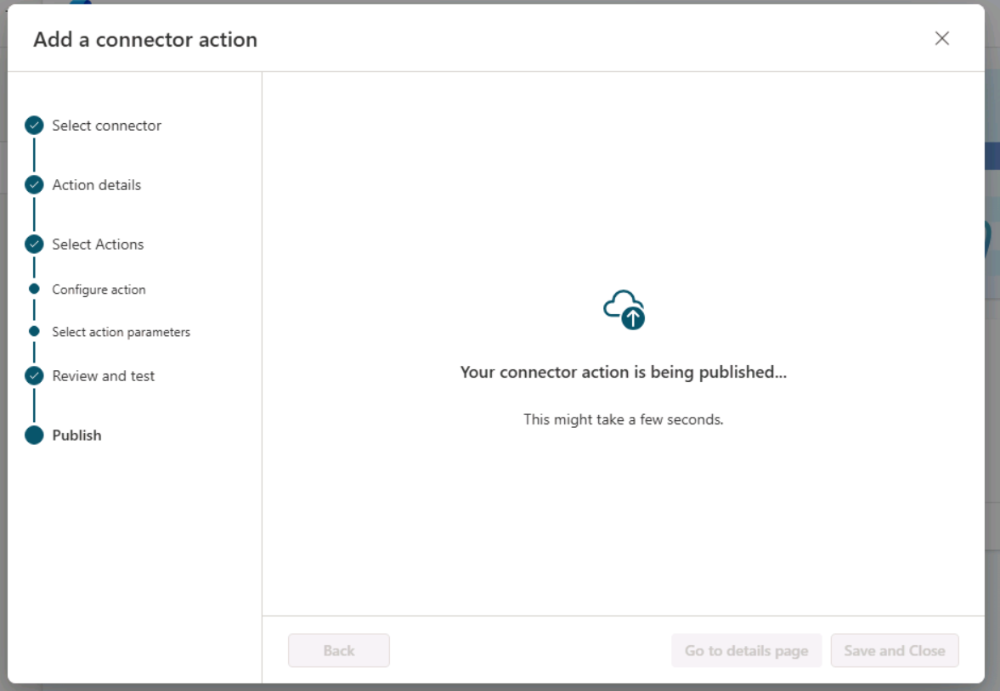

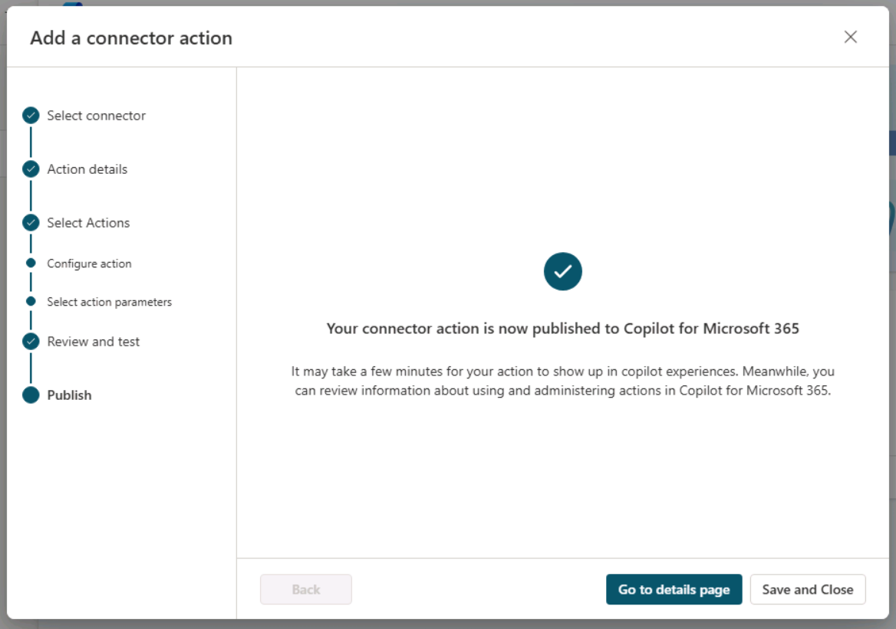

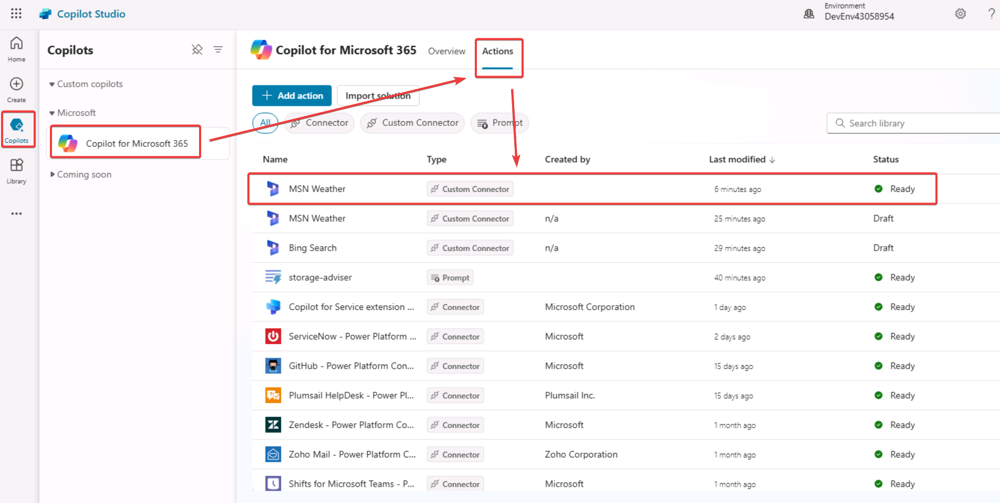