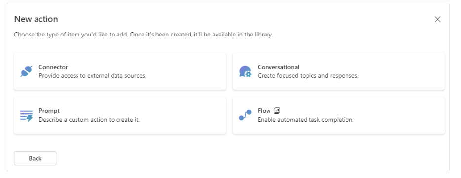

# コパイロットの機能拡張の種類

https://learn.microsoft.com/ja-jp/microsoft-365-copilot/extensibility/#types-of-extensibility

「Copilot for Microsoft 365」の拡張方法として、「Graphコネクタ」「宣言型コパイロット」「プラグイン」の3種類がある

注: 「コネクター」のように長音を付けず「コネクタ」と書かれる。

- Graphコネクタ
- 宣言型コパイロット
- プラグイン
  - APIプラグイン
  - メッセージ拡張機能
  - Copilot Studioのアクション
    - 「Copilot for Microsoft 365」（等）のアクション
    - 「カスタム コパイロット」のアクション

## Graphコネクタ

→ [Graphコネクタ](graph-connector.md)

## 参考: Power Platform / Azure Logic Appsのコネクタ

Power PlatformやAzure Logic Appsにも「コネクタ」がある。コパイロットではそれを「アクション」の中から使用できる。これは「Graphコネクタ」とは別のもの。

https://learn.microsoft.com/ja-jp/connectors/

各コネクタはトリガーとアクションを含む。

たとえば「[Azure Blob Storage コネクタ](https://learn.microsoft.com/ja-jp/connectors/azureblob/)」は「BLOB が追加または変更されたとき」トリガーや「BLOB コンテンツを取得する」アクションを含む。

## 宣言型コパイロット declarative copilot

https://learn.microsoft.com/ja-jp/microsoft-365-copilot/extensibility/overview-declarative-copilot

Microsoft 365 用の Copilot をカスタマイズするための指示、アクション、知識を宣言することで、独自の copilot を作成できる。

Teams Toolkit, Copilot Studio, Microsoft 365 Admin Center, SharePointなどのツールを使用して作成する。https://learn.microsoft.com/en-us/microsoft-365-copilot/extensibility/overview-declarative-copilot#build-declarative-copilots

2024/8現在プライベートプレビュー中につき詳細な情報はまだ出てきていない。

## プラグイン

「プラグイン」の内訳として、「APIプラグイン」「メッセージ拡張機能」「Copilot Studioのアクション」がある。
https://learn.microsoft.com/ja-jp/microsoft-365-copilot/extensibility/#plugins

※「Copilot Studioのアクション」は以前は「プラグイン」と呼ばれていた。https://learn.microsoft.com/ja-jp/microsoft-copilot-studio/copilot-conversational-plugins

わかりやすい解説（注 「プラグイン」と呼ばれていたころの資料）: https://www.qes.co.jp/media/powerplatform/CopilotStudio/a392

### プラグイン / APIプラグイン

### プラグイン / メッセージ拡張機能

### プラグイン / 「Copilot for Microsoft 365」（等）のアクション

https://learn.microsoft.com/ja-jp/microsoft-copilot-studio/copilot-plugins-overview#handlers-and-content-sources---action-types

- 会話的コネクタ ... コパイロットのトピックと同様。
- コネクタ ... 外部データソースへのアクセス。MSN Weather等。
- Promptコネクタ ... 生成AI
- Flowコネクタ ... Power Automate クラウドフローを呼び出す。

### プラグイン / 「カスタム コパイロット」のアクション
https://learn.microsoft.com/ja-jp/microsoft-copilot-studio/advanced-plugin-actions

アクションの種類
- 事前構築されたコネクタ アクション
- ユーザー定義コネクタとアクション
- [Power Automate クラウド フロー](https://learn.microsoft.com/ja-jp/power-automate/overview-cloud)
- AI Builder プロンプト
- [Bot Framework スキル](https://learn.microsoft.com/ja-jp/azure/bot-service/skills-conceptual?view=azure-bot-service-4.0&preserve-view=true)

たとえば「[Power Automate クラウド フロー](https://learn.microsoft.com/ja-jp/power-automate/overview-cloud)」を利用する場合、まずPower Automateで「Power Automate フロー」を作成する。この「Power Automate フロー」では、「Run a flow from Copilot」トリガーを配置する。また「Respond to Copilot」アクションでフローから結果を返すようにする。そして、Copilotのトピックの「アクション ノード」から、それを呼び出す。https://learn.microsoft.com/ja-jp/microsoft-copilot-studio/advanced-flow

また「[Bot Framework スキル](https://learn.microsoft.com/ja-jp/azure/bot-service/skills-conceptual?view=azure-bot-service-4.0&preserve-view=true)」を利用する場合は、まずコパイロットにそのスキルを追加する。つぎにCopilotのトピックのノード選択で「アクションの呼び出し」を選び、そのスキルを選ぶ。https://learn.microsoft.com/ja-jp/microsoft-copilot-studio/advanced-use-skills

## 独自の拡張機能の作成

https://learn.microsoft.com/ja-jp/microsoft-copilot-studio/copilot-plugins-overview#creating-your-own-new-extension

