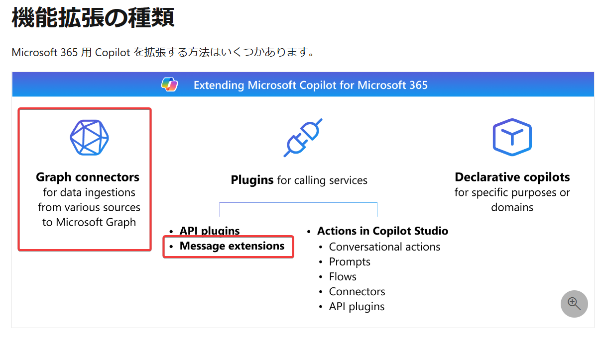

# モジュール1 Microsoft Copilot の機能拡張の基礎

https://learn.microsoft.com/ja-jp/training/modules/microsoft-copilot-extensibility-fundamentals/

<!--
## ドキュメント:
https://learn.microsoft.com/en-us/microsoft-365-copilot/extensibility/
-->

## なぜ Copilotを拡張するのか？ Copilotを拡張すると何ができるのか？

## 「拡張」はどこで使用できるのか？

Microsoft Teams内のCopilot（チャット）で使用できる。

## どのように拡張するのか？

- Graphコネクタ
- 宣言型コパイロット(Declarative copilots)
- プラグイン
  - APIプラグイン
  - メッセージ拡張機能
  - Copilot Studioの「アクション」
    - 会話アクション
    - プロンプトアクション
    - コネクタアクション

