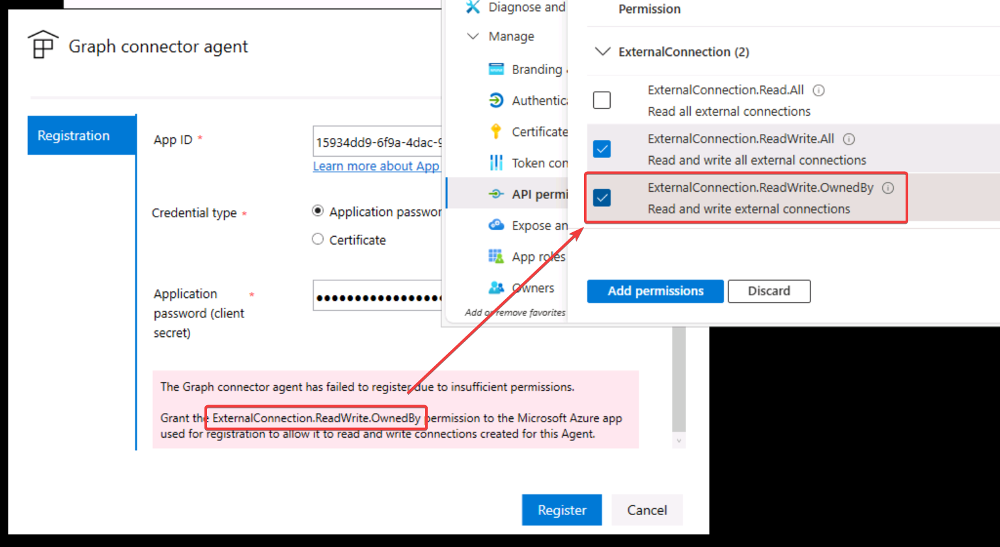

# MS-4014: AI エージェントを構築し、Microsoft 365 Copilotを拡張するための基盤を構築する

https://learn.microsoft.com/ja-jp/training/paths/build-foundation-extend-microsoft-365-copilot/

- Microsoft 365 Copilotを拡張・カスタマイズする方法について概要を学習します。
- 4つのモジュールで構成されます。
- モジュール1では「一般的に、エージェントとは何か」「エージェントはビジネスにどのように役に立つのか」について説明します。
- モジュール2では「マイクロソフト製品において（拡張やカスタマイズをせず、すぐに使えるCopilotやエージェントとしては）どのようなCopilotやエージェントがあるのか」「エージェント開発者向けのAzureサービスにはどのようなものがあるのか」を説明します。
- モジュール3では「エージェントの拡張・カスタマイズの方法」について説明します。
- モジュール4では「独自のエージェントの開発方法」について説明します。
- ※本コースでは「Microsoft 365 Copilotの使い方」は解説されません。必要に応じて[MS-4018](https://learn.microsoft.com/ja-jp/training/paths/draft-analyze-present-microsoft-365-copilot/)などのMicrosoft 365 Copilot入門者・利用者向けコースをご受講ください。
- ※本コースにはラボ（実機演習）はございません。座学のみとなります。

## 講義

- [開始時のご案内](../opening.md)
- 講義
  - モジュール1 AI エージェントの開発の概要
    - [講義資料PDF](m01.pdf)
  - モジュール2 Microsoft AI エージェント ソリューションの概要
    - [講義資料PDF](m02.pdf)
  - モジュール3 シナリオに最適なMicrosoft 365 Copilot拡張パスを選択する
    - [講義資料PDF](m03.pdf)
  - モジュール4 カスタム AI エージェントの開発パスを選択する
    - [講義資料PDF](m04.pdf)
- [認定試験のご紹介](../ms-copilot/exam.md)
- [終了時のご案内](../closing-no-lab.md)
- 満足度調査アンケート

<!--
ラボ
Graphコネクタエージェント（GCA）のインストール

https://www.youtube.com/watch?v=D-AVeZWT8n4

Build a foundation to build AI agents and extend Microsoft 365 Copilot
Build a foundation to extend Microsoft 365 Copilot

https://techcommunity.microsoft.com/blog/iltcommunicationblog/coming-soon-ms-4014-build-a-foundation-to-extend-microsoft-365-copilot/4284869

This course explores how to extend Copilot's capabilities through Microsoft Graph connectors, declarative and custom engine agents, guiding participants through the selection of the most suitable development path. Concluding with the management and distribution of agents, this course allows learners to explore the Microsoft 365 Admin center for agent administration.

このコースでは、Microsoft Graph コネクタとカスタム エンジン copilots を使用して Copilot の機能を拡張し、参加者が最適な開発パスを選択するように誘導する方法について説明します。 最後に、Microsoft 365 管理センターのエージェント管理を使用します。

https://techcommunity.microsoft.com/blog/iltcommunicationblog/ilt-course-retirement-ai-3018-copilot-foundations/4383209

このコースは AI-3018: Copilot Foundations の置き換え。

https://learn.microsoft.com/ja-jp/training/paths/build-foundation-extend-microsoft-365-copilot/

https://learn.microsoft.com/en-us/training/paths/build-foundation-extend-microsoft-365-copilot/

1-Day

## ラボ

https://github.com/MicrosoftLearning/MS-4014-Build-a-foundation-to-extend-Microsoft-Copilot-365

https://github.com/MicrosoftLearning/MS-4014-Build-a-foundation-to-extend-Microsoft-365-Copilot.ja-jp

Due to new Microsoft 365 tenant restrictions, tenants will now be available for seven (7) days after a learner first launches their lab. This means that classes that use tenants should not be scheduled beyond this 7-day period.

- Azure portal > Entra ID > アプリの登録
- Microsoft Graph Connector Agent をインストール http://www.microsoft.com/en-us/download/details.aspx?id=104045
    - used to index on-premises data sources using Microsoft Graph connectors
    - Microsoft Graph connectors provide a platform for you to ingest your unstructured, line-of-business data into Microsoft Graph
    - Prebuilt Microsoft Graph connectors https://learn.microsoft.com/en-us/microsoftsearch/pre-built-connectors-overview
    - Graph connector agent: acts as a bridge to provide quick and secure data transfer between on-premises data and cloud services
- Microsoft Graph Connector Agent をセットアップ
- Download Sample Excel/Word file
- 

ExternalConnecton.ReadWrite.OwnedBy

https://learn.microsoft.com/en-us/microsoftsearch/graph-connector-agent#create-an-app
-->
