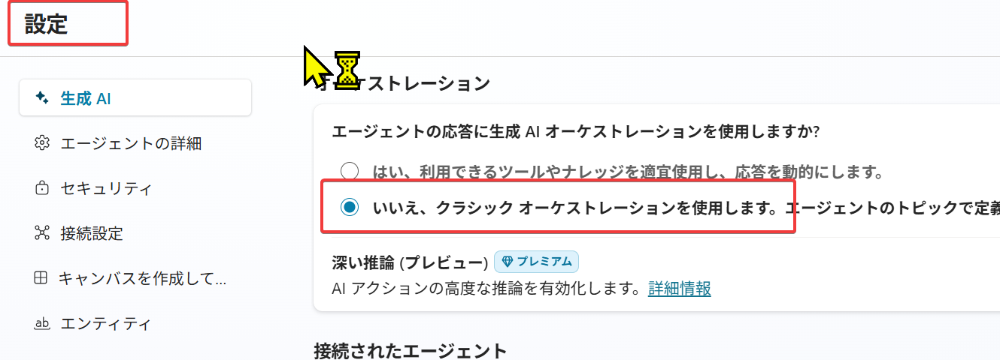
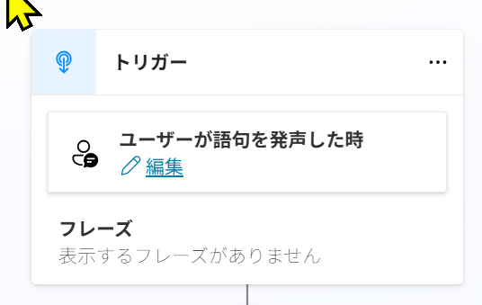

# PL-7008: Microsoft Copilot Studio でエージェントを作成する

<!--
Microsoft Learn教材: 
https://learn.microsoft.com/ja-jp/training/paths/create-extend-custom-copilots-microsoft-copilot-studio/
-->

## 2025/12/18 補足

エージェントの「設定」で生成AIオーケストレーションを無効に設定すると、トピック→最初から の画面のトリガーに「ユーザーが語句を発生した時」が表示されます。

## 講義

- [開始時のご案内](../opening.md)
- 講義
  - [講義資料PDF](https://github.com/hiryamada/notes/releases/download/PL-7008/pl-7008.pdf)
- [Microsoft 365 関連の認定試験のご案内](../ab-exam.md)
- [終了時のご案内](../closing-mscopilot.md)
- （希望者のみ）ラボ

## 時間配分（予定）

- 9:30 ～ 10:00 開始時のご案内、講師自己紹介
- 10:00 ～ 10:45 モジュール 1,5,6,8 解説
- 11:00 ～ 11:30 ラボ1,2 解説
- 11:30 ～ 13:30 ラボ1,2 実施 ＋ ランチタイム 
- 13:30 ～ 14:30 モジュール2,3,4,7 解説・ラボ3～9解説
- 14:45 ～ 15:00 認定試験のご案内、アンケート、終了時のご案内
- 15:00          講義終了（退室可）
- 15:00 ～ 17:30 （オプション）質疑応答 ＋ （オプション）ラボ3～9実施

## ラボ環境

- マイクロソフトアカウントの作成: https://signup.live.com/
  - '～@outlook.com' というメールアドレスでマイクロソフトアカウントを作成できます
- ラボ環境: https://esi.learnondemand.net/User/Login
- ラボ環境は起動してから1時間以上放置すると終了してしまいますのでご注意ください。

## ラボ手順書

ラボ手順はラボ環境内に表示されますので、ラボ実施時はそちらを参照してください。

ラボを起動せずにラボ手順のみ参照したい場合は以下のページを利用できます（英語版手順）

https://microsoftlearning.github.io/mslearn-copilotstudio/

## 不動産のプロモーションに役立つ情報が掲載されているサイト

ラボ4タスク2.2 で、エージェントのナレッジとして設定できる「公開Webサイト」の例。

- https://mailchimp.com/resources/generate-real-estate-leads/ 
- https://smei.org/marketing-strategy/ 

