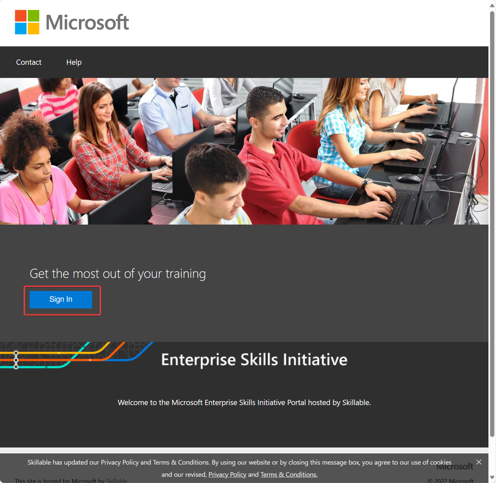
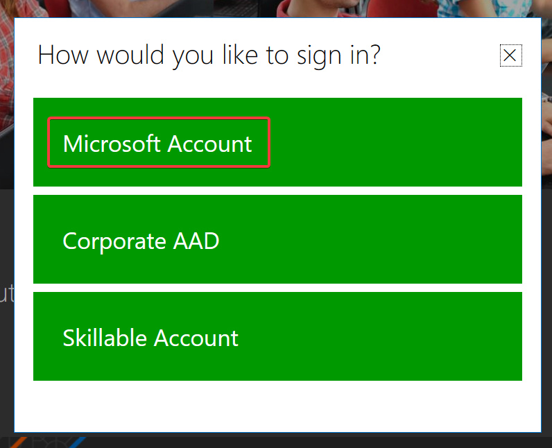
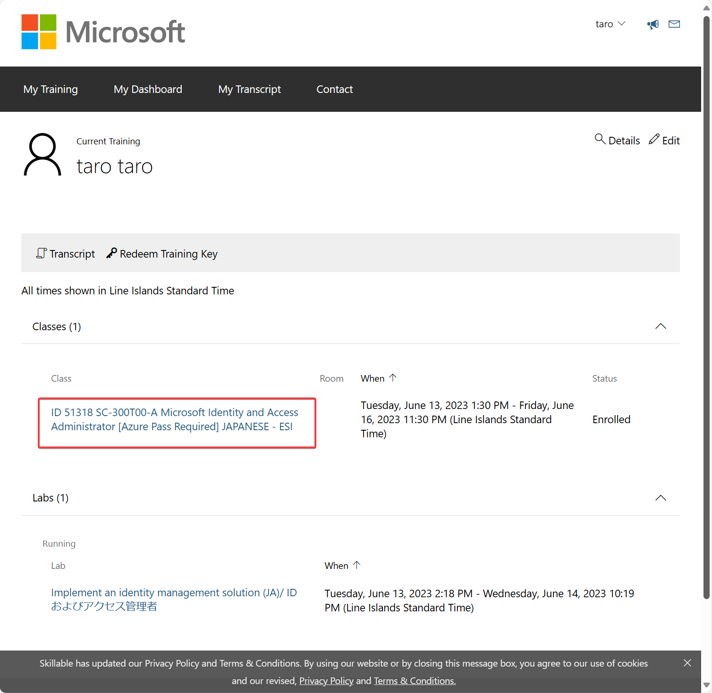
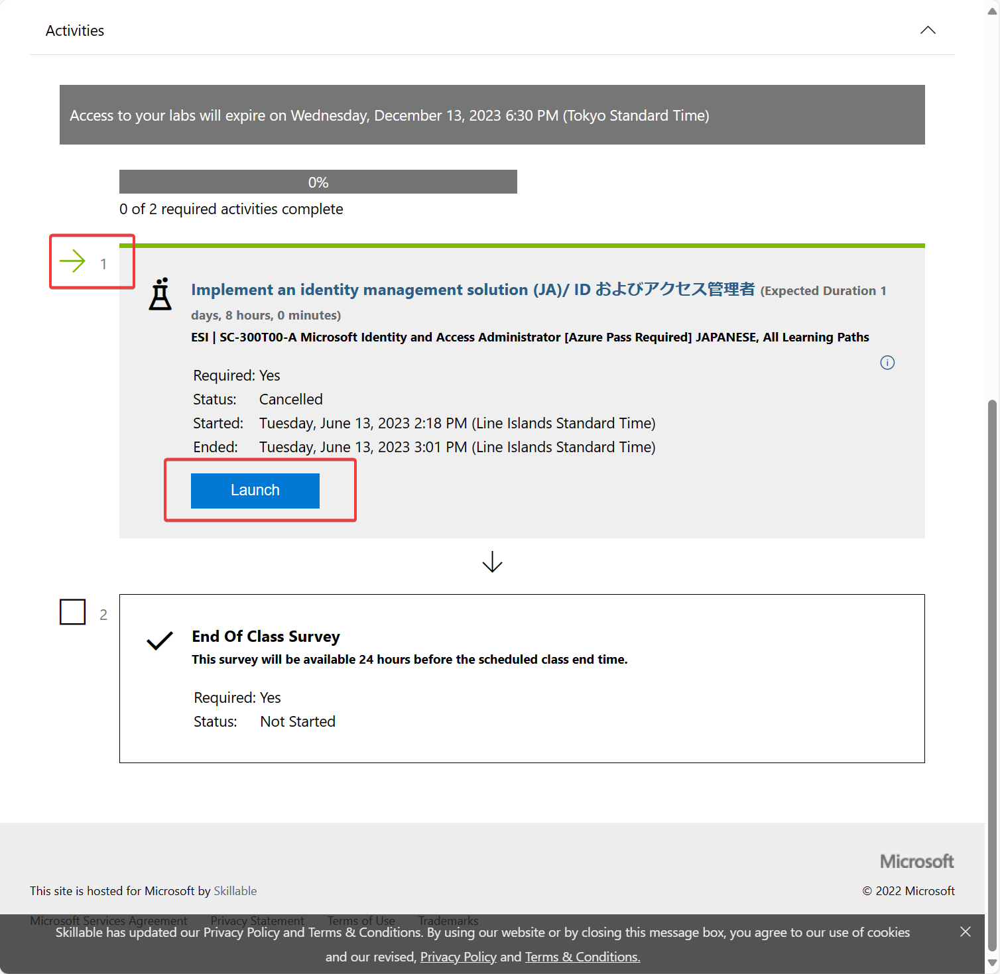
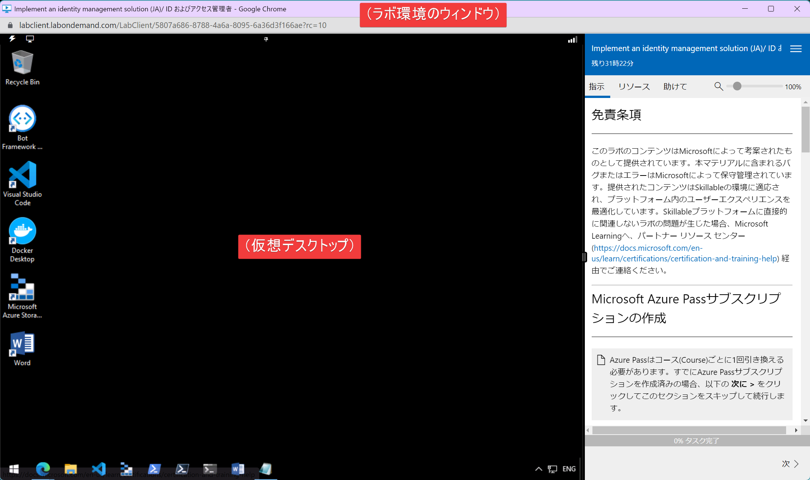
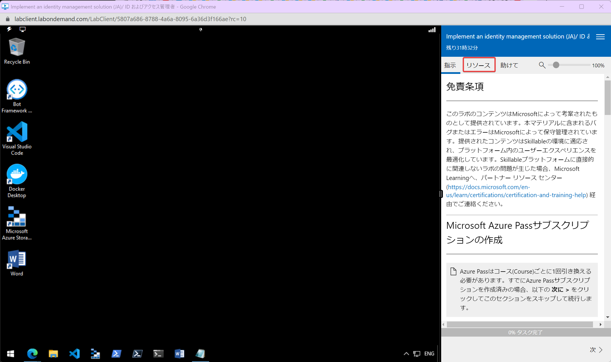
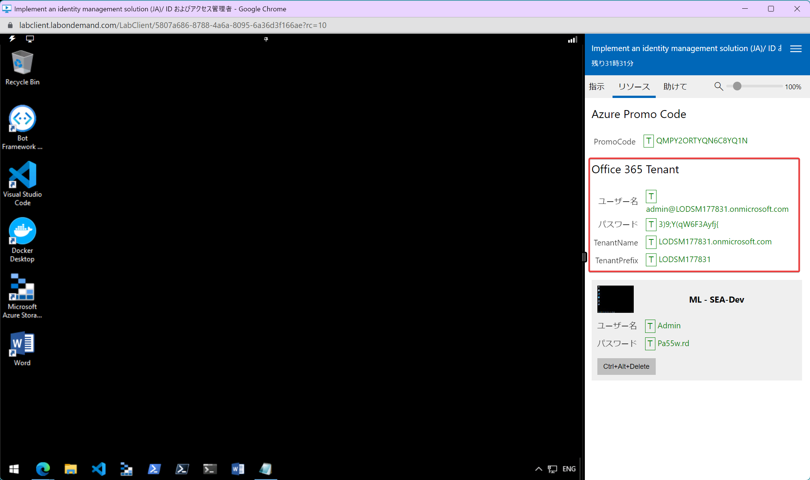
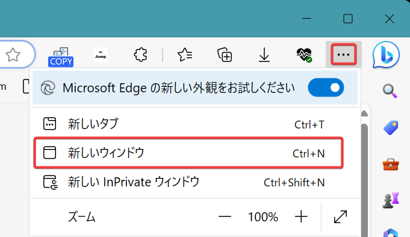
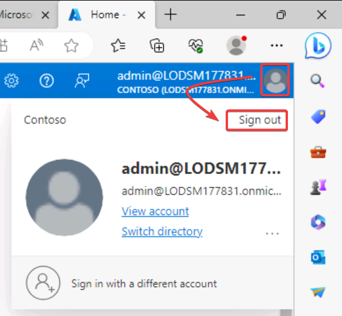
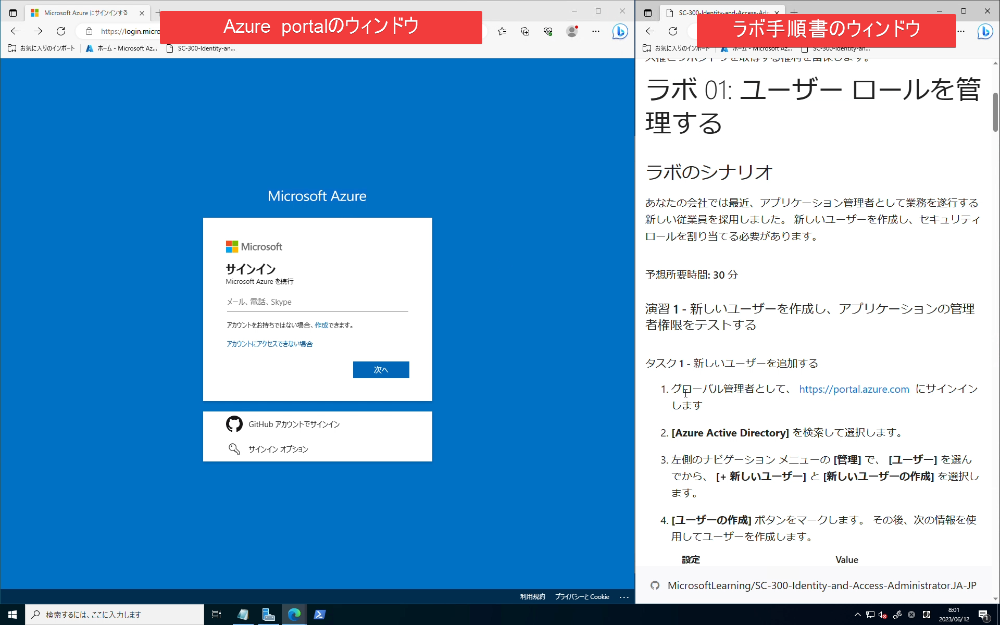

# ラボ1

## 概要

- ユーザーの作成
- 「アプリケーション管理者」ロールを割り当て・割り当てを削除
- CSVファイルによるユーザーの一括インポート
- ユーザーの削除と復元
- ライセンスの割り当て（「利用場所」設定が必要、Premium P2を割り当て）

## ラボ環境の起動

Webブラウザーで、ラボ環境を開きます。

https://esi.learnondemand.net/

サインイン（Sign In）をクリックします。

Microsoft Account をクリックします。

トレーニング開始時に作成したMicrosoftアカウントを使用してサインインします。

トレーニングの開始時（初日の朝）に、すでに「トレーニングキー」の入力は済んでいますので、SC-300のクラスが表示されるはずです。まだ「トレーニングキー」の入力をしていない方は、講師までお問い合わせください。

SC-300のクラスをクリックします。

少し下にスクロールして、ラボ1を起動（Launchをクリック）します。

3分ほどすると、ラボ環境のウィンドウが表示されます。

※ネットワークなどの状態によって、「仮想デスクトップ」部分がうまく表示されず、「接続の問題」といったエラーメッセージが表示される場合がありますが、それは無視してください。

右側「リソース」をクリックします。

Office 365 Tenant 情報をコピーして、手元のメモ帳などに記録してください。

以降、このウィンドウは開いたままにしておきます。

## ラボ環境のご注意

ラボ環境は以下のように、ウィンドウの左側に仮想デスクトップ、右側に手順書が表示される構成となっています。

ラボの実施中は、このウィンドウは閉じずに、そのままにしておいてください。

現在、このSC-300のラボ環境（仮想デスクトップ）では、以下のような問題が発生する場合があります。

- 仮想デスクトップが表示されない
- コピー・ペーストができない
- タイプした文字が二重に打ち込まれる場合がある
  - 例 `azure` → `aazzuurree`
- 日本語が入力できない
- 「指示」にラボ手順書が表示されない

そこで、ラボ環境（仮想デスクトップ）ではなく、お手元のPCのWebブラウザーを使用してラボを実施してください。

## ラボの実施

- お手元のPCで、Webブラウザーのウィンドウを2つ開きます。
  - （2つのタブではなく、2つのウィンドウを開きます）

- ウィンドウを左右に並べます。
- 1つのウィンドウ（左）では、Azure portalを開きます。
  - https://portal.azure.com/
  - サインイン画面が表示されます。もし、別のアカウントでサインイン済みになってしまう場合は、画面右上のアイコンをクリックして「サインアウト」を選び、サインアウトして、サインイン画面を表示します。

- もう一つのウィンドウ（右）では、ラボ手順書を開きます。
  - https://microsoftlearning.github.io/SC-300-Identity-and-Access-Administrator.JA-JP/

- Azure portalのウィンドウにて、さきほどラボ環境からコピーしておいたOffice 365 Tenant 情報のユーザー名とパスワードを使用して、Azure portalにサインインします。
- 以降は、画面右側のラボ手順書に従ってラボ（演習）を進めます。

## 動画

ラボの実施手順を記録した動画です。

ご自身でラボの操作をされる前に、動画を使用して、手順を確認していただくことをおすすめします。

- SC-300 ラボ1 演習1 https://youtu.be/w4SgKrDpEeY
- SC-300 ラボ1 演習2 https://youtu.be/twOHLfAy_Mw
- SC-300 ラボ1 演習3 https://youtu.be/C3MNFxliHZE
- SC-300 ラボ1 演習4 https://youtu.be/HVVu5zMbHiQ
- SC-300 ラボ1 演習5 https://youtu.be/1yQnXYlbI1I
- SC-300 ラボ1 演習6 https://youtu.be/cyQnzxzAKt8
