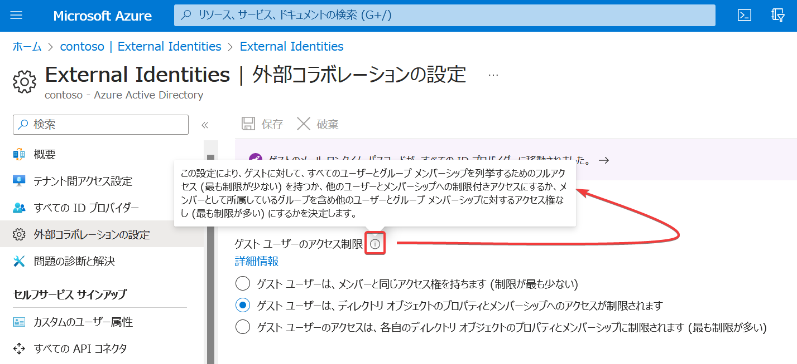

# ラボ4

ゲストとしてテナントに招待された外部ユーザーのアクセス権などを設定（確認）します。

## 概要

- ユーザー＞ユーザー設定＞外部コラボレーションの設定を管理します
- 「ユーザー フローによるゲスト セルフサービスのサインアップを有効にする」を有効化
- External Identities＞すべてのIDプロバイダー＞メールのワンタイム パスコード（Yesを確認）
- 外部コラボレーションの設定
- 「ゲスト ユーザーのアクセスは、各自のディレクトリ オブジェクトのプロパティとメンバーシップに制限されます (最も制限が多い)」を選択
- 「メンバー アクセス許可を持つゲストを含むメンバー ユーザーと特定の管理者ロールに割り当てられたユーザーがゲスト ユーザーを招待できる」を選択
- 「ユーザー フローによるゲスト セルフサービスのサインアップを有効にする」を「いいえ」に設定

## ラボの開始手順

→ [ラボの開始手順](lab00.md)

## 注意

各設定の意味についてはAzure portal内のヘルプメッセージ（「i」をポイントすると表示される）でも確認できます。

また「詳細情報」をクリックするとAzure ADのドキュメントが表示され、更に詳しい情報を確認できます。

## 動画

ラボの実施手順を記録した動画です。

ご自身でラボの操作をされる前に、動画を視聴して、手順を確認していただくことをおすすめします。

音声はありません。

- SC-300 ラボ4 https://youtu.be/JRgkP-VuPz4
