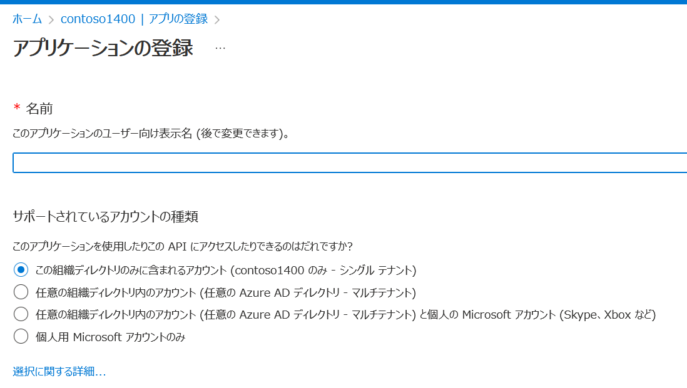

# アプリの登録

■アプリの登録とは？

https://learn.microsoft.com/ja-jp/azure/active-directory/develop/active-directory-how-applications-are-added#why-do-applications-integrate-with-azure-ad

「Azure AD アプリケーション ギャラリー」に登録されていない、自社の新規に開発したアプリケーション（業務アプリ等）は、自社のAzure ADテナントに登録できる。

新規に開発したアプリケーションをAzure ADに登録することを「アプリの登録」という。

■なぜ「アプリの登録」をするのか？

「アプリの登録」により、次のようなメリットが得られる。

- アプリケーションへのサインインにAzure ADを使用できる。
  - ID管理の一元化
  - シングルサインオン
  - 条件付きアクセス
  - MFA
- アプリからMicrosoft Graphを呼び出すことができるようになる
  - アプリからOutlook、OneDrive、Azure ADなどのデータや機能にアクセスできる
- アプリのAPIを、別のアプリに公開し、使わせることができる
- （オプション）他社テナントのユーザーや、Microsoftアカウントをもつユーザーにも、アプリを利用してもらうことができる

■「エンタープライズアプリケーションの追加」と「アプリの登録」の違いは？

「エンタープライズアプリケーションの追加」は、すでにAzureの他テナントに登録されているアプリを、自社で使用する場合に使用する。アプリは「Azure AD アプリケーション ギャラリー」から追加する。

「アプリの登録」は、新規に開発した、「Azure AD アプリケーション ギャラリー」に登録されていないアプリを、Azure AD に登録する際に使用する。

■「アプリの登録」で登録したアプリは、誰が使用できるのか？

「アプリの登録」をすると、そのアプリは、そのテナントに、「エンタープライズアプリケーション」としても追加される。

「エンタープライズアプリケーション」側で、アプリをユーザーに割り当てることで、ユーザーはそのアプリにアクセスできるようになる。

■どのテナントが、「アプリの登録」で登録されたアプリを使用できるのか？

「アプリの登録」の「サポートされているアカウントの種類」で決定する。

- この組織ディレクトリのみに含まれるアカウント
- 任意の組織ディレクトリ内のアカウント
- 任意の組織ディレクトリ内のアカウントと個人の Microsoft アカウント
- 個人用 Microsoft アカウントのみ

||自社テナントのAzure ADユーザー|他社テナントのAzure ADユーザー|Microsoftアカウント|
|-|-|-|-|
|この組織ディレクトリのみに含まれるアカウント|○|✕|✕|
|任意の組織ディレクトリ内のアカウント|○|○|✕|
|任意の組織ディレクトリ内のアカウントと個人の Microsoft アカウント|○|○|○|
|個人用 Microsoft アカウントのみ|✕|✕|○|

※シングルテナント＝自社テナントのみでアプリを使用できる。自社専用の業務アプリを登録する場合に使用。

※マルチテナント＝全テナントでアプリを使用できる。他社にも使ってほしい業務アプリを登録する場合に使用。

■誰が「アプリの登録」を実行できるのか？

Azure AD のデフォルトでは、すべてのユーザーが「アプリの登録」を実行できる。

この状態での運用が推奨されている。

■なぜ、デフォルトで「アプリの登録」ができるようになっているのか？なぜ、これが推奨なのか？

https://jpazureid.github.io/blog/azure-active-directory/users-can-register-applications/

> 管理者としては、一般のユーザーにアプリケーションを登録できるようにしておくことについて抵抗感を持たれるようなことがあるのではないかとも思います。
>
>しかし、この設定を「いいえ」に設定してユーザーによる登録を制限した場合には、ユーザーは自身で Azure Active Directory のテナントを作成して組織の管理が及ばないテナントにアプリケーションを登録して作業を行う可能性が高くなります。このような状況は、いわゆるシャドー IT を促進してしまうことに繋がるため、「ユーザーはアプリケーションを登録できる」の設定を「はい」にすることを推奨しています。
>
>組織で管理されているユーザーがビジネスを目的として組織アカウントを使用してアプリケーションを利用されることで、管理者はどのようなアプリケーションが、どのユーザーによって利用されているか確認することができます。また、その利用が適切でない場合には、ユーザーに注意を促すこともできますし、ユーザーが組織を離れた場合にも、その組織アカウントを削除することでアプリケーションへのアクセスも停止させることができるなど一元管理のメリットを得られます。

■（それでも）一般ユーザーによる「アプリの登録」を制限するには

https://learn.microsoft.com/ja-jp/azure/active-directory/roles/delegate-app-roles#restrict-who-can-create-applications

組織の [ユーザー設定] ページで、 [ユーザーはアプリケーションを登録できる] 設定を [いいえ] に設定する。

この場合、以下のAzure ADロールを割り当てられたユーザーだけが、「アプリの登録」を作成できるようになる。

- 全体管理者
- アプリケーション管理者
- アプリケーション開発者
- クラウド アプリケーション管理者

