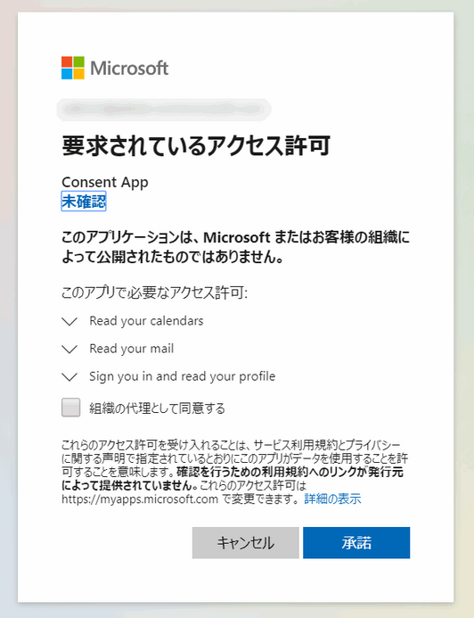
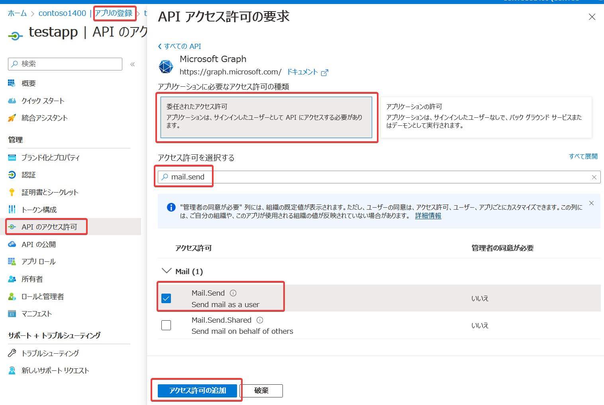

# Azure AD 同意のフレームワーク（consent framework）

※「アプリケーションの同意ユーザー エクスペリエンス」とも。

https://learn.microsoft.com/ja-jp/azure/active-directory/develop/application-consent-experience

ユーザーが、アプリケーションに対し、権限を委任する仕組み。

※委任＝（仕事などを）（別の人間などに）まかせること。許可を出すこと。

アプリケーションが動作するために必要な権限だけを許可（付与）することができる。

一般ユーザーによる同意と、管理者による同意の2種類がある。

https://jpazureid.github.io/blog/azure-active-directory/azure-ad-consent-framework/

https://docs.microsoft.com/ja-jp/azure/active-directory/develop/consent-framework

https://docs.microsoft.com/ja-jp/azure/active-directory/develop/v2-permissions-and-consent

「アプリの登録」の「APIのアクセス許可」で、アプリが必要とする「アクセス許可」を追加する。

