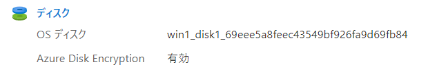

# Azure Disk Encryption

2016/9/29 Azure Disk Encryption 一般提供開始
https://azure.microsoft.com/ja-jp/updates/generally-available-azure-disk-encryption-for-windows-and-linux-for-standard-and-premium-iaas-virtual-machines/

- VMのOS とデータ ディスクのボリュームを暗号化
  - BitLocker 機能を使用(Windows VM)
  - DM-Crypt 機能を使用(Linux VM)
- 一時ディスクの暗号化も可能
  - [VolumeType パラメーターでALLを指定(Windows VM)](https://docs.microsoft.com/ja-jp/azure/virtual-machines/windows/disk-encryption-windows#enable-encryption-on-a-newly-added-data-disk)
  - [EncryptFormatAll 機能を使用(Linux VM)](https://docs.microsoft.com/ja-jp/azure/virtual-machines/linux/disk-encryption-linux#use-encryptformatall-feature-for-data-disks-on-linux-vms)
- Azure Key Vaultを使用
    - キー コンテナーと VM は、同じ Azure リージョンおよびサブスクリプションに存在している必要がある
    - アクセスポリシーで「Azure Disk Encryption (ボリューム暗号化用)」を有効化する必要がある
- サポートされるVM
  - [第 1 世代(Gen1)と第 2 世代(Gen2)の VM](https://docs.microsoft.com/ja-jp/azure/virtual-machines/generation-2) をサポート
    - VM起動時の詳細設定タブで、VM generationセクションでGen1/Gen2を選択
    - [第 1 世代(Gen1)と第 2 世代(Gen2)の比較](https://docs.microsoft.com/ja-jp/azure/virtual-machines/generation-2#generation-1-vs-generation-2-capabilities)
  - Premium Storage を使用した VM でも利用可能
- 制限
  - Basic、A シリーズ VM、またはメモリが 2 GB 未満の仮想マシンでは利用できない
  - すべてのOSで使用できるわけではない
    - [動作保証されるLinux(Linux VM)](https://docs.microsoft.com/ja-jp/azure/virtual-machines/linux/disk-encryption-overview#supported-operating-systems)
    - [サポートされるOS(Windows VM)](https://docs.microsoft.com/ja-jp/azure/virtual-machines/windows/disk-encryption-overview#supported-operating-systems)

■設定例1

**途中でエラーが出るが問題ない**

https://docs.microsoft.com/ja-jp/azure/virtual-machines/windows/disk-encryption-portal-quickstart

- Windows VMを起動する
- VM＞ディスク＞追加設定＞暗号化設定（ADE）
- 暗号化するディスク」で「OSディスク」または「OSとデータディスク」を選択
- Key Vaultを新規作成(create new)
  - 基本タブ: Key Vaultの名前を入力
  - 「アクセスポリシー」タブ: 
    - 「Azure Disk Encryption (ボリューム暗号化用)」にチェックを入れる
  - 「確認および作成」、「作成」
- 作成が終わると、Key Vaultが選択された状態になるが、キーの選択で下記のようにエラーが出る。

caller needs data action: 'Microsoft.KeyVault/vaults/keys/read' to perform action on resource ...

- **エラーを無視して、画面下部「保存」をクリックする。**
- 検証が終わるまでしばらく待つ。完了すると「ディスク」の画面に遷移する。

設定状況の確認:

- VM＞概要＞ディスク で、Azure Disk Encryptionが有効になっていることが確認できる。

- VM＞拡張機能 で、AzureDiskEncryption が追加されていることが確認できる。

- 作成したKey Vaultには、「シークレット」として[「BEK」（BitLocker暗号化キー）](https://azure.microsoft.com/ja-jp/updates/azure-backup-now-supports-bek-encrypted-azure-virtual-machines/)が格納されていることが確認できる。

■設定例2

**こちらの手順の場合は途中でエラーが起きない**

- Windows VMを作成
- Key Vaultを新規作成
  - 基本タブ:
    - Key Vaultの名前を入力
    - リージョン: VMと同じにする
  - 「アクセスポリシー」タブ: 
    - 「Azure Disk Encryption (ボリューム暗号化用)」にチェックを入れる
    - 「アクセス許可モデル」として「Azure ロールベースのアクセス制御」を選択
  - 「確認および作成」、「作成」
  - アクセス制御（IAM）
    - 「キー コンテナー管理者」を、自分自身（操作中のユーザー）に割り当てる
  - キーを作成
    - key1
- VM＞ディスク＞追加設定＞暗号化設定（ADE）
  - Key Vault: 上記で作成したKey Vaultを選択
  - キー: key1
  - バージョン: （バージョンを選択）
  - 「保存」

設定状況の確認:

- VM＞概要＞ディスク で、Azure Disk Encryptionが有効になっていることが確認できる。

- VM＞拡張機能 で、AzureDiskEncryption が追加されていることが確認できる。

- Key Vault＞キーには、key1が格納されている。

- Key Vault＞シークレットには、「Wrapped BEK」（キーを使って暗号化（ラップ）されたBitLocker暗号化キー）が格納されている。

