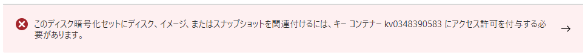
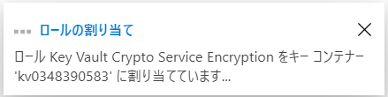
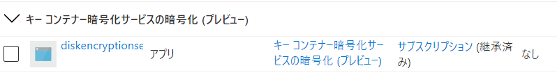
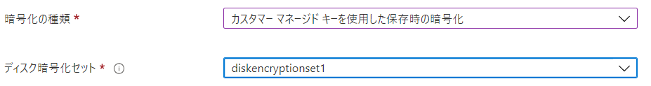

# Azure Disk Storage のサーバー側暗号化

※「Azure Storage 暗号化」とも

■サーバー側暗号化（SSE）

https://docs.microsoft.com/ja-jp/azure/virtual-machines/managed-disks-overview#server-side-encryption

- 対象
  - サーバー側暗号化は、マネージド ディスクを使用できるすべてのリージョンのすべてのマネージド ディスク、スナップショット、イメージに対して**既定で有効**
- 対象外
  - 一時ディスク
    - サーバー側暗号化によって暗号化されない
    - 「ホストでの暗号化」で暗号化できる
- キー
  - 暗号化と暗号化解除に使用される
- キーの管理
  - プラットフォーム マネージド キー（デフォルト）
    - プラットフォームが自動でキーを管理
  - カスタマー マネージド キー
    - Azure Key Vaultにキーを格納
    - お客様がキーを管理
    - 定期的にキーをローテーション (変更) 可能
      - コンプライアンス要件を満たすことができる
      - [自動のローテーションも可能](https://docs.microsoft.com/ja-jp/azure/virtual-machines/disk-encryption#automatic-key-rotation-of-customer-managed-keys)

■マネージドディスクの暗号化

https://docs.microsoft.com/ja-jp/azure/virtual-machines/disk-encryption

- Azure マネージド ディスク (OS およびデータ ディスク) に格納されているデータをクラウドに永続化するときに、既定で保存時に自動的に暗号化される
- 256 ビット AES 暗号化を使って透過的に暗号化される
- パフォーマンスには影響しない
- 追加のコストはかからない

```
Azure Storage（データを暗号化して保存）
↑
サーバー
└VM
 └マネージドディスク
```

■「ホストでの暗号化」との関係

ホストでの暗号化が有効になっているディスクの場合、Azure Storage では暗号化されない。

VM をホストしているサーバーがデータの暗号化を提供し、暗号化されたデータは Azure Storage に送信される。

```
Azure Storage（暗号化は行わない）
↑
サーバー（データを暗号化してAzure Storageに送信）
└VM（「ホストでの暗号化」を有効）
 └マネージドディスク
```

■SSEでCMKを使う手順

https://docs.microsoft.com/ja-jp/azure/virtual-machines/disks-enable-customer-managed-keys-portal


- Key Vaultとキーの準備
  - 「アクセスポリシー」タブで、**アクセス許可モデルを「Azure ロールベースのアクセス制御」に設定**
  - **消去保護を有効にする**
  - アクセス制御（IAM）
    - 自分自身（操作中のユーザー）にOwnerを割り当て
  - キーを作成 testkey
    - ※キー作成が失敗する場合はブラウザでページリロードしてリトライ
- 「ディスク暗号化セット」を作成
  - diskencryptionset1
  - SSE暗号化の種類: 以下のいずれかを選択
    - カスタマーマネージドキーを使用した保存時の暗号化
    - プラットフォームマネージドキーとカスタマーマネージドキーを使用した二重暗号化
    - Key Valut, キー, バージョン: 上記で作成したものを選択
  - 作成したディスク暗号化セットに移動し、概要ページの「このディスク暗号化セットにディスク、イメージ、またはスナップショットを関連付けるには、キーコンテナー～～にアクセス許可を付与する必要があります。」をクリック
  - 
  - ロールが割り当てられる
  - 
  - キーコンテナー側で割り当てられたロール
  - 
- VMの作成
  - 「ディスク」タブで、暗号化の種類を以下から選択
    - カスタマーマネージドキーを使用した保存時の暗号化
    - プラットフォームマネージドキーとカスタマーマネージドキーを使用した二重暗号化
    - 上記で作成した暗号化セットを選択
  - 
  - OSディスク、データディスクとも同様の設定
