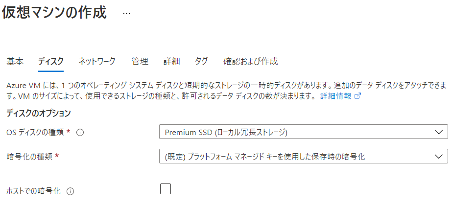

# ホストでの暗号化 (エンドツーエンド暗号化とも)

https://docs.microsoft.com/ja-jp/azure/virtual-machines/disks-enable-host-based-encryption-portal


わかりやすい図解
https://www.sebhook.com/2021/01/28/azure-host-based-encryption/


■概要

- VM ホスト上の格納データは、保存時に暗号化され、暗号化された状態でストレージ サービスに送られる
- 対象: OSとデータディスクのキャッシュ、一時ディスク、エフェメラルOSディスクの暗号化を行う。

■使用されるキー

- OS とデータ ディスクの**キャッシュ**
  - プラットフォーム マネージド キー
  - カスタマー マネージド キー
  - プラットフォーム マネージド キー＋カスタマー マネージド キー（二重暗号化）
- **一時ディスク**と**エフェメラル OS ディスク**
  - プラットフォーム マネージド キー

■機能の利用方法

https://docs.microsoft.com/ja-jp/azure/virtual-machines/disks-enable-host-based-encryption-portal#prerequisites

1. 以下のコマンドで機能を有効化

```
Register-AzProviderFeature -FeatureName "EncryptionAtHost" -ProviderNamespace "Microsoft.Compute"
```

2. 以下のリンクからAzure portalにサインイン ※現時点では、このリンクを使用しないと、ホストでの暗号化が表示されない

https://aka.ms/diskencryptionupdates


■VM作成時

仮想マシンの作成＞ディスク＞ホストでの暗号化 にチェック



■設定状況の確認・変更

仮想マシン＞ディスク＞追加設定＞ホストでの暗号化

※変更は、VM割当解除状態でなければできない。

