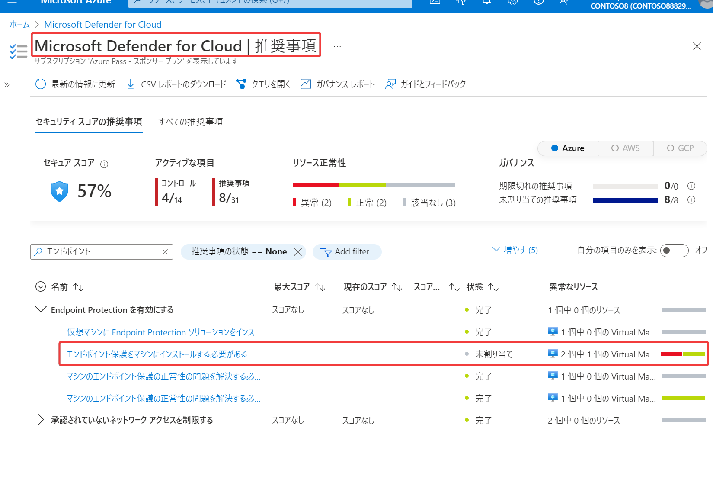
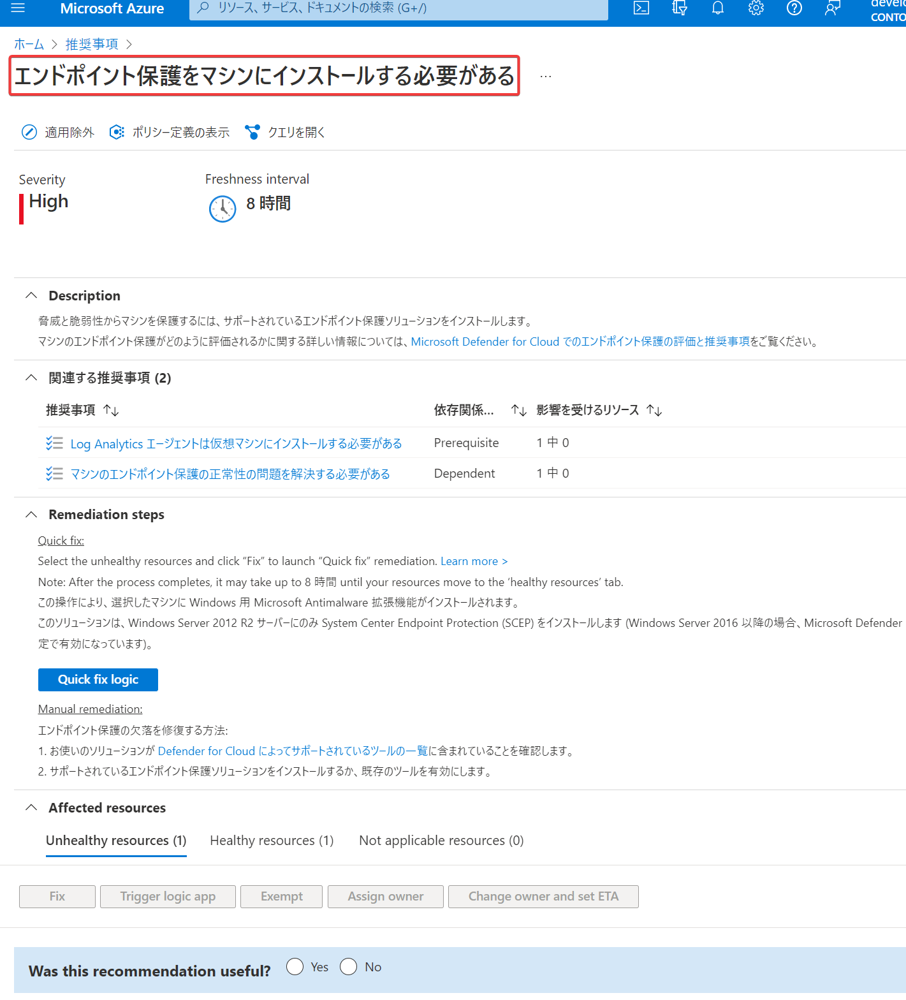

# エンドポイントの保護

■エンドポイントとは？

ユーザーと直接対話するコンピューター システム。

- PC
- スマホ
- タブレット

■参考: エンドポイント と EDR (Endpoint Detection and Response)

https://www.rworks.jp/cloud/azure/azure-column/azure-entry/26125/

> EDR（ Endpoint Detection and Response ）とは、ユーザーが利用するパソコンやサーバー、タブレットなどの「エンドポイント」における不審な動作・挙動を検知し、迅速な対応を支援するソリューション

https://www.cybereason.co.jp/blog/edr/2224/

> 高度化するサイバー攻撃をアンチウイルスやファイアウォールなどの従来型のセキュリティソリューションでは防ぎきることが難しくなったという状況があり、サイバー攻撃を入口で防御するだけでなく、攻撃者が組織内部に侵入した場合を想定し、迅速に検知、対応することによって被害を防ぐことを目的として、EDRが急速に広まっています。

■「Microsoft Defender for Endpoint」とは？

https://www.rworks.jp/cloud/azure/azure-column/azure-entry/26125/

> Microsoft Defender for Endpoint（旧： Microsoft Defender ATP ）は、マイクロソフトが提供しているクラウドベースの EDR 製品です。Windows 10 に標準コンポーネントとして組み込まれており、世界中の Windows 10 端末から収集された膨大なセキュリティ情報をマイクロソフト社のセキュリティスペシャリストによる分析を行っており、最新の脅威に対しても信頼性の高い対策を講じることが可能な製品となっています。

ドキュメント: https://learn.microsoft.com/ja-jp/microsoft-365/security/defender-endpoint/microsoft-defender-endpoint?view=o365-worldwide

■「Microsoft Defender for Cloud」 とは？

https://learn.microsoft.com/ja-jp/azure/defender-for-cloud/defender-for-cloud-introduction

Azure、オンプレミス、マルチクラウド (Amazon AWS および Google GCP) のすべてのリソース用のクラウド セキュリティ態勢管理 (CSPM) と クラウド ワークロード保護プラットフォーム (CWPP)。

■「Microsoft Defender for Cloud」 による「エンドポイント保護ソリューション」の監視

「Microsoft Defender for Cloud」で監視されている Windows / Linux マシンに「エンドポイント保護ソリューション」がインストールされていない場合、推奨事項「エンドポイント保護をマシンにインストールする必要がある」が表示される。

■「Microsoft Defender for Cloud」 でサポートされている「エンドポイント保護ソリューション」

https://learn.microsoft.com/ja-jp/azure/defender-for-cloud/supported-machines-endpoint-solutions-clouds-servers?tabs=features-windows&WT.mc_id=Portal-Microsoft_Azure_Security#supported-endpoint-protection-solutions

- Windows用
  - Microsoft Defender ウイルス対策 (Microsoft Defender Antivirus)
    - （Windows Server 2016 以降の OSに組み込まれている）
  - Microsoft System Center Endpoint Protection (Microsoft Antimalware)
    - （拡張機能による組み込み）
  - Trend Micro – Deep Security
  - Symantec v12.1.1100 以降
  - McAfee v10 以降
- Linux用
  - Microsoft Defender for Endpoint for Linux
    - （拡張機能による組み込み）
  - McAfee v10 以降
  - Sophos V9+
