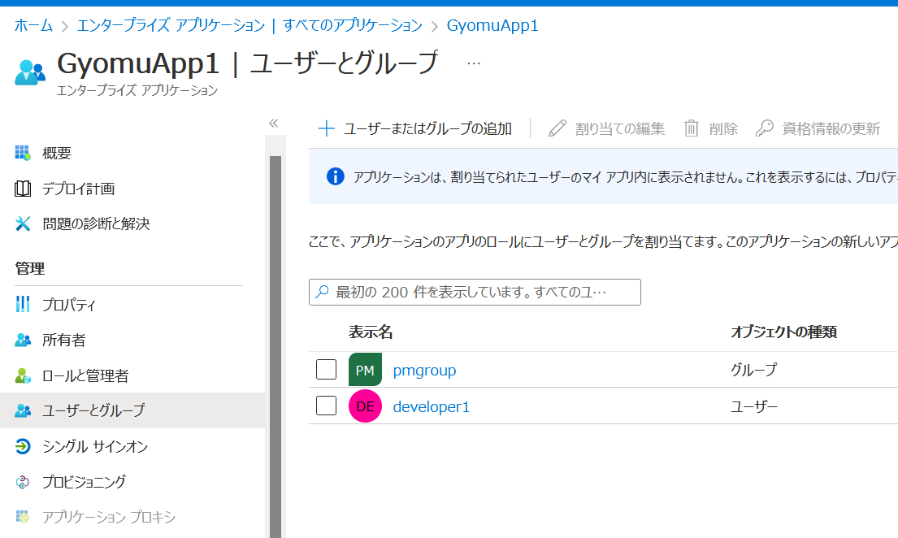
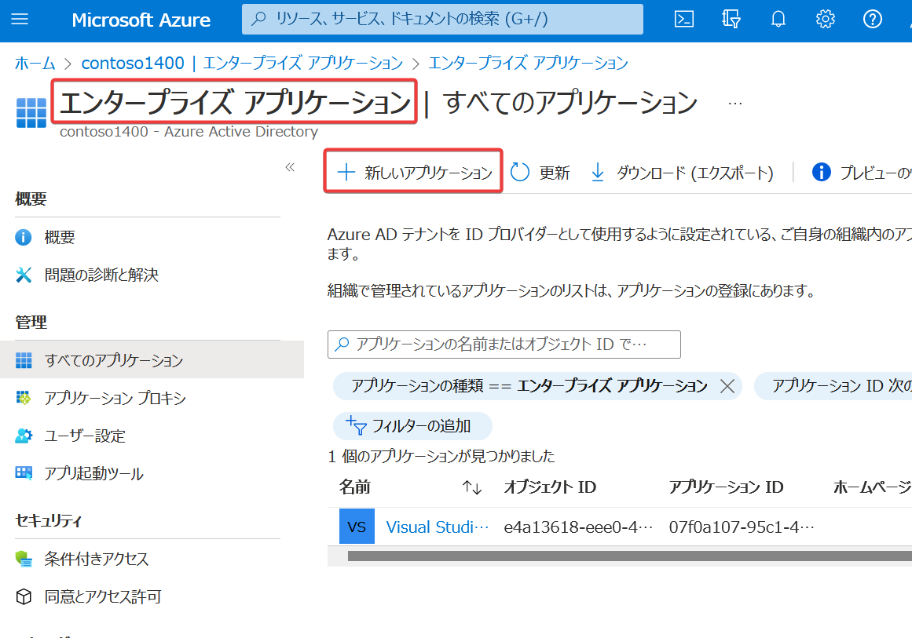
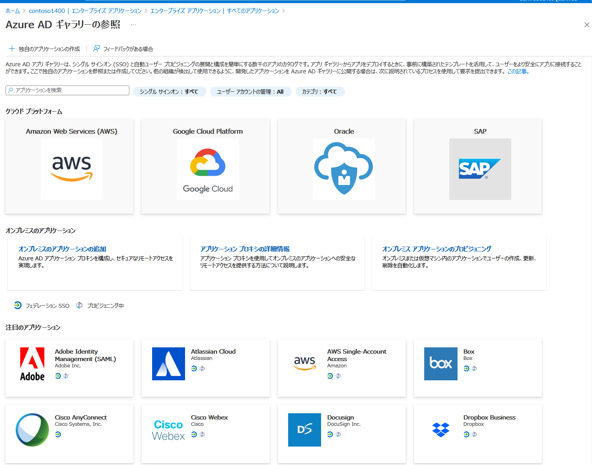
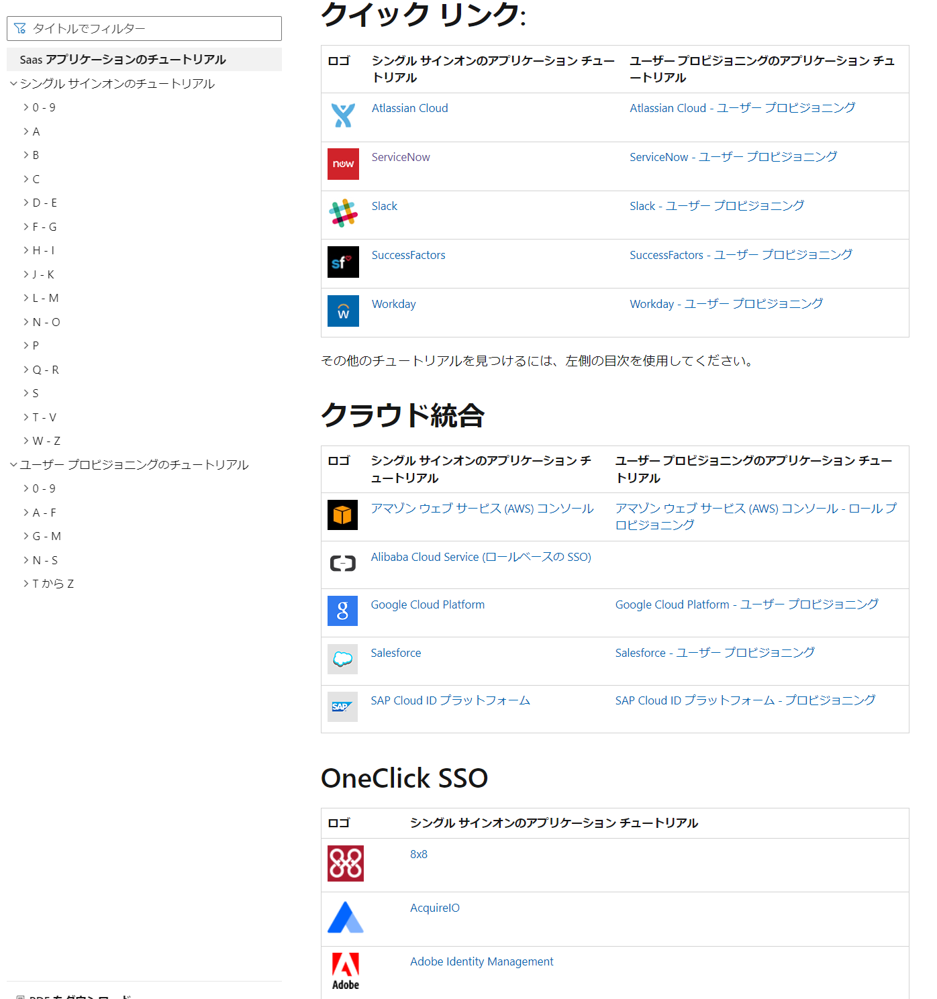

# エンタープライズ アプリケーション

■組織が使用するすべてのアプリケーションをAzure ADテナントに追加する（推奨）

https://learn.microsoft.com/ja-jp/azure/active-directory/fundamentals/five-steps-to-full-application-integration-with-azure-ad

組織が新しいアプリケーションの使用を開始したら、すぐにそれを Azure AD テナントに追加することが推奨されている。

https://learn.microsoft.com/ja-jp/azure/active-directory/manage-apps/overview-application-gallery

■なぜ、すべてのアプリケーションをAzure ADテナントに追加するのか？

https://learn.microsoft.com/ja-jp/azure/active-directory/fundamentals/five-steps-to-full-application-integration-with-azure-ad

アプリケーションをAzure AD テナントに追加することで、以下のメリットを活用できる。

- アプリケーションへのサインインにAzure ADを使用できる。
  - ID管理の一元化
  - シングルサインオン
  - 条件付きアクセス
  - MFAが使用できる
  - [自動ユーザープロビジョニング](https://learn.microsoft.com/ja-jp/azure/active-directory/app-provisioning/user-provisioning)が使用できる
    - Azure ADのユーザー情報をアプリに連携できる。
    - Azure ADにユーザーを作成 → アプリケーションにそのユーザー情報を反映
- アプリケーションにユーザーやグループを割り当てることで、そのユーザーやグループにアプリケーションの利用を利用させることができる（アプリの利用をコントロールできる）
- 組織でのアプリケーション利用状況の把握が可能となる

■誰が、アプリケーションをAzure ADテナントに追加できるのか？

以下のAzure ADロールが割り当てられたユーザー。

- グローバル管理者
- クラウド アプリケーション管理者
- アプリケーション管理者

■追加されたアプリケーションは、誰が利用できるのか？

エンタープライズアプリケーションの「ユーザーとグループ」で追加したユーザーとグループが、このアプリを使用できる。

■Azure AD アプリケーション ギャラリー

「Azure AD アプリケーション ギャラリー」を使用すると、すでにAzureに登録された、何千ものアプリケーションを、自社のAzure ADテナントにすばやく追加できる。

Azure portal＞Azure AD＞エンタープライズ アプリケーション＞＋新しいアプリケーション

■チュートリアル

https://learn.microsoft.com/ja-jp/azure/active-directory/saas-apps/tutorial-list

主要なアプリケーションをAzure ADに追加するためのチュートリアルが提供されている。

Salesforce、ServiceNow、Adobe Creative Cloud、Slack、Zoom、Dropbox、AWS、Google Cloudなど・・・。

■「エンタープライズ アプリケーション」の「所有者」※ロールではない

https://learn.microsoft.com/ja-jp/azure/active-directory/manage-apps/assign-app-owners?pivots=portal

「所有者」は、シングル サインオン、自動ユーザープロビジョニング、ユーザー割り当てなど、アプリケーションの組織固有の構成を管理できる。

「所有者」は、自分が所有するアプリケーションのみを管理できる。

■「エンタープライズ アプリケーション」の「所有者」はどのように設定されるのか？

管理者ロールを持たないAzure ADユーザーが、「アプリの登録」で、アプリケーションを登録すると、そのユーザーは、そのエンタープライズ アプリケーションの「所有者」となる。

「所有者」は、他の「所有者」を追加または削除できる。

「アプリケーション管理者」ロールや「クラウド アプリケーション管理者」ロールを持つユーザーは、組織内のエンタープライズ アプリケーションに「所有者」を割り当てることができる。
