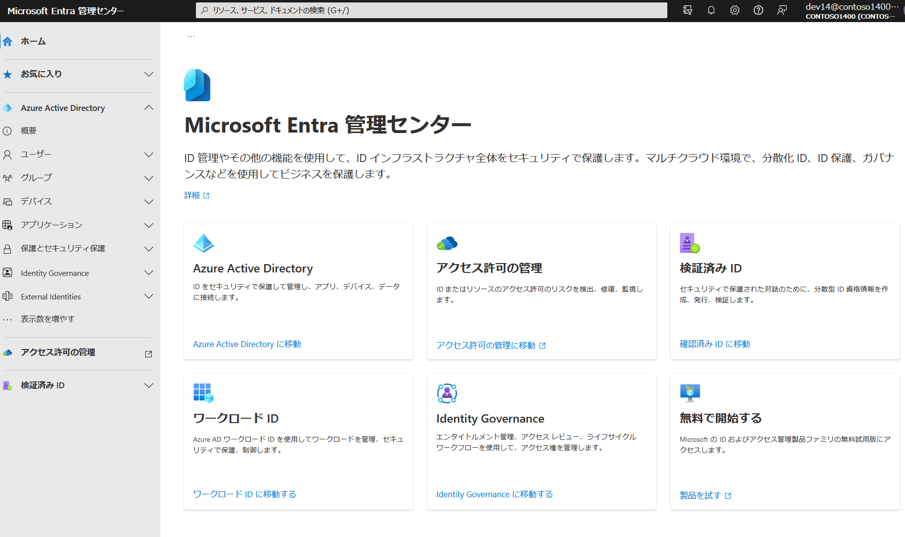
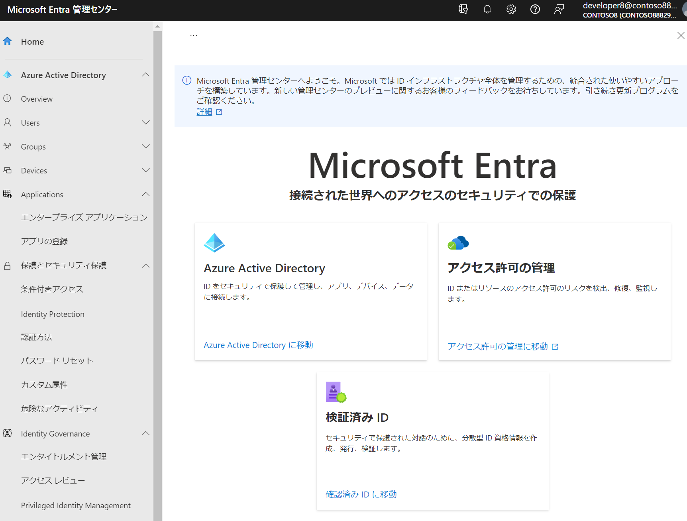

# Microsoft Entra（エントラ、エンチュラ、「入口」）

2022/5/31より、Azure AD は Microsoft Entraの一部となった。Entraには「Azure AD」、「Permissions Management」、「Velified ID」が含まれる。

- Microsoft Entra
  - Azure AD
  - Permission Management
  - Velified ID

Permissions Management(アクセス許可の管理)はCIEM(Cloud Infrastructure Entitlement Management)ソリューション。7/28に一般提供開始。[元CloudKnox（2021/7に買収）](https://jpazureid.github.io/blog/azure-active-directory/CloudKnox-acquisition-whats-available-now-and-whats-coming-soon/)。マルチクラウドにおける未使用および過剰なアクセス許可の検出、修復、継続的監視を行う。具体的には、Azureに加えてAWSやGCPのアクセス許可を一元的に監視・修復。（なお[Microsoft Defender for Cloud](https://learn.microsoft.com/ja-jp/azure/defender-for-cloud/defender-for-cloud-introduction)はCSPM/CWPPソリューションであり、CSPMはクラウドの設定ミスの発見と修復を行う）

Velified ID(確認済みID)は分散型ID（DID）を提供。8/28に一般提供開始。ユーザーが自分の属性情報に関するコントロール権を確保した上で、各データ保有者が保有するユーザーの属性情報のうち必要な情報を、ユーザーの許可した範囲で連携し合う。具体的には、企業が従業員を証明し、提携企業の割引制度を使う、学校が卒業生に証書を発行する、などのシナリオに対応。

Microsoft EntraのURL
https://entra.microsoft.com/

ドキュメント
https://learn.microsoft.com/ja-jp/entra/

Entra発表時のブログ（日本語訳）
https://news.microsoft.com/ja-jp/2022/06/01/220601-secure-access-for-a-connected-worldmeet-microsoft-entra/

分散型IDについての解説（野村総研）
https://www.nri.com/-/media/Corporate/jp/Files/PDF/service/ips/technology_1.pdf

「クラウドエンタイトルメント」とは
https://www.scsk.jp/sp/sysdig/blog/container_security/ciem.html

