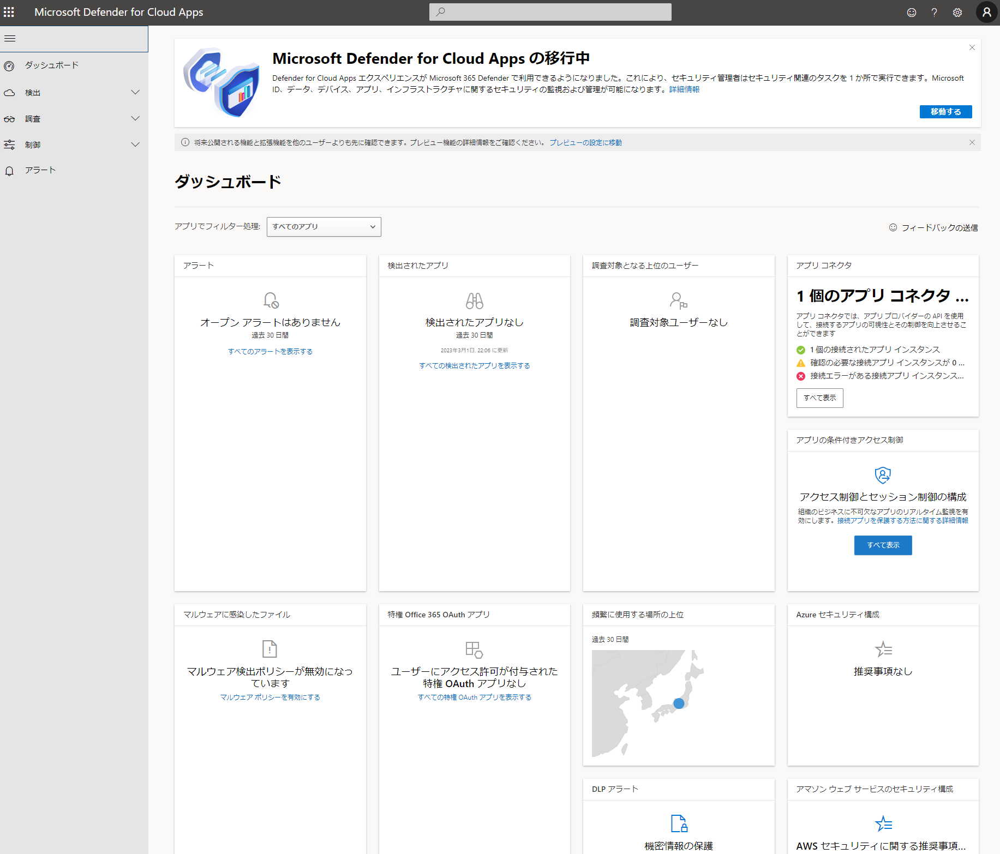

# Microsoft Defender for Cloud Apps

旧 Microsfot Cloud App Security（MCAS）

MCASの入門ビデオ（少し古いですが、おすすめ）
https://www.youtube.com/watch?v=PbgQpWeduMY

■Microsfot Defender for Cloud Apps とは？

CASB (キャスビー Cloud Access Security Broker) 製品。

https://portal.cloudappsecurity.com

■CASBとは？

https://www.nri-secure.co.jp/glossary/casb
企業や組織が、従業員によるクラウドサービスの利用を可視化・制御するソリューション

■クラウド アプリの利用状況を分析する ～Cloud Discovery ダッシュボード～

https://learn.microsoft.com/ja-jp/defender-cloud-apps/set-up-cloud-discovery

31,000 を超えるクラウド アプリが掲載されたカタログに照らしてトラフィック ログを分析する。

組織内のクラウド アプリの全体的な使用状況をひとめで確認できる。

■クラウド アプリのリスクを評価する ～クラウド アプリ カタログ～

■検出機能を強化する ～アプリコネクター～

https://learn.microsoft.com/ja-jp/defender-cloud-apps/enable-instant-visibility-protection-and-governance-actions-for-your-apps

Microsoft Defender for Cloud Apps の検出機能と制御機能を強化できる。

例: Box（クラウドストレージ）を接続する
https://cloudsteady.jp/post/52505/

■AD FS から Azure ADへ移行できるか調べる ～AD FS アプリケーション アクティビティ レポート～

https://learn.microsoft.com/ja-jp/azure/active-directory/reports-monitoring/concept-usage-insights-report#ad-fs-application-activity

多くの組織は、AD FS を使用して、クラウドアプリケーションに SSO を提供している。

※[AD FSの概要](https://atmarkit.itmedia.co.jp/fwin2k/operation/adfs2sso03/adfs2sso03_01.html)

※[現在はAD FSを廃止してAzure ADへ移行する企業が多くなっている。](https://www.google.com/search?q=ad+fs+%E5%BB%83%E6%AD%A2)

AD FS アプリケーションを Azure AD に移動して認証を行うことには、特にコスト管理、リスク管理、生産性、コンプライアンス、ガバナンスに関して大きなメリットがある。

Azure portal の 「Azure AD の使用状況と分析情報レポート」＞「AD FS アプリケーション アクティビティ レポート」を使用して、Azure AD に移行できるアプリケーションをすばやく特定できる。

過去 30 日間に認証のためにアクティブなユーザー ログインが行われた、自身の組織内のすべての AD FS アプリケーションが一覧表示される。

■さらなる学習のためのコンテンツ

Microsoft Learn ラーニングパス: Microsoft Defender for Cloud Apps
https://learn.microsoft.com/ja-jp/training/paths/m365-cloud-app-security-fundamentals/

ドキュメント
https://learn.microsoft.com/ja-jp/defender-cloud-apps/what-is-defender-for-cloud-apps
