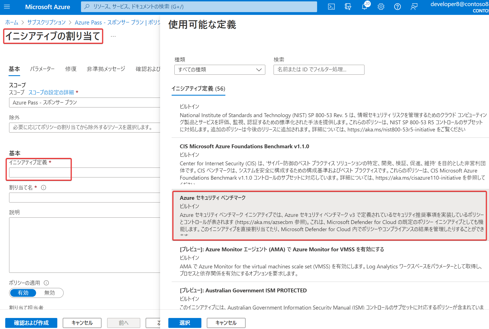

# Microsoft クラウド セキュリティ ベンチマーク

旧「Azure セキュリティベンチマーク」, 2022/10にリブランディング

https://aka.ms/azsecbm

※セキュリティの「ベンチマーク」は、（コンピュータの性能をスコア化するものではなく）セキュリティのガイドライン、ベストプラクティス、対策集などを表す。

https://docs.microsoft.com/ja-jp/security/benchmark/azure/overview

Azure とマルチクラウド環境のワークロード、データ、およびサービスのセキュリティを強化するための規範的なベスト プラクティスと推奨事項を提供。

推奨事項は、環境内で特定のセキュリティ構成設定を選択するための開始点となり、組織のリスクの迅速な軽減に役立つ。

■コントロール

https://learn.microsoft.com/ja-jp/security/benchmark/azure/overview#controls

Azure Security Benchmarkは12個の「コントロール」（分野）から構成されている。

■スプレッドシート（表）

スプレッドシート形式で Azure セキュリティ ベンチマークをダウンロードできる。https://github.com/MicrosoftDocs/SecurityBenchmarks

■Azure Policyの「Azure セキュリティベンチマーク」イニシアチブ

https://learn.microsoft.com/ja-jp/azure/governance/policy/samples/azure-security-benchmark

Azure Security BenchmarkをAzure Policyとして提供するもの。たとえば、Azureサブスクリプションに、このイニシアチブを割り当てることで、リソースが Azure Security Benchmark に準拠していることを確認できる。

■参考: IPAの「情報セキュリティベンチマーク」

https://www.ipa.go.jp/security/benchmark/benchmark_tokuchover47.html

情報セキュリティ対策ベンチマークでは、Web上の質問に答えると、散布図、レーダーチャート、スコア（点数）などの診断結果が自動的に表示されます。本システムで実際に診断を行った企業の診断データに基づき、自社の対策状況を他社の対策状況と比較することができます。

■参考: CIS Benchmarks

https://www.nri-secure.co.jp/glossary/cis-benchmarks

> 情報システムを安全に構築・維持管理するためのベストプラクティスをまとめたガイドラインで、PCやサーバ、ネットワーク機器、モバイル機器、データベース、アプリケーション、クラウドサービス等の製品やサービスに対してバージョンごとに詳細なパラメータまでを定めています。