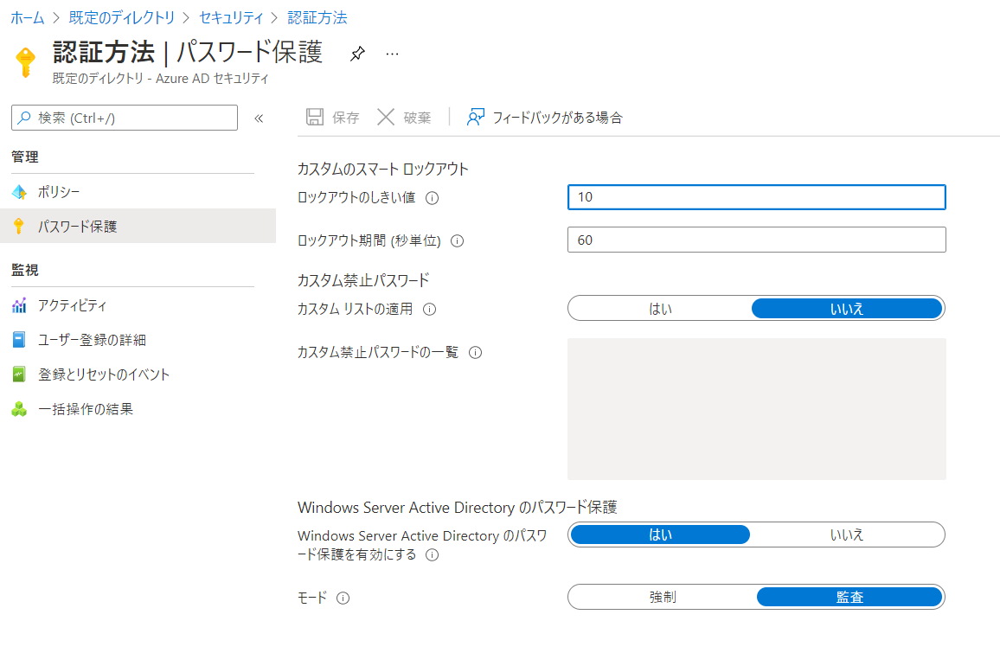

# パスワード保護

https://docs.microsoft.com/ja-jp/learn/modules/explore-authentication-capabilities/6-describe-password-protection-management

https://docs.microsoft.com/ja-jp/azure/active-directory/authentication/concept-password-ban-bad-combined-policy

■パスワード保護とは

- ユーザーが**脆弱なパスワード**を設定するリスクを軽減する機能
  - ユーザーがパスワードを**設定**・**変更**する際にチェックがかかる
- **パスワードスプレー攻撃**で使用される可能性がある**脆弱なパスワード**を効率的にブロックできる
- ブロックされる可能性のあるパスワードの例: P@$$w0r や Passw0rd1
- **脆弱なパスワード**とそのバリアント（変形）が検出され、ブロックされる

■脆弱なパスワードとは

https://docs.microsoft.com/ja-jp/azure/active-directory/authentication/tutorial-configure-custom-password-protection#configure-custom-banned-passwords

- ユーザーは多くの場合、学校、スポーツ チーム、有名人などのありふれた単語を使用してパスワードを作成する
- 組織名、製品名、本社の場所、会社固有の内部用語・略語などもよく使用される
- これらのパスワードは簡単に推測できるため、脆弱である。

■パスワードスプレー攻撃とは

https://docs.microsoft.com/ja-jp/windows-server/identity/ad-fs/technical-reference/ad-fs-password-protection#password-spray-attack

多数のアカウントに対して、**脆弱なパスワード**を試す攻撃。

```
Azure AD
├user1@example.com / bk3a_feFWfJ!E234
├user2@example.com / MGJS329fMF98$-fJ
└user3@example.com / p@ssword   ......... 脆弱なパスワード

↑多数のユーザーに対し、サインインを試行
攻撃者
```

脆弱なパスワードが設定されたアカウントがあると、攻撃者によってそのアカウントが奪取されてしまう。

■禁止パスワード リスト

ユーザーがパスワードを変更またはリセットすると、強力なパスワードを使用するように強制するために、リストを使用してチェックされる

- グローバル 禁止パスワード リスト
  - Azure AD テナント内のすべてのユーザーに自動的に適用される
  - Azure AD Identity Protection チームによって管理
  - 有効化したり構成したりする必要はない
  - 無効にすることはできない
  - セキュリティを強化するため、Microsoft ではグローバル禁止パスワード リストの内容を公開していない
- カスタム 禁止パスワード リスト
  - エントリを定義できる
  - 組織固有のその他の脆弱な用語をブロックすることもできる
  - 脆弱なバリエーションや組み合わせが自動的にブロックされる。
    - 例 "Contoso" と設定すると、"Contoso!1" などもブロックされる

■カスタム禁止パスワードリストの設定方法

Azure AD＞セキュリティ＞認証方法＞パスワード保護



■オンプレミスAD DSでのパスワード保護

https://docs.microsoft.com/ja-jp/azure/active-directory/authentication/concept-password-ban-bad#on-premises-hybrid-scenarios

https://docs.microsoft.com/ja-jp/azure/active-directory/authentication/concept-password-ban-bad-on-premises

https://docs.microsoft.com/ja-jp/azure/active-directory/authentication/howto-password-ban-bad-on-premises-deploy

- オンプレミスAD DSでのパスワード変更時も、Azure ADポリシーに準拠したパスワードを設定するように、強制することができる。
- Azure AD に格納されているものと同じ**グローバルとカスタムの禁止パスワード リスト**が使用される。
- Azure AD がクラウドベースで実行するのと同じパスワード変更チェックがオンプレミスで実行される。
- ユーザーのクリア テキスト パスワードは、パスワード検証操作のときも、他のどのようなときでも、ドメイン コントローラーの外部に出ることはない。
- オンプレミスに以下をインストールする。Microsoftダウンロードセンターからダウンロードする。
  - 「パスワード保護プロキシ」（Password Protection Proxy）
  - 「パスワード保護DCエージェント」（Password Protection DC Agent）
    - ※DC＝ドメインコントローラー

■ライセンス要件

https://docs.microsoft.com/ja-jp/azure/active-directory/authentication/concept-password-ban-bad#license-requirements

- クラウド専用ユーザー
  - グローバル禁止パスワード リストを使用した Azure AD パスワードの保護: Free
  - カスタム禁止パスワード リストを使用した Azure AD パスワードの保護: P1 or P2
- オンプレミスの AD DS から同期されたユーザー
  - グローバル禁止パスワード リストを使用した Azure AD パスワードの保護: P1 or P2
  - カスタム禁止パスワード リストを使用した Azure AD パスワードの保護: P1 or P2
