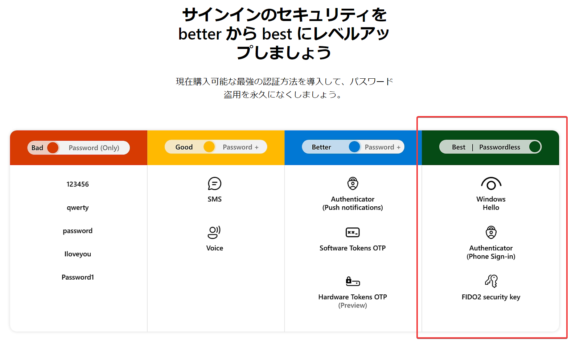

# Azure ADのパスワードレス認証

■パスワードレス認証について

Microsoftでは、パスワードレス認証を推進・推奨している。

https://www.microsoft.com/ja-jp/security/business/solutions/passwordless-authentication

パスワードレス認証は、パスワード＋MFA認証よりも優れているとされている。

■Azure ADのパスワードレス認証オプション

Microsoft では、Azure Active Directory (Azure AD) と統合される次の 3 つのパスワードレス認証オプションを提供しています。

Microsoft Authenticator - ユーザーが任意のプラットフォームまたはブラウザーにサインインできるようにすることで、あらゆる iOS や Android フォンを強力なパスワードレスの資格情報に変えます。

FIDO2 準拠のセキュリティ キー - キオスクなどの共有マシンにサインインするユーザー、電話の使用が制限されている状況、および高い特権を持つ ID に対して便利です。

Windows Hello for Business - 専用の Windows コンピューターを使用するユーザーに最適です。

■参考: Microsoftアカウントのパスワードレス認証

https://internet.watch.impress.co.jp/docs/column/shimizu/1360029.html

- 2021年9月から、個人向けMicrosoftアカウントのパスワードレス運用が可能になった。
- Microsoftアカウントからパスワードを削除することで、パスワードが漏洩する機会そのものをなくす取り組みだ。
- 方法は簡単で、Microsoftアカウントのウェブページ（要サインイン）で、［セキュリティ］の［高度なセキュリティオプション］で、［追加のセキュリティ］の項目にある［パスワードレスアカウント］の［有効にする］をクリックすればいい。
- 画面に表示された数字を確認し、スマートフォンのMicrosoft Authenticatorアプリで同じ数字をタップ

https://support.microsoft.com/ja-jp/account-billing/microsoft-%E3%82%A2%E3%82%AB%E3%82%A6%E3%83%B3%E3%83%88%E3%81%A7%E3%83%91%E3%82%B9%E3%83%AF%E3%83%BC%E3%83%89%E3%82%92%E4%BD%BF%E7%94%A8%E3%81%97%E3%81%AA%E3%81%84%E6%96%B9%E6%B3%95-674ce301-3574-4387-a93d-916751764c43

- パスワードレス化とは、パスワードを削除し、代わりにパスワードレスメソッドを使用してサインインする方法を指します。
- Windows Hello、Microsoft Authenticator アプリ、SMS または電子メール コード、物理セキュリティ キーなどのパスワードのないソリューションは、より安全で便利なサインイン方法を提供します。

■参考: Windows Hello

https://support.microsoft.com/ja-jp/windows/windows-hello-%E3%81%BE%E3%81%9F%E3%81%AF%E3%82%BB%E3%82%AD%E3%83%A5%E3%83%AA%E3%83%86%E3%82%A3-%E3%82%AD%E3%83%BC%E3%81%A7-microsoft-%E3%82%A2%E3%82%AB%E3%82%A6%E3%83%B3%E3%83%88%E3%81%AB%E3%82%B5%E3%82%A4%E3%83%B3%E3%82%A4%E3%83%B3%E3%81%99%E3%82%8B-800a8c01-6b61-49f5-0660-c2159bea4d84

パスワードを覚えたり、リセットしたりする必要をなくすには、Windows Hello または FIDO 2 準拠セキュリティ キーを使用した Microsoft アカウントへのサインインをお試しください。 Windows 11 を実行するデバイスと Microsoft Edge ブラウザーが必要です。 (この機能は現在、Xbox やスマートフォンでは使用できません)。