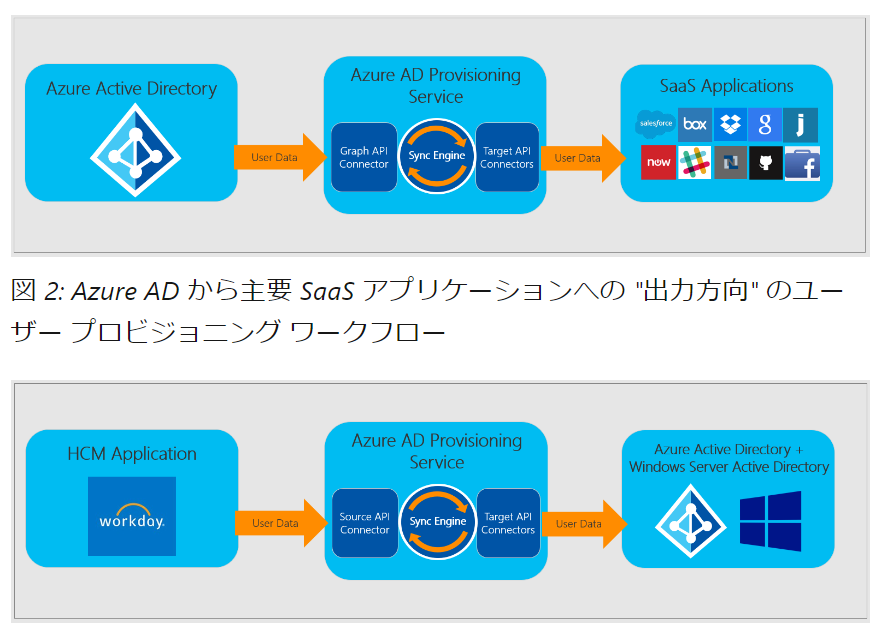

# SCIM （Azure AD プロビジョニング サービス）

System for Cross-domain Identity Management

参考: https://locked.jp/blog/what-is-scim/

- 複数のドメイン間でユーザーIDの情報をやり取りするための標準規格
- HTTPS / JSONを使用して通信する

https://learn.microsoft.com/ja-jp/azure/active-directory/app-provisioning/how-provisioning-works

- 人材管理 (HCM) アプリケーションから 「Azure AD プロビジョニング サービス」経由で、Azure AD および ADDS へのユーザー プロビジョニングが可能
- Azure AD から主要 SaaS アプリケーションへの "出力方向" のユーザー プロビジョニングが可能

