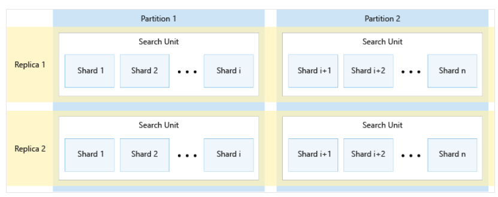

## レプリカ

主にクエリ操作の負荷分散に使用されるインスタンス。

各レプリカはインデックスの1つのコピーをホストする。

クエリを実行すると、クエリはいずれかのレプリカで実行される。よって、レプリカを増やすと、クエリ操作が高速化される。

```
Azure AI Searchリソース
└レプリカ1 ... クエリを 100% 担当
  └パーティション1 (index1のコピー) (index2のコピー)
```
↓レプリカ数を1から2に変更
```
Azure AI Searchリソース
├レプリカ1 ... クエリを 50% 担当
│└パーティション1 (index1のコピー) (index2のコピー)
│
└レプリカ2 ... クエリを 50% 担当
  └パーティション1 (index1のコピー) (index2のコピー)
```

また、レプリカを増やすと読み取り・書き込みの可用性が高まる。

## パーティション

読み取り・書き込みのための物理ストレージとI/O。パーティションを増やすとストレージ容量が拡大する。また、インデックス作成が高速化される。

たとえば2つのパーティションを作成するとインデックスは2つに分割される。

```
Azure AI Searchリソース
├レプリカ1
│└パーティション1 (index1のコピー) (index2のコピー)
│
└レプリカ2
  └パーティション1 (index1のコピー) (index2のコピー)
```
↓パーティション数を1から2に変更
```
Azure AI Searchリソース
├レプリカ1
│├パーティション1 (index1のコピーの前半) (index2のコピーの前半)
│└パーティション2 (index1のコピーの後半) (index2のコピーの後半)
└レプリカ2
  ├パーティション1 (index1のコピーの前半) (index2のコピーの前半)
  └パーティション2 (index1のコピーの後半) (index2のコピーの後半)
```

## 検索ユニット search unit

物理ストレージとI/Oを提供するサーバー。インデックスはここに記録される。

検索ユニット数＝レプリカ数 x パーティション数。検索ユニットに比例したコストがかかる。


https://learn.microsoft.com/ja-jp/azure/search/index-similarity-and-scoring#sharding-effects-on-query-results

※インデックスは内部的に複数の「シャード」に分割されて記録される。シャードはユーザーがコントロールできない。

## 読み取りの可用性を高めたい場合

レプリカを2以上にする。SLA 99.9% が提供される。

## 書き込みの可用性を高めたい場合

レプリカを3以上にする。SLA 99.9% が提供される。

## クエリ操作を高速化したい場合

レプリカを増やす。

## ストレージを増やしたい場合

パーティションを増やす。

## インデックス作成を高速化したい場合

パーティションを増やす。
