# Request-Reply パターン

「要求 - 応答パターン」


https://learn.microsoft.com/ja-jp/azure/service-bus-messaging/message-sessions#request-response-pattern


https://www.enterpriseintegrationpatterns.com/patterns/messaging/RequestReply.html

```
リクエスター（requester、要求者）
↓リクエスト
Requestチャンネル  Replyチャンネル
↓
リプライヤー（replier、応答者）
↓リプライ
Replyチャンネル
```



# Service Busでの実装

https://learn.microsoft.com/ja-jp/azure/service-bus-messaging/message-sessions#request-response-pattern

(1)送信側アプリケーションを一意に識別するように特定のヘッダー パラメーターを設定することにより、複数のアプリケーションが 1 つの要求キューに要求を送信できます。

(2)受信側アプリケーションは、キューに入ってくる要求を処理し、セッション対応のキューで応答を送信して、送信側が要求メッセージで送信した一意識別子にセッション ID を設定します。

(3)要求を送信したアプリケーションは、特定のセッション ID でメッセージを受信し、応答を正しく処理することができます。

Multiple applications can send their requests to a single request queue, with a **specific header parameter** set to uniquely identify the sender application. 

The receiver application can process the requests coming in the queue and send replies on the session enabled queue, setting the session ID to **the unique identifier** the sender had sent on the request message. 

The application that sent the request can then receive messages on the specific session ID and correctly process the replies.

- 要求キュー（セッションを使用しない）
  - メッセージに、アプリケーションを一意に識別する識別子(GUID)を設定
- 応答キュー（セッションを使用）
  - メッセージのセッションIDの値としてメッセージのGUIDを設定

# C#による実装

https://dotnetdevlife.wordpress.com/2022/03/17/servicebus-request-reply-pattern/

