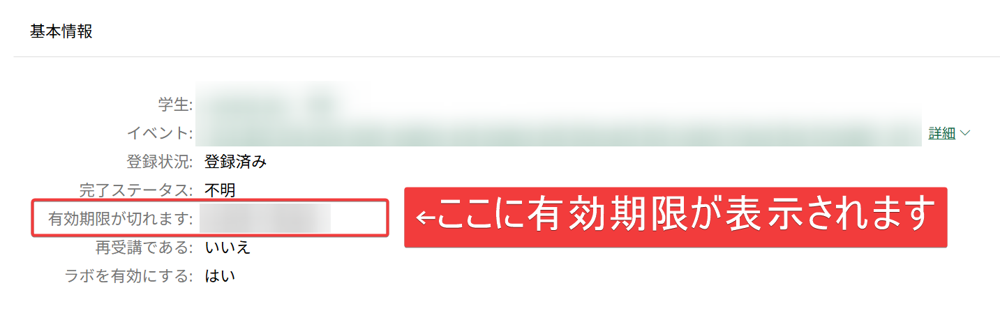

■総合ご案内

- トレーニングお申し込み、認定試験のお申し込み、サポートへの問い合わせ、よくあるご質問などの情報は、以下の資料からご確認いただけます。
- https://aka.ms/lxp-userguide
- トレーニングに関してご不明点がございましたら、まずこちらをご確認ください。

<!--
■ご受講者様向けLinkedInコミュニティ

- LinkedInに、ご受講者様向けLinkedInコミュニティがあります。
- 学習に役立つ情報、コース開催情報などをこちらで共有しております。
- LinkedInをご利用でしたら、ぜひご参加ください。
- http://aka.ms/esicommj
-->

■講義資料

- 講師が講義で使用した講義資料は、GitHubで公開しております。
- トレーニング後もぜひご活用ください。
- 社内などで共有していただいてもかまいません。
- 利用期限は特にございません。

■各種有効期限

- 「ラボ環境」（ https://esi.learnondemand.net/ ）のラボ有効期限はラボ環境内に表示されます。
  - 
  - ただしトレーニングキーの投入自体はトレーニング期間中に実施する必要があります。まだの方はお早めに！
- Teams会議チャットのご利用（ご質問など）は本日17:30までとさせていただきます。
- その他（講義資料、Microsoft Learn、ラボ手順書）は無期限にご利用いただけます。
