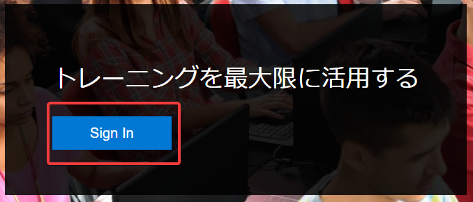
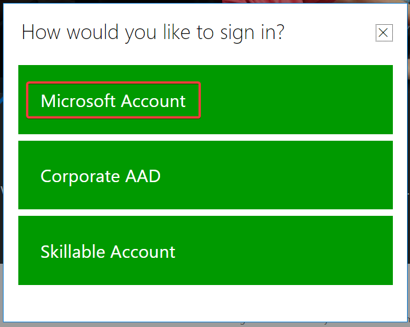
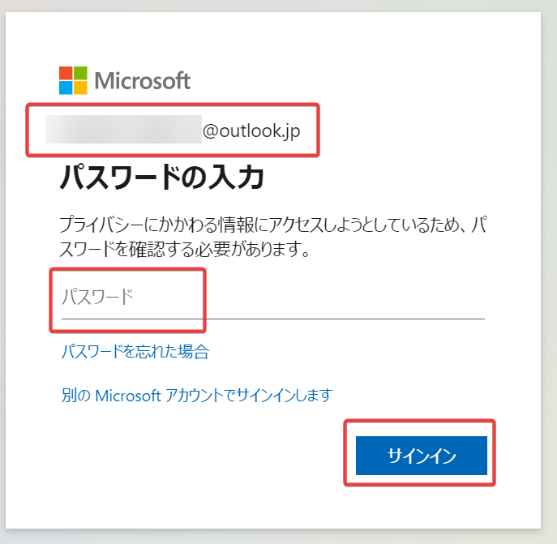
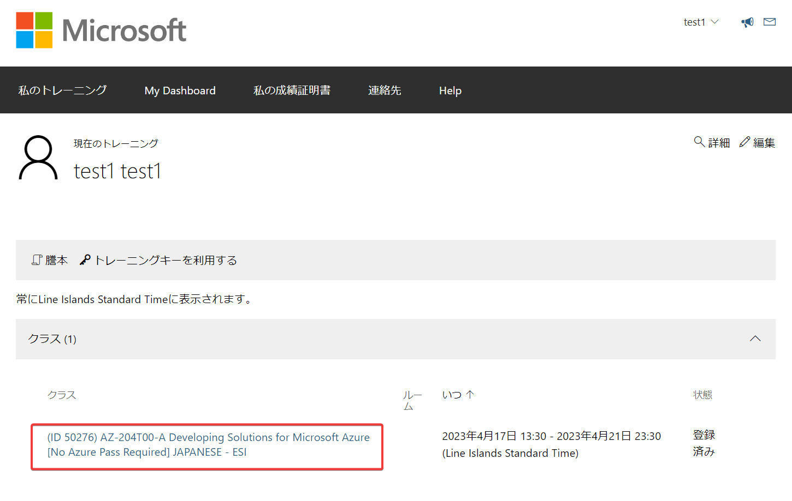
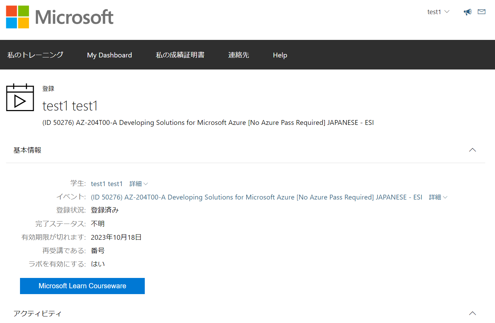

# ラボ環境の利用方法

■「ラボ環境」の概要

- 演習（ハンズオン）は「ラボ環境」で実施します。
- 「ラボ環境」は、各トレーニングの受講開始（トレーニングキー入力時）より半年後まで利用可能です。
- 「ラボ環境」には、複数の「ラボ」が含まれています。

■ラボ環境の起動方法

トレーニング開始時に作成したMicrosoftアカウントが必要です。

https://esi.learnondemand.net/ にサインインします。

以下のような画面が表示されます。

画面下にスクロールし、「Hands on Labs」を表示します。

■ラボ環境の中での操作

以降、こちらのPDFファイルをご参照ください。

[PDF: ラボ利用方法のご説明](CloudSliceLab.pdf)