# Cloud Skills Challenge

マイクロソフトが毎年開催する「Microsoft Build」(5月ころ. 2023は5/23-24)や「Microsoft Ignite」（10月ころ）の中で、
「Cloud Skills Challenge」というイベントが開催される場合があります。
このイベントでは、マイクロソフトがおすすめするMicrosoft Learnラーニングパスを学習すると、
認定試験が無料で受験できるバウチャーが発行されます。

■Build 2023 Cloud Skills Challenge 情報

https://aka.ms/buildcsc

https://www.microsoft.com/ja-JP/cloudskillschallenge/build/registration/2023

Microsoft Learn Cloud Skills Challenge 内の 1 つのチャレンジを完了すると、無料の Microsoft 認定試験を 1 回受けることができます。（複数チャレンジをクリアしても無料認定試験は1回のみ受験可）

■スケジュール

2023 年 5 月 23 日の午後 4 時 (16:00) UTC に開始され、2023 年 6 月 20 日の午後 4 時 (16:00) UTC に終了

この試験のオファーの引き換え期間は、2023年6月30日にスタートし、試験の予約と受験を含め2023年9月27日に終了します。

■チャレンジの種類

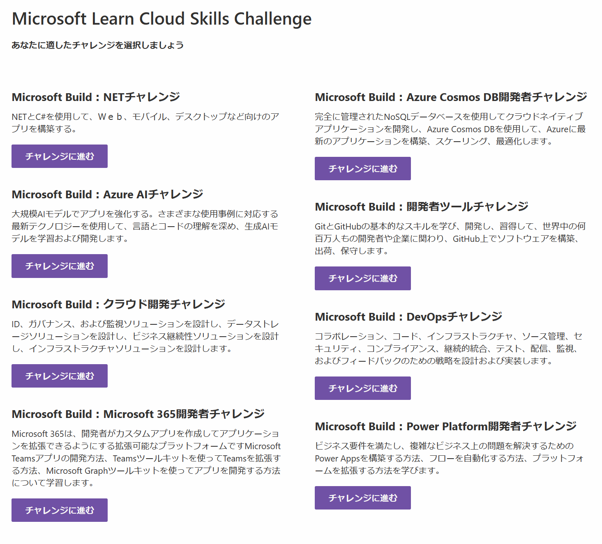

■受験できる認定試験

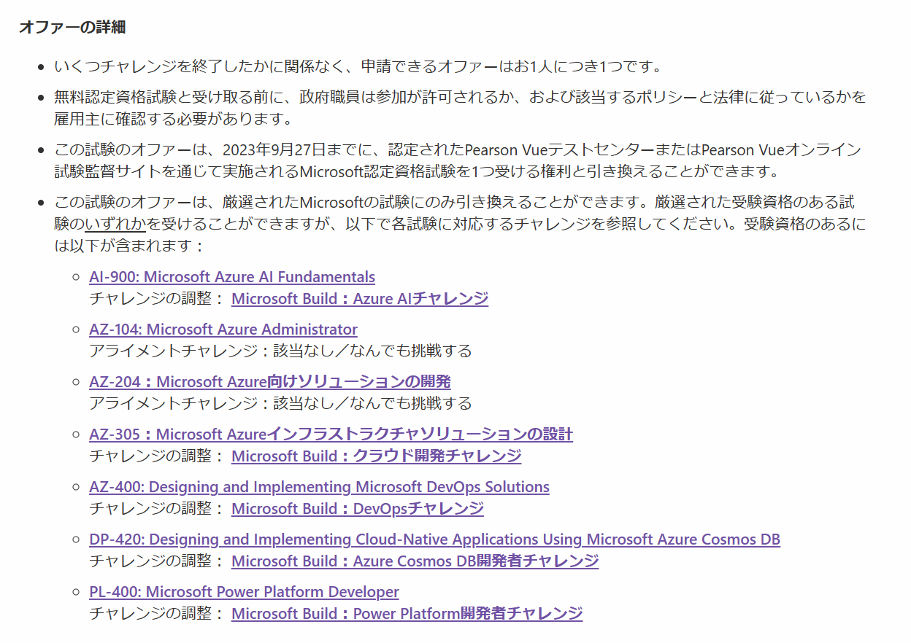

■チャレンジの例 - 「.NET Challenge」

「.NET Challenge」に参加
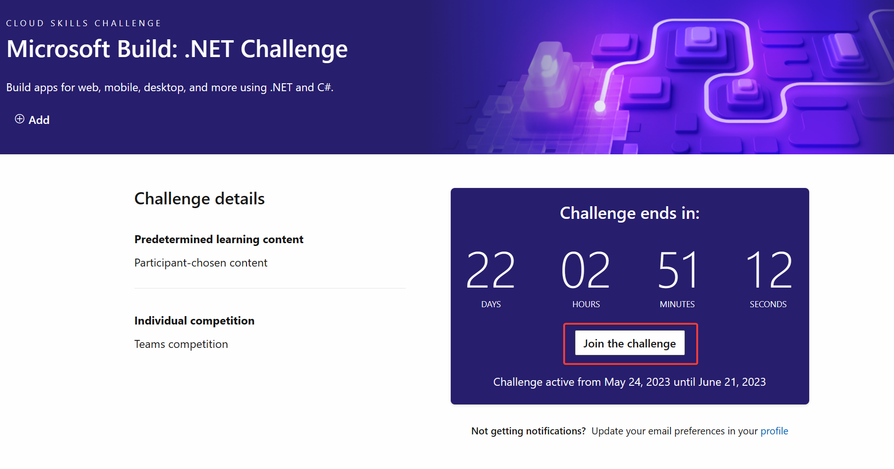

公式ルールを確認
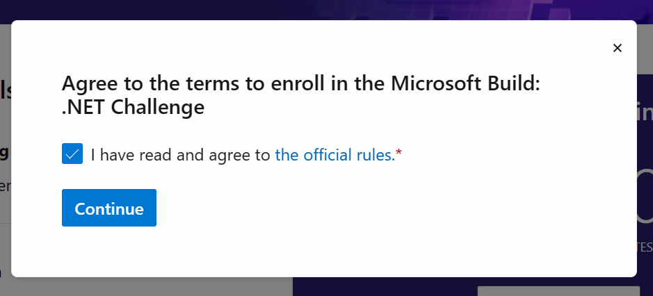

登録された
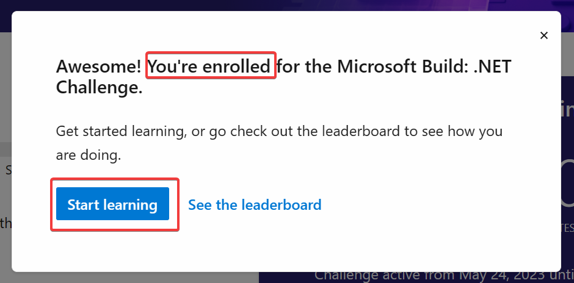

33モジュールを学習すればよい。
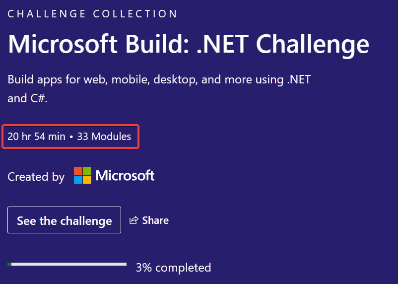

※過去に学習済みのモジュールについてはすでに完了となっている
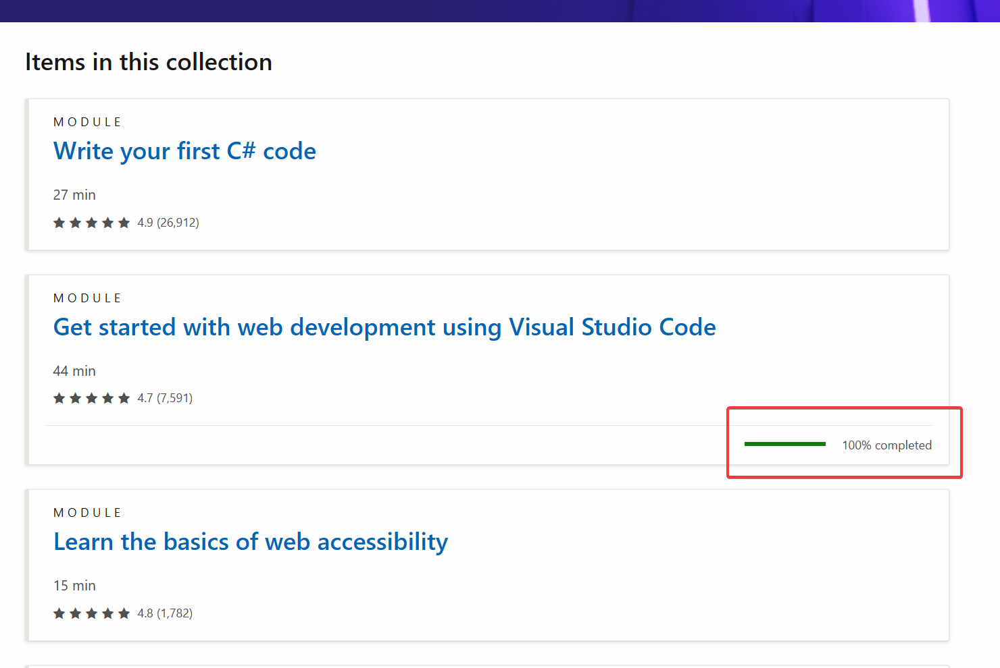

モジュールの1つ目を開く
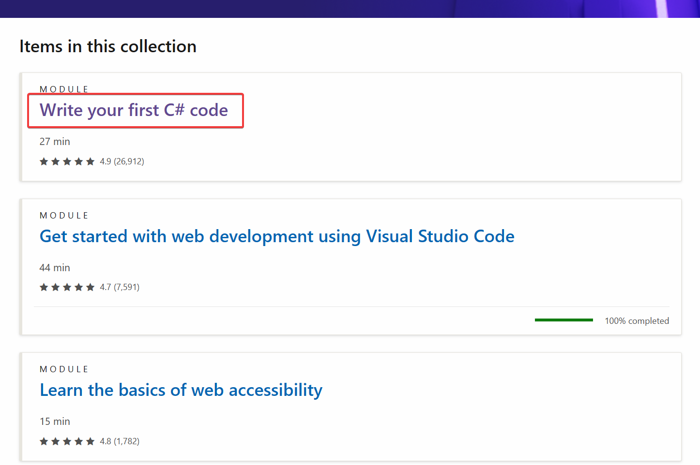

モジュールが表示される
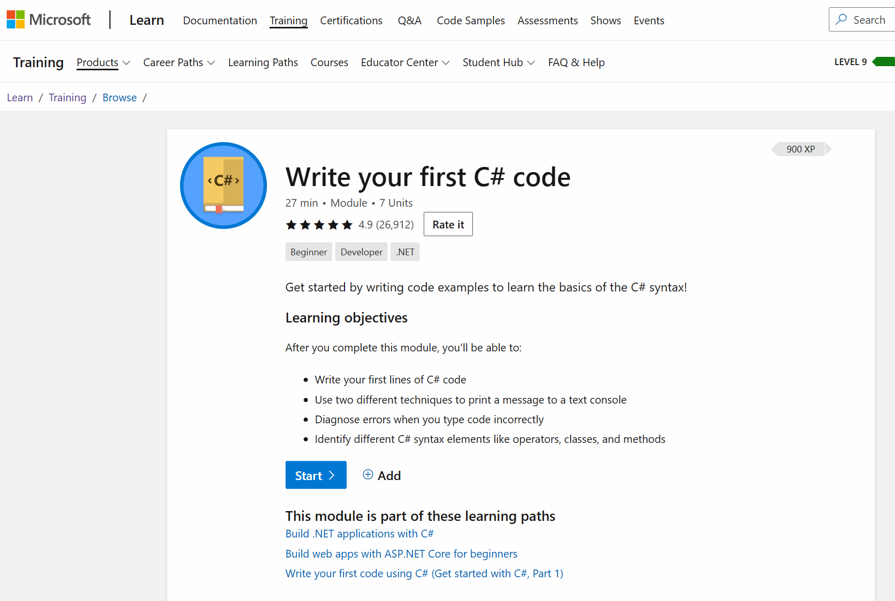

画面左下のリンクから日本語コンテンツに切り替えが可能
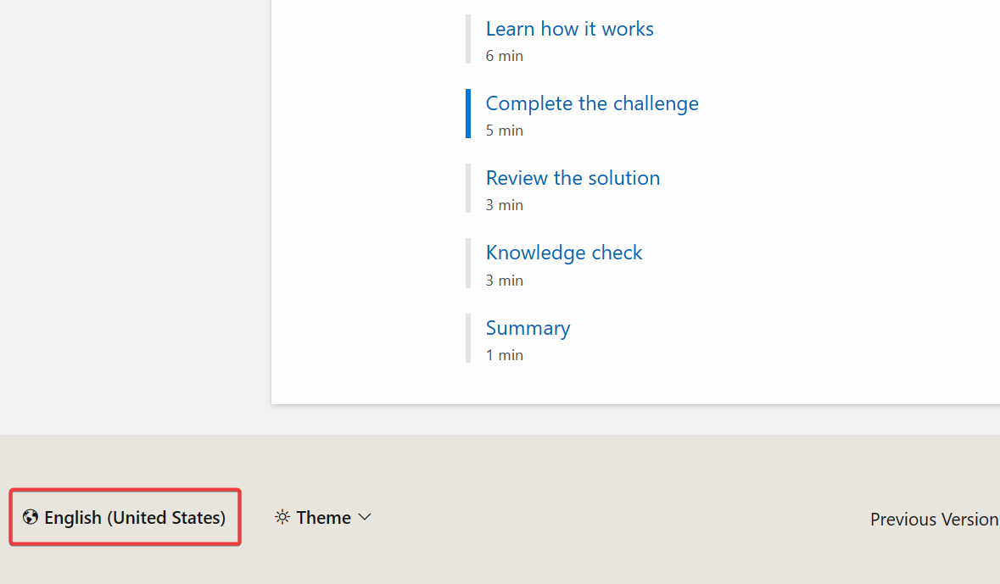

モジュール内の各ページ（ユニット）を表示すると、XP（経験値）がたまる。XPがたまるとレベルが上がる。[XPやレベルの解説](https://learn.microsoft.com/ja-jp/teamblog/microsoft-learn-tour#points-achievements-trophies-and-levels)
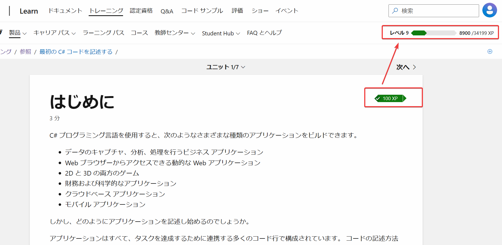

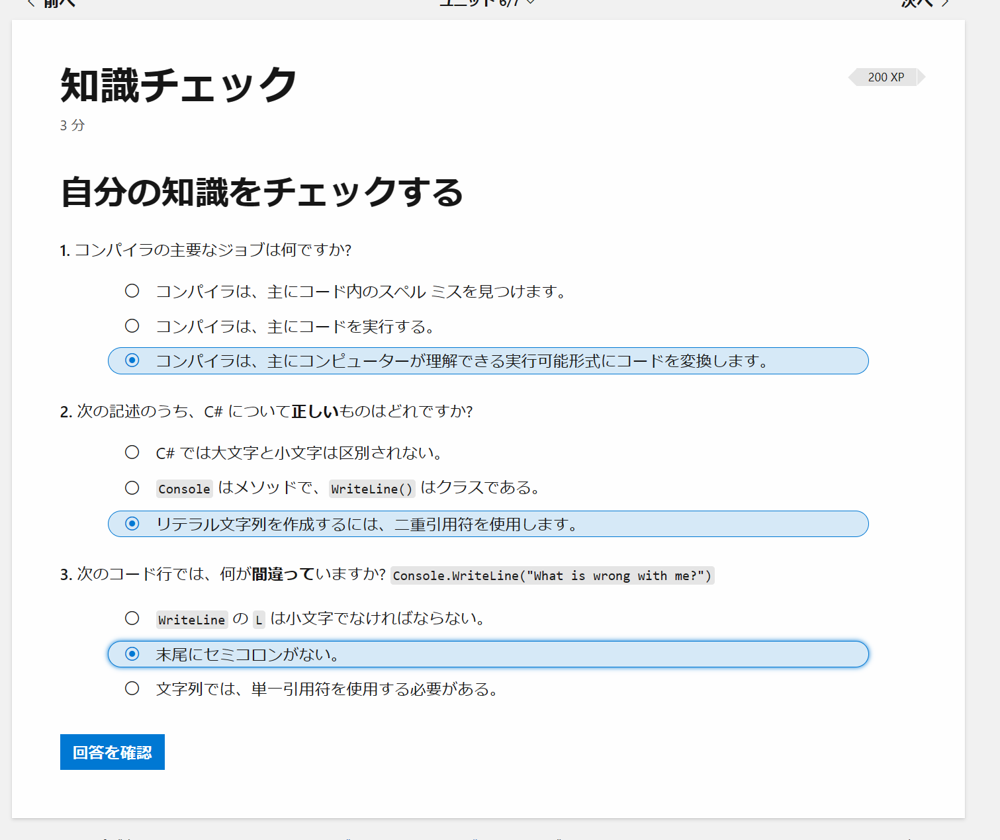

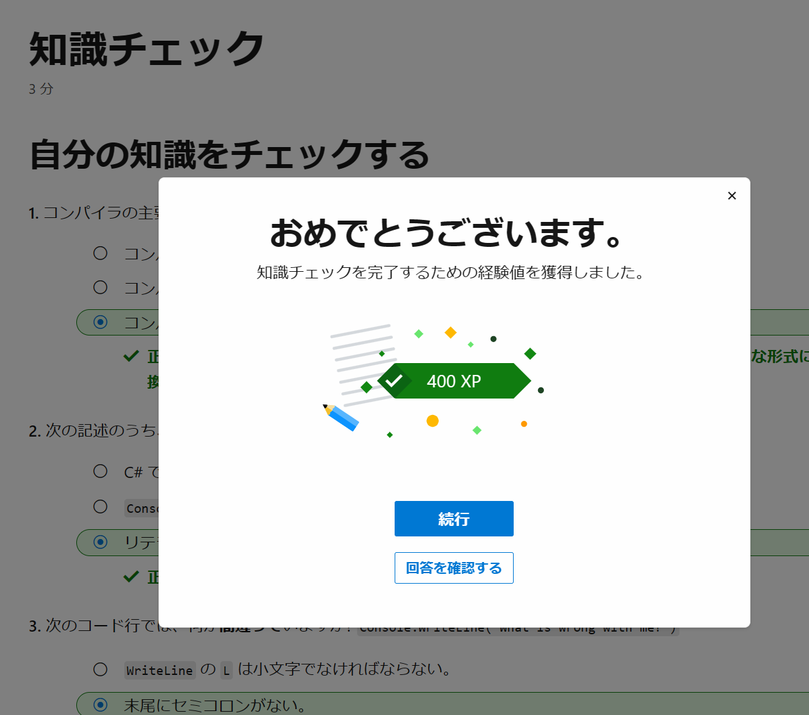

画面右上のプロファイル、課題と辿ると、現在のチャレンジの名称と期限が表示される
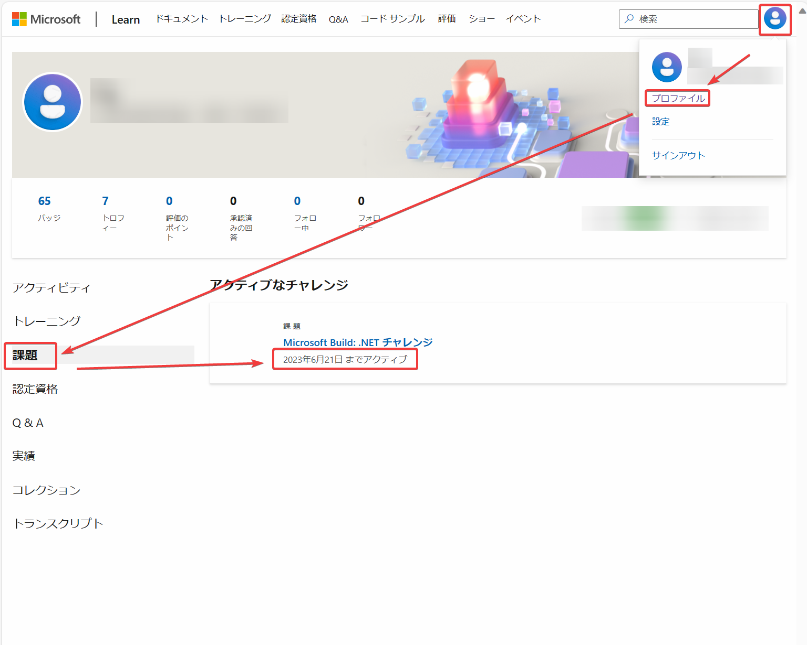