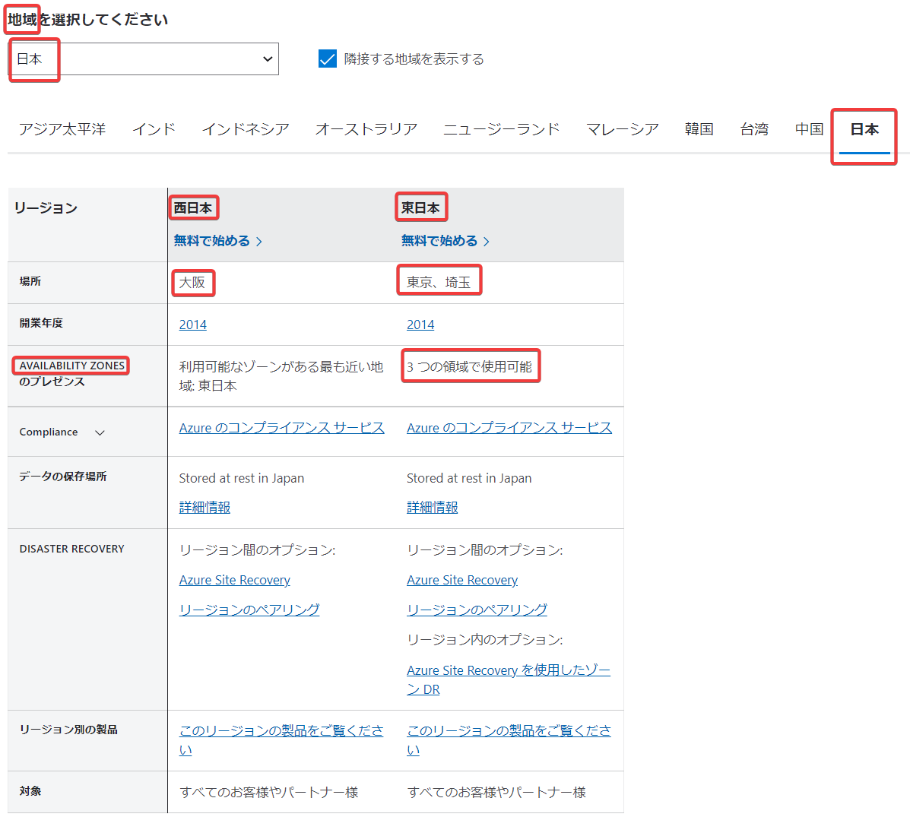

# Azureのデータセンター

■Azureの地域とリージョン

https://azure.microsoft.com/ja-jp/explore/global-infrastructure/geographies/#overview




```
地域（≒国）
└リージョン
  └可用性ゾーン(ゾーン1/2/3)
    └データセンター
```

- すべてのリージョンが、可用性ゾーンに対応しているわけではない。
  - 例: 地域「日本」では、「東日本リージョン」は可用性ゾーンに対応、「西日本リージョン」は可用性ゾーン非対応。
- 現在可用性ゾーンに対応していないリージョンでも、今後、可用性ゾーンに対応する可能性はある。
  - 例: 東日本リージョン
    - 2014/2/26より[東日本リージョン（と西日本リージョン）の運用を開始](https://gihyo.jp/admin/clip/01/azurenews2014/201403/04)
    - 2019/4/19から[可用性ゾーンに対応](https://ascii.jp/elem/000/001/848/1848904/)した。

■リージョン

- VMなどのリソースを作成する際に、そのリソースが配置されるリージョンを指定する。
- 例: サーバーを日本国内で運用したい。データを日本国内に保存したい。
  - →リージョンとして「東日本リージョン」または「西日本リージョン」を選択。

■可用性ゾーン

- リージョンに「可用性ゾーン」があり、サービス（リソース）が可用性ゾーンに対応している場合は、「可用性ゾーン」を利用できる。
  - ゾーン冗長とゾーン指定 https://learn.microsoft.com/ja-jp/azure/reliability/availability-zones-service-support
    - 「ゾーン（Zonal）」サービス: リソースを配置する可用性ゾーンを指定
      - 例: VMは「ゾーン（Zonal）」サービス。VMを配置する可用性ゾーンを指定する。
    - 「ゾーン冗長」サービス: リソースが自動的にゾーン間で複製(replicated)または分散(distributed)される。
      - 例: 仮想ネットワークは「ゾーン冗長」サービスであり、リソースが複数のゾーンで運用されるため、ゾーン障害に強い。一つのゾーンに障害が発生しても、別のゾーンでリソースの運用を継続できる。
    - 「ゾーン（Zonal）」と「ゾーン冗長」が両方選べるサービスもある。


■Azure のデータセンターの概要（施設、建物、および物理上のセキュリティ）

https://learn.microsoft.com/ja-jp/azure/security/fundamentals/physical-security


■データセンターツアー
https://news.microsoft.com/stories/microsoft-datacenter-tour/

操作例
- Start Exploring
- Enter The Lobby
- Explore Lobby
- Enter Server Room
- Explore Server Room
- Server Blades

■偽名で運用 !? Azureデータセンターの「トリビア」を集めてみた

https://ascii.jp/elem/000/001/474/1474081/


■グローバルインフラストラクチャマップ

グローバルインフラストラクチャ: 世界中のリージョン（データセンター）と、それらを接続する世界規模のバックボーンネットワーク（通信ケーブル等）

インタラクティブデモ:
https://infrastructuremap.microsoft.com/

操作例
- Skip Intro
- Explore the globe
- 地球儀を回して日本を表示する
- マウスホイールで拡大・縮小
- 東日本リージョンをクリック


