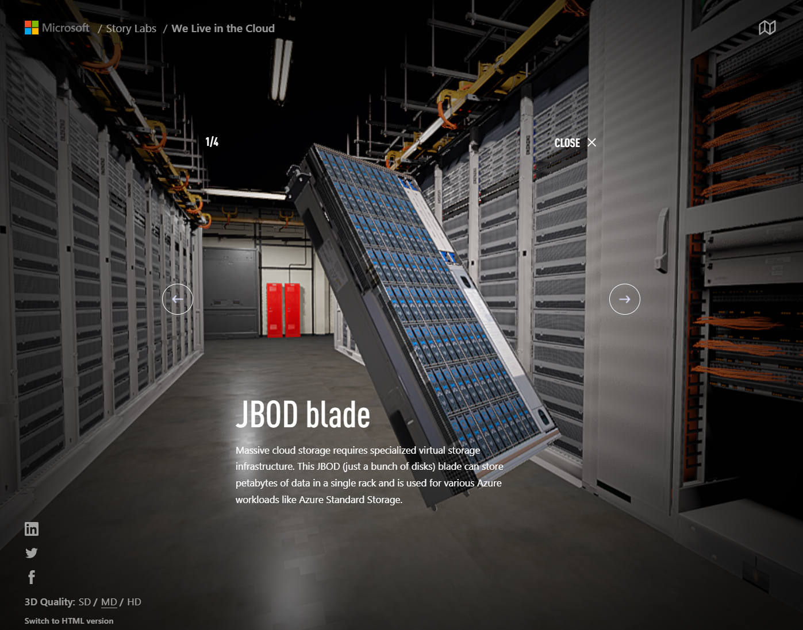
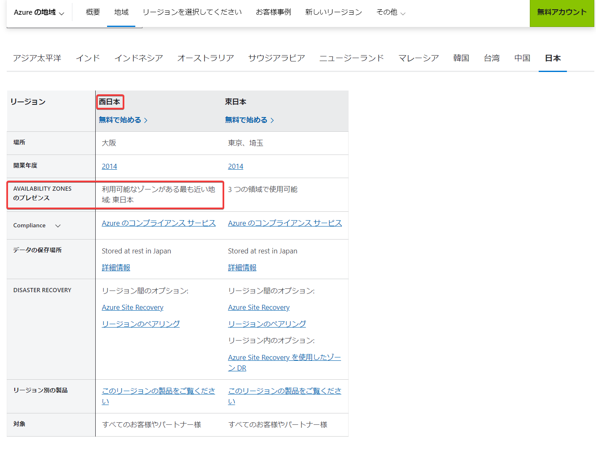

# Azure西日本リージョン

2014/2/26、Azure東日本リージョン（データセンター: 東京・埼玉）と西日本リージョン（データセンター: 大阪）が稼働を開始。

https://codezine.jp/article/detail/7661

2019/4/19、Azure東日本リージョンが可用性ゾーンに対応

https://ascii.jp/elem/000/001/848/1848904/

可用性ゾーンのイメージ(データセンター部分は想像図)

```
リージョン
├可用性ゾーン1
│├データセンター1
│└データセンター2
├可用性ゾーン2
│├データセンター3
│└データセンター4
└可用性ゾーン3
  ├データセンター5
  └データセンター6
```

※可用性ゾーンはそれぞれ電源・冷却・通信設備を備えており、あるゾーンの物理障害が他のゾーンに波及しないようになっている。

※セキュリティ上の理由により、Azureデータセンターの場所、軒数、所在地、規模などの詳細は公開されておらず、マイクロソフト社員も（必要な社員を除き）詳細を知らされていない。[バーチャルデータセンターツアー](https://news.microsoft.com/stories/microsoft-datacenter-tour/)で、データセンター内部の[サーバールーム](https://news.microsoft.com/stories/microsoft-datacenter-tour/server-room/)の様子などを確認できる。



参考: [偽名で運用 !? Azureデータセンターの「トリビア」を集めてみた](https://ascii.jp/elem/000/001/474/1474081/)

2023/3/27、西日本リージョンの設備の増強を発表。（2023/2に複数の新たなデータセンターの稼働を開始）近い将来に可用性ゾーン機能に対応する予定。

https://www.itmedia.co.jp/news/articles/2303/28/news114.html

■ついに西日本リージョンも可用性ゾーンに対応！

https://b2b-ch.infomart.co.jp/news/detail.page?IMNEWS1=3898166

マイクロソフトは、2014 年 2 月より東日本リージョン・西日本リージョンのペアリージョン構成で Microsoft Azure (当時のサービス名称は Windows Azure) のサービスを開始しました。Microsoft Azure は、日本国内初となる東西 2 リージョン体制でサービスを提供することで、クラウド基盤として、東日本、西日本それぞれのお客様から、東西冗長構成を高く評価いただいてきました。

昨今のデジタル化やクラウド活用が進むにつれ、Microsoft Azure の需要もさらなる高まりを見せています。今回のリージョン拡大と追加投資により、こうしたお客様からの旺盛なクラウド需要に対応できる体制が整うことになります。

西日本リージョンの新たなデータセンターは、Microsoft Azure の可用性ゾーンとしての要件を満たしたものとなっています。西日本リージョン全体で、物理的に異なる 3 つ以上のデータセンターでの稼働を実現していることに加えて、それぞれのデータセンターが独立したネットワークや電源供給を担保することで、全体でデータセンター単位の障害に耐えるものです。

また、西日本におけるネットワーク基盤に関しても投資を行い、西日本リージョンのデータセンター間のネットワークレイテンシーも可用性ゾーン構成の要件となる低遅延を実現しています。

西日本リージョンに関しては、稼働開始した新しいデータセンターを用いて、近い将来に可用性ゾーン機能に対応することを予定しています。今後も西日本リージョンへの継続的な投資を進めていく中で、ペアリージョンとなる東日本リージョンと比較して、90% 以上の種類のサービスを提供します。これにより、高度なデータベース機能や分析サービスのような機能群についても、将来的に日本国内の東西両リージョンで利用が可能となります。その結果、東日本リージョンと西日本リージョンの活用シナリオが広がり、お客様はシステムやサービスの継続性をより高いレベルで実現することや、災害対策に対して更に柔軟な対応をとることが可能になる他、日本全国へ展開するサービスの設計・実装の柔軟性が向上します。

Microsoft Azure の日本国内リージョンの拡充を受け、Microsoft Azure そのものだけではなく、その上で稼働する Microsoft Teams や Power Platform といった Microsoft Cloud 全体の強化も図っていきます。日本マイクロソフトは、 Microsoft Cloud を通して、お客様が制約された資源でもより多くのことが実現出来るよう、引き続き支援してまいります。

https://www.itmedia.co.jp/news/articles/2303/28/news114.html

西日本リージョンでは少なくとも3つ以上のデータセンターからサービスを提供する体制が整ったとしている。西日本リージョンは今後、3つ以上あるゾーン（リージョンを構成するサーバ群の単位）のいずれかで障害が起きたとき、他のゾーンで補助する「可用性ゾーン機能」にも対応する予定。

■いつから可用性ゾーンが使える？

2023/3/31現在、まだ明確な発表はない。

まだAzure公式のリージョン情報のページにも変化がない。

https://azure.microsoft.com/ja-jp/explore/global-infrastructure/geographies/#geographies




■参考: AWSの日本のリージョン

2011/3 東京リージョンを開設（AZに対応） https://aws.amazon.com/jp/about-aws/whats-new/2011/03/02/announcing-asia-pacific-tokyo-region/

2018/2 大阪ローカルリージョンを開設（AZに非対応、単一データセンター） https://aws.amazon.com/jp/about-aws/whats-new/2018/02/announcing-the-aws-osaka-local-region/

2021/3 大阪リージョンを開設（AZに対応） https://aws.amazon.com/jp/about-aws/whats-new/2021/03/osaka-becomes-second-standard-region-in-japan/
