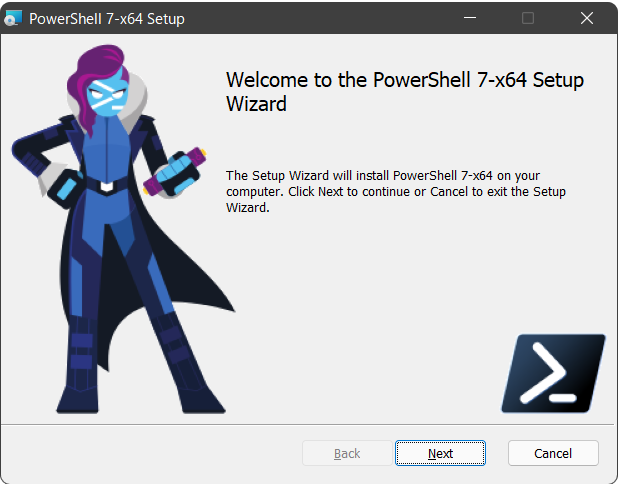

# PowerShell


■PowerShell 7.2

2021/11/8 一般提供開始
https://devblogs.microsoft.com/powershell/general-availability-of-powershell-7-2/



[Posh-chan(PowerShell)](https://blog.shibata.tech/entry/2017/10/14/153510)

```
PowerShell 7.2.0
Copyright (c) Microsoft Corporation.

https://aka.ms/powershell
Type 'help' to get help.

PS C:\Program Files\PowerShell\7> $PSVersionTable

Name                           Value
----                           -----
PSVersion                      7.2.0
PSEdition                      Core
GitCommitId                    7.2.0
OS                             Microsoft Windows 10.0.22000
Platform                       Win32NT
PSCompatibleVersions           {1.0, 2.0, 3.0, 4.0…}
PSRemotingProtocolVersion      2.3
SerializationVersion           1.1.0.1
WSManStackVersion              3.0
```