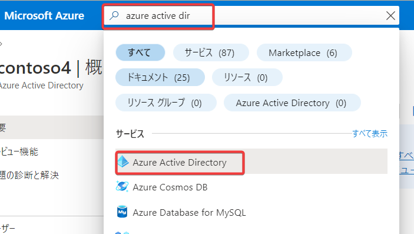
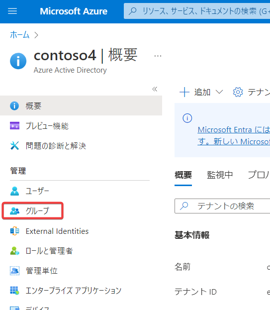
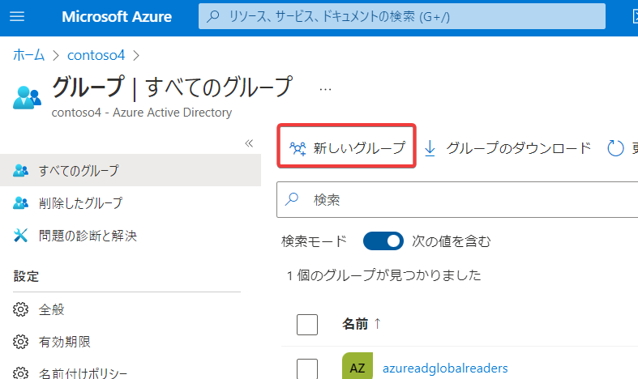
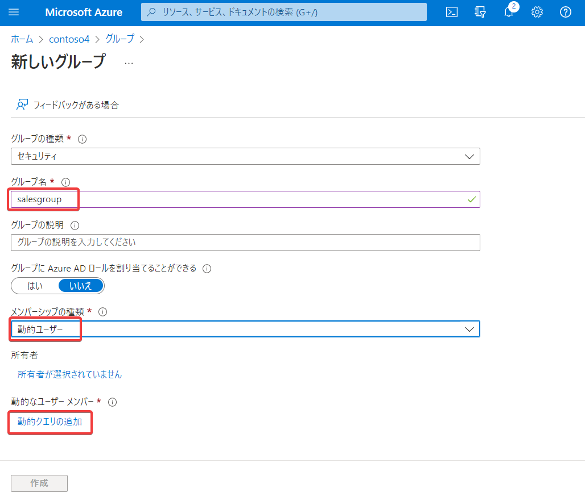
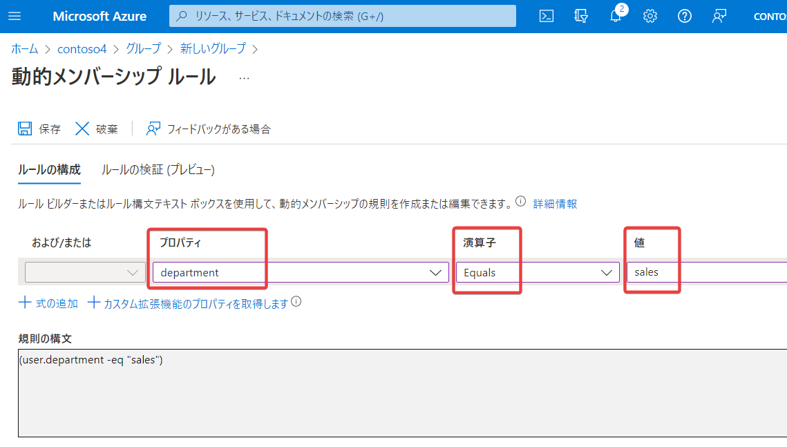
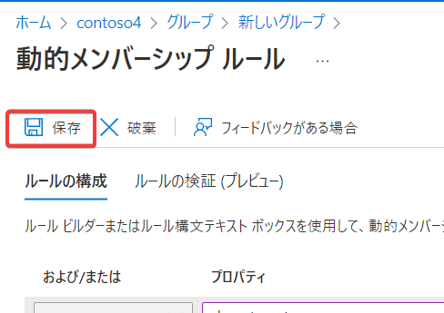
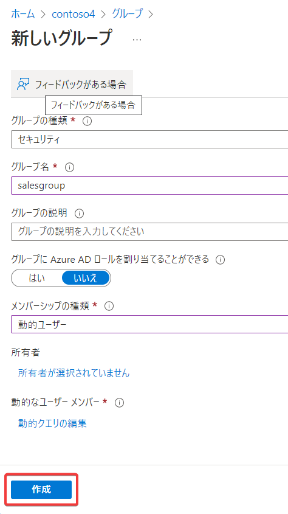
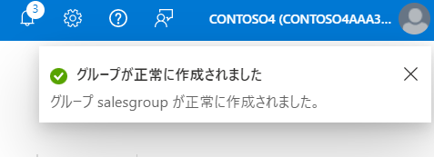
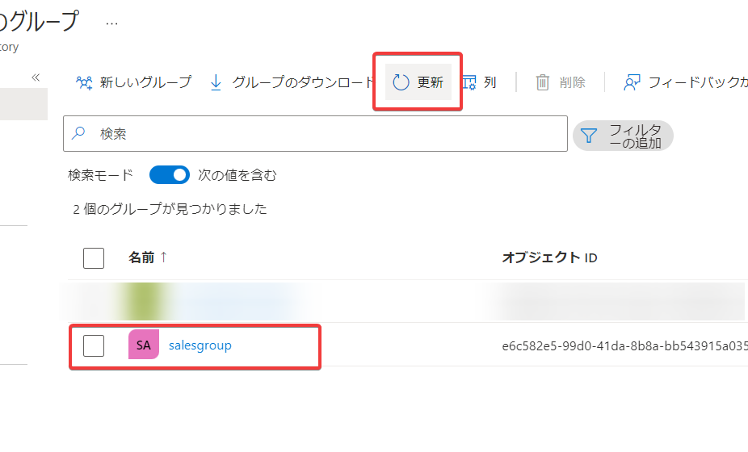
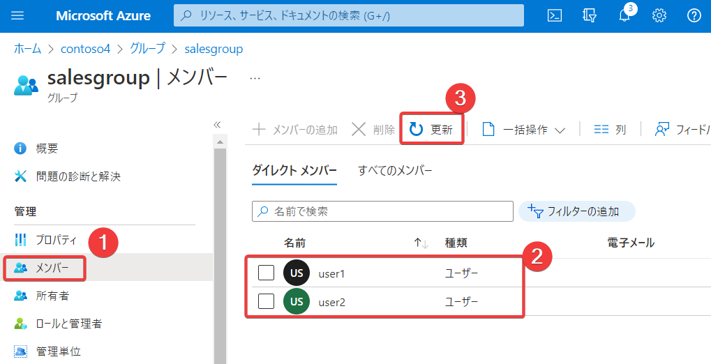

画面上部の検索で「azure active directory」を検索し、「Azure Active Directory」をクリック

画面左メニューから「グループ」をクリック

「新しいグループ」をクリック

グループの種類「セキュリティ」、グループ名「salesgroup」、メンバーシップの種類「動的ユーザー」を入力/選択。「動的クエリの追加」をクリック。

※「動的ユーザー」が選択できない場合は、1分ほど待ってWebブラウザのリロードを行い、再度試す。それでも選択できない場合は、P2ライセンスの割り当てがうまくできていない可能性があるので、P2ライセンスの割り当てからやり直す。

プロパティ「department」、演算子「Equals」、値「sales」を選択/入力。

「保存」をクリック

「作成」をクリック

画面右上に「グループが正常に作成されました」と表示される。ただし一覧には自動的には反映されない。

「更新」をクリックすると、一覧に、作成した動的グループ「salesgroup」が現れる。「salesgroup」をクリック。

画面左の「メンバー」をクリックすると、一覧に「user1」「user2」が表示される。

表示されない場合は1分ほど待って「更新」をクリックする。※動的グループを作成してから、メンバーにユーザーが表示されるまで、数分かかる場合がある。何度か「更新」を繰り返す。

それでもだめな場合は「動的グループ」のルール作成か、ユーザーの「部署」の設定のどちらか、あるいは両方に誤りがあるので、両方をチェックする。

