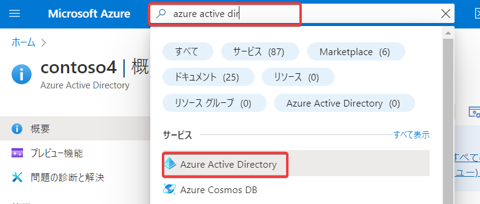
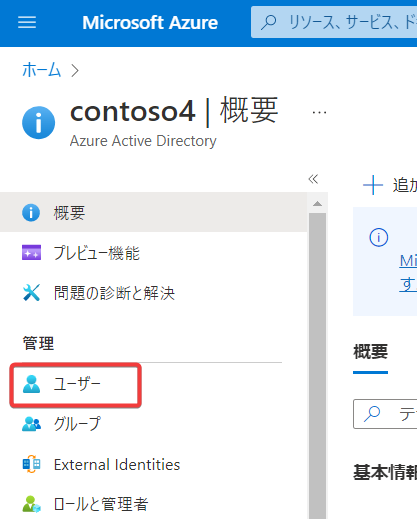
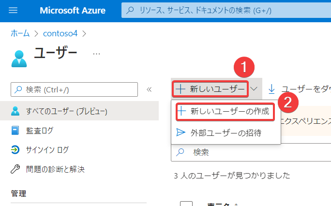
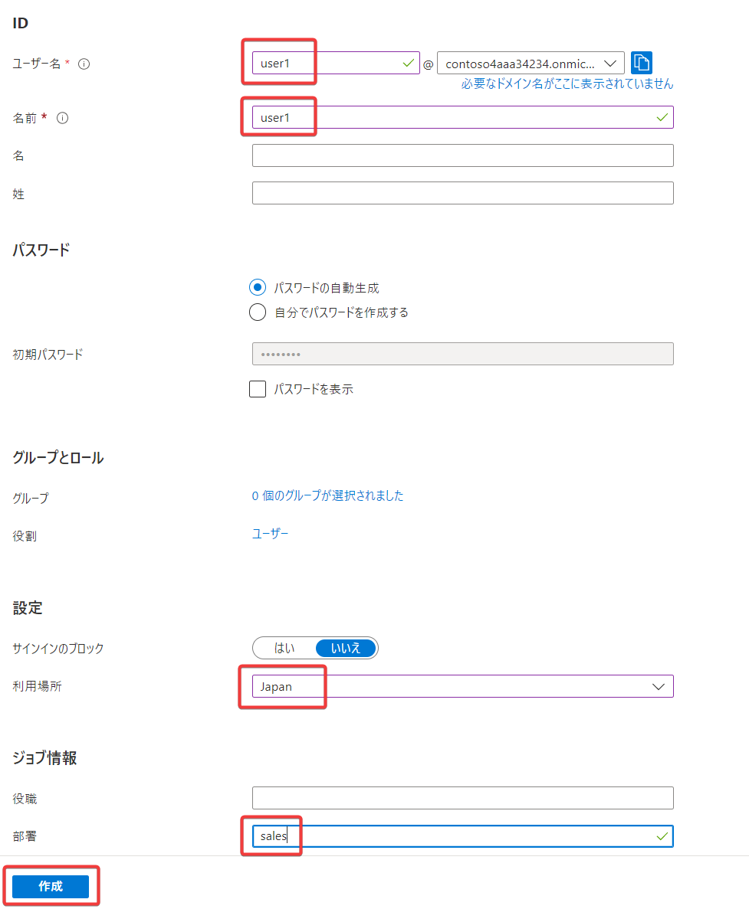
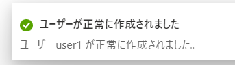
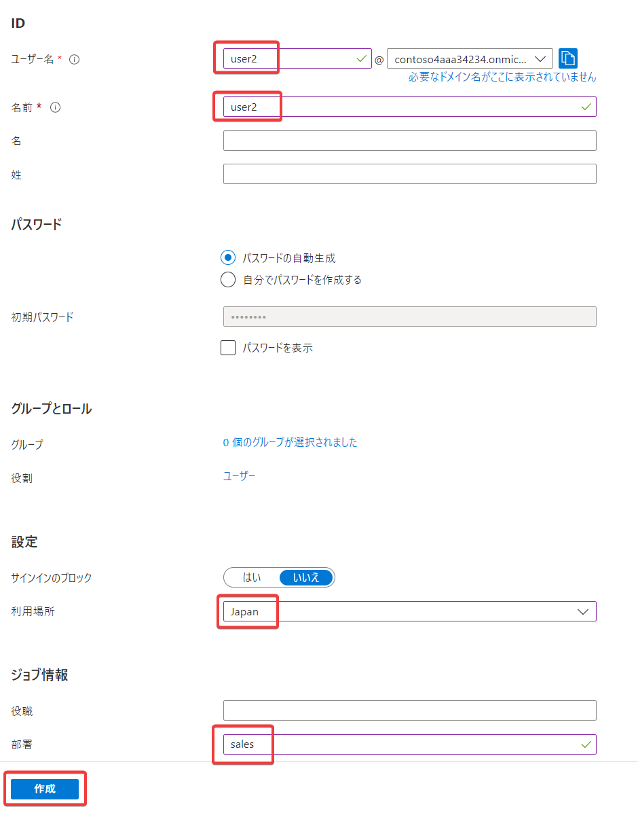
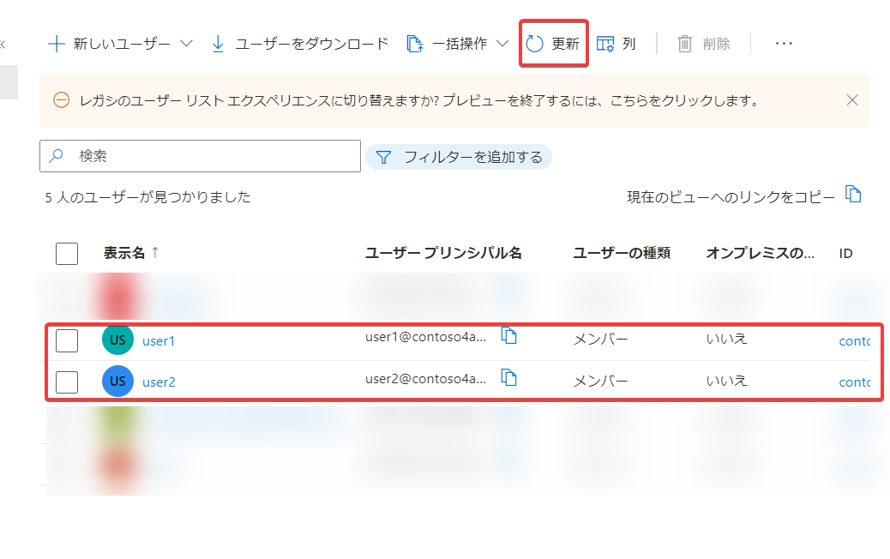

画面上部の検索で「azure active directory」を検索し、「Azure Active Directory」をクリック

画面左のメニューで「ユーザー」をクリック

「＋新しいユーザー」をクリックし、「＋新しいユーザーの作成」をクリック

ユーザー名「user1」、名前「user1」、利用場所「Japan」、部署「sales」と入力して「作成」をクリック

「ユーザーが作成されました」と表示されるが、一覧に反映されるには少し時間がかかる。かまわず進めて良い。

再度「＋新しいユーザー」をクリックし、「＋新しいユーザーの作成」をクリック

ユーザー名「user2」、名前「user2」、利用場所「Japan」、部署「sales」と入力して「作成」をクリック

一覧画面の「更新」をクリックして、一覧表示に「user1」「user2」が含まれていればOK。反映されない場合は1分ほど待ってから再度「更新」をクリック。

