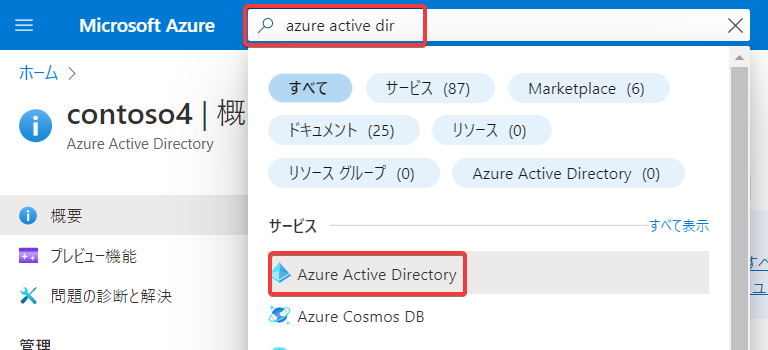
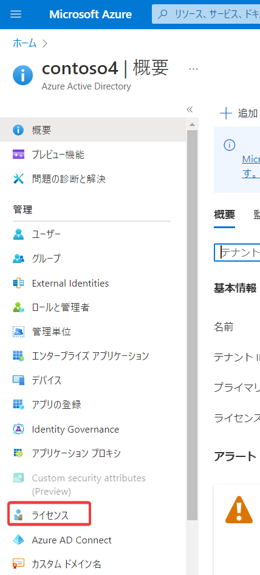
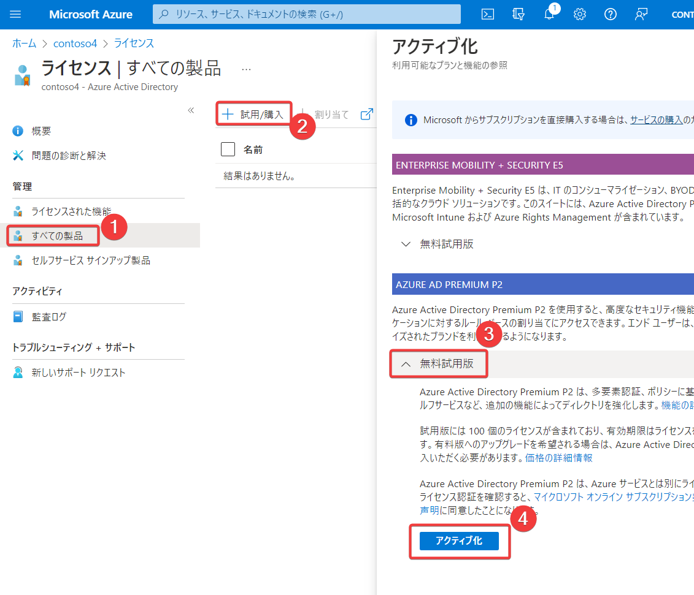
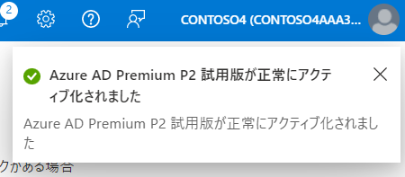
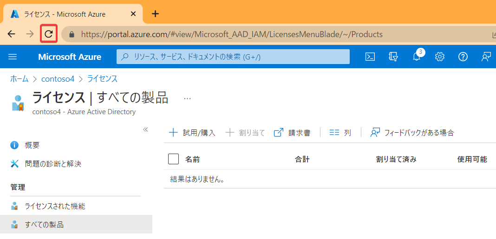
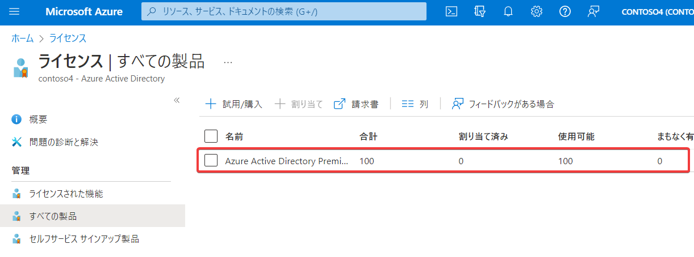

画面上部の検索で「azure active directory」を検索し、「Azure Active Directory」をクリック

画面左のメニューから「ライセンス」をクリック

すべての製品＞＋使用/購入＞無料試用版＞アクティブ化 を順にクリック

画面右上に「正常にアクティブ化されました」と表示される。

ブラウザのリロード機能を使用してページをリロードする。（リロードボタンをクリック、またはF5を押す）

このような表示になればOK。表示が変わらない場合は1分ほど待ってリロードを行う。

