# ACIで、コンテナー化されたWebアプリを起動する

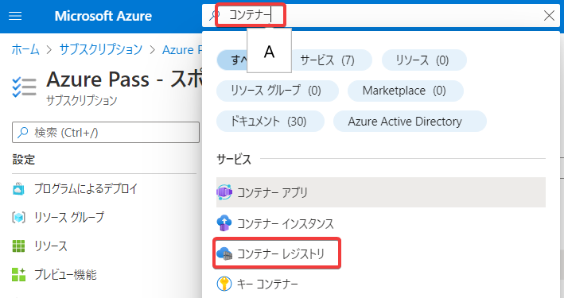

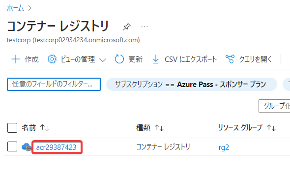

「管理者ユーザー」を有効化する

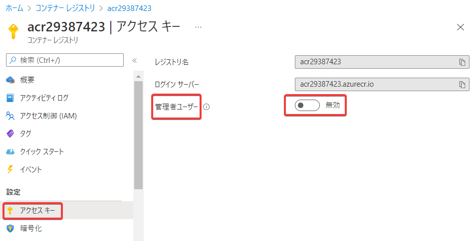

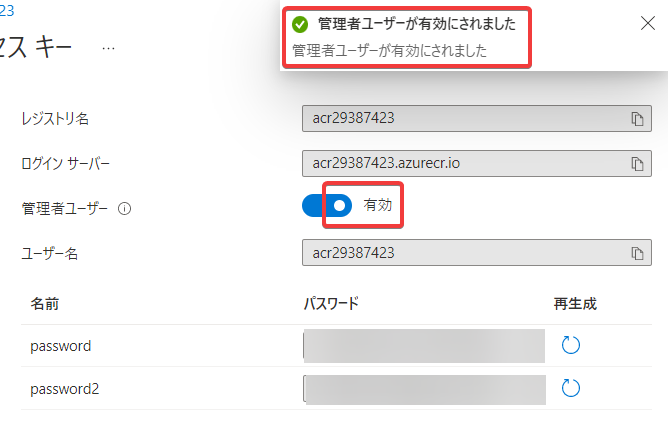

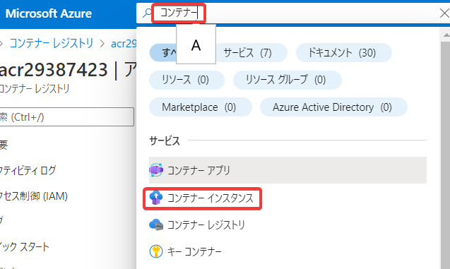

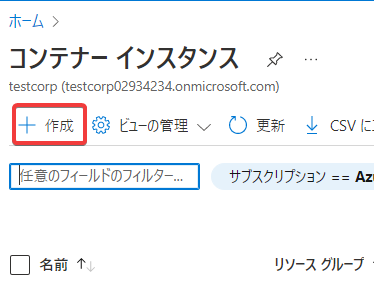

- リソースグループを新規作成
- コンテナー名を指定
- 地域 (US) East US
- レジストリ、イメージ、イメージタグ: 前の手順で作成したレジストリ、イメージを指定。タグはlatestとなる。
- 「次: ネットワーク」をクリック

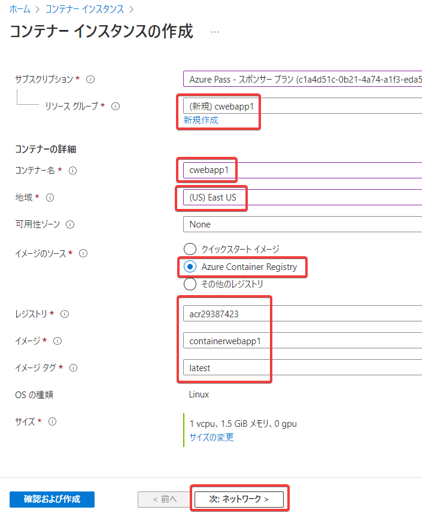

- ネットワークの種類: パブリック
- ポート: 8080
- 「確認および作成」
  
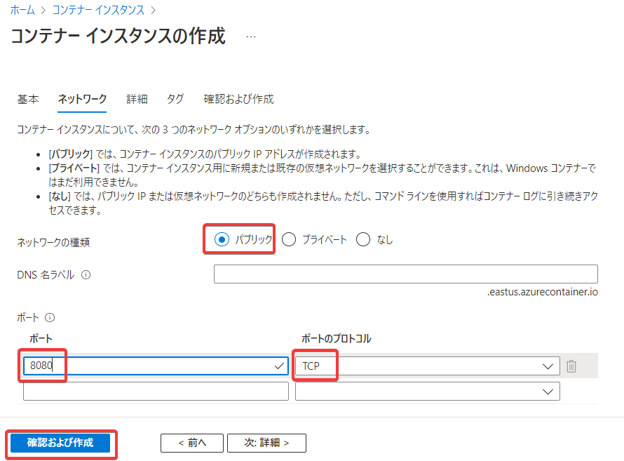

- ポートを確認 8080 (TCP)
- 「作成」

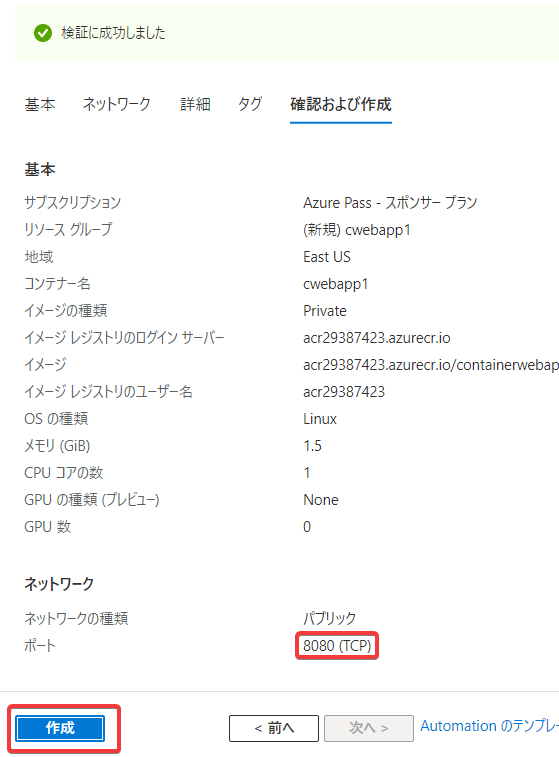

「デプロイが進行中です」と表示される。1分ほど待つ。

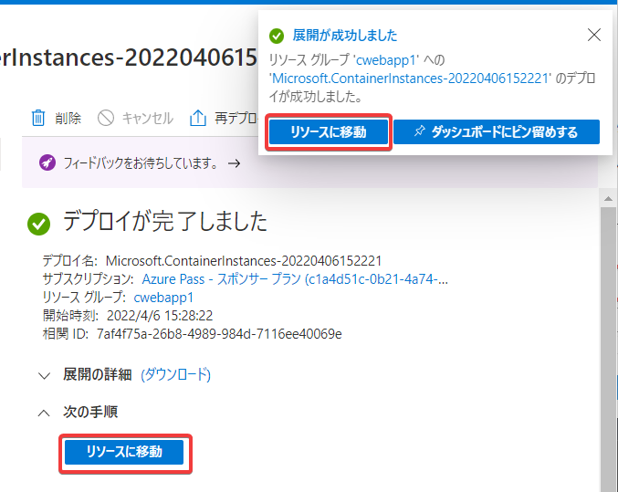

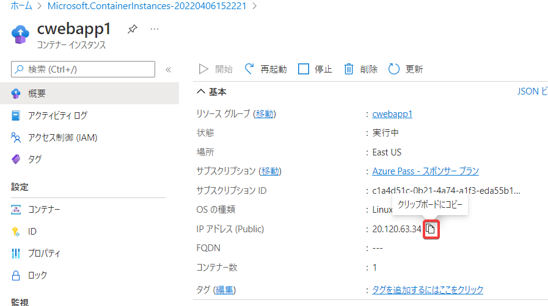

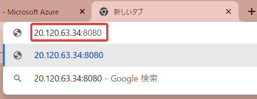

※タイミングによってはWebアプリ起動に少し時間がかかる。1分ほど待って再読み込みをおこなう。

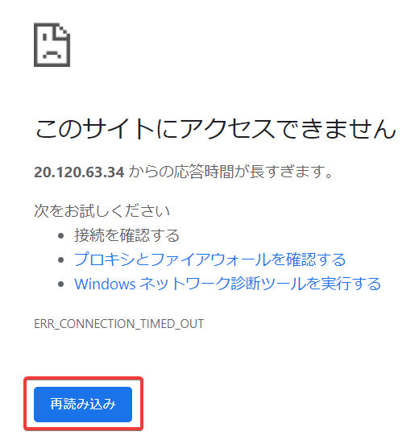

Webアプリにアクセスできた。

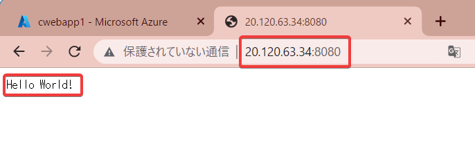