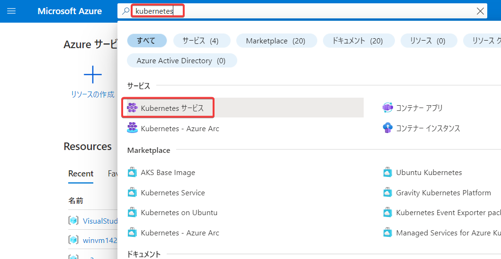
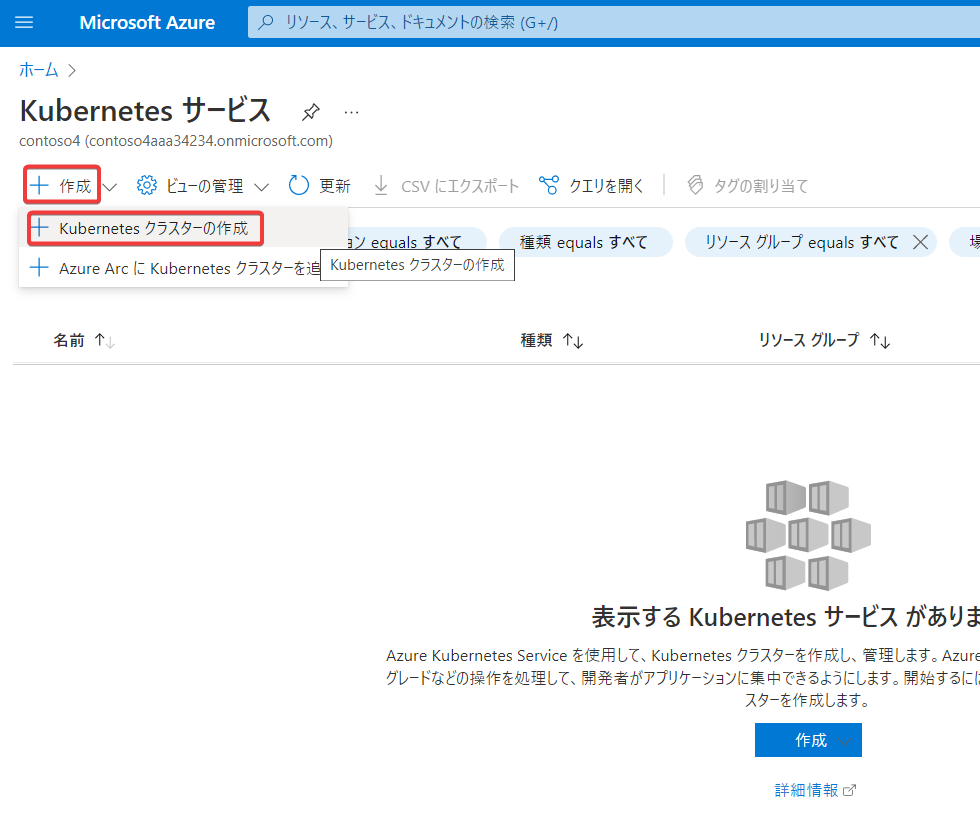
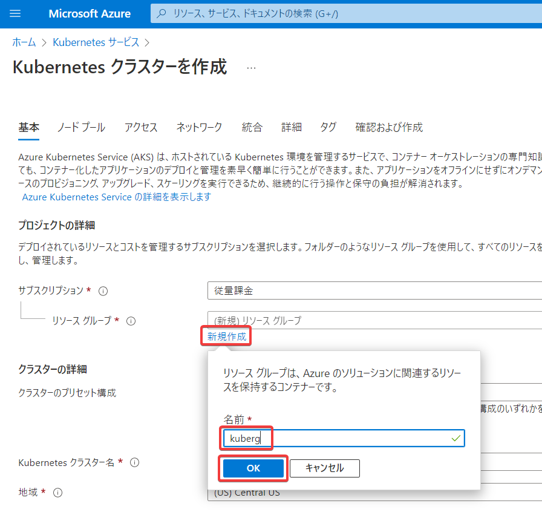
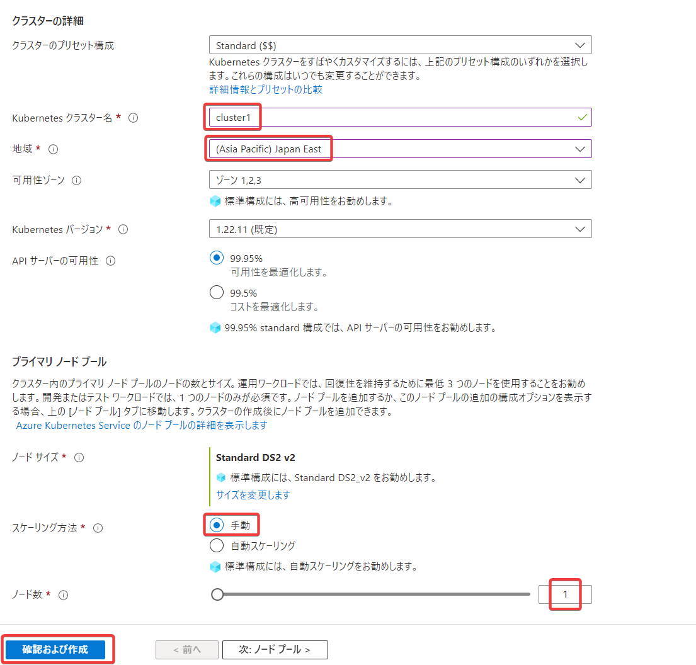
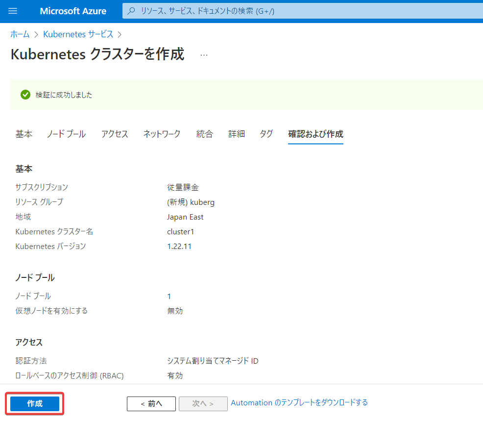
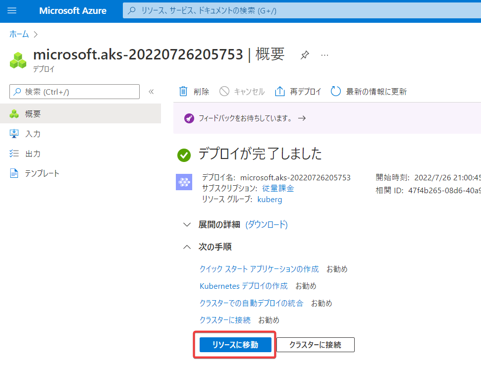
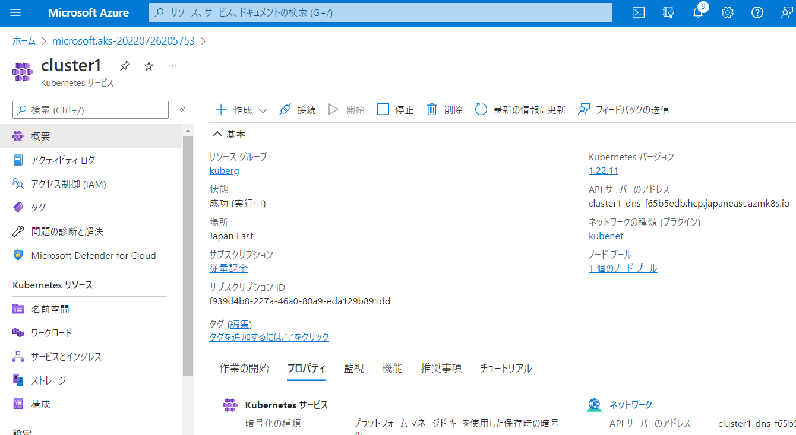

# Kubernetesクラスターの作成

---

- Azure portal
- 画面上部の検索「kubernetes」
- 「Kubernetes サービス」

---

- 「＋ 作成」
- 「＋ Kubernetesクラスターの作成」

---

- リソースグループの 「新規作成」
- 名前「kuberg」
- 「OK」

---

- Kubernetesクラスター名 「cluster1」
- 地域「(Asia Pacific) Japan East」
- スケーリング方法「手動」
- ノード数「1」
- 確認および作成

---

- 作成

---

- リソースに移動

---

- Kubernetesサービス（クラスター cluster1 ）が作成できた

