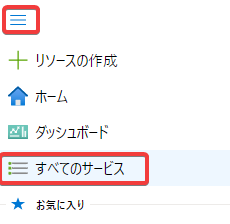
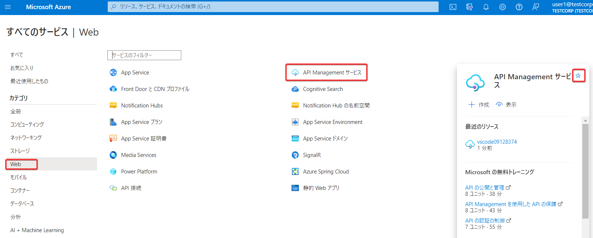
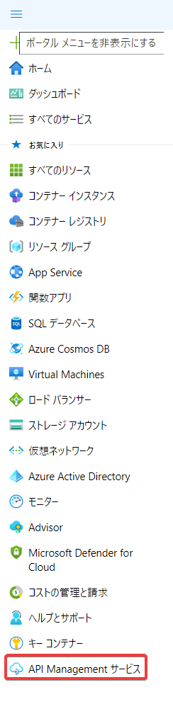
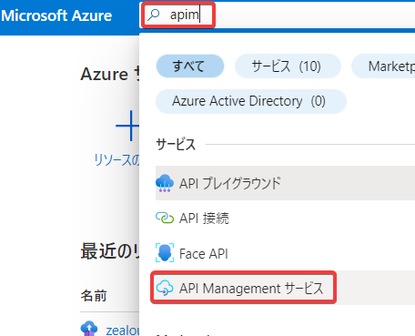
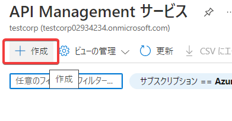
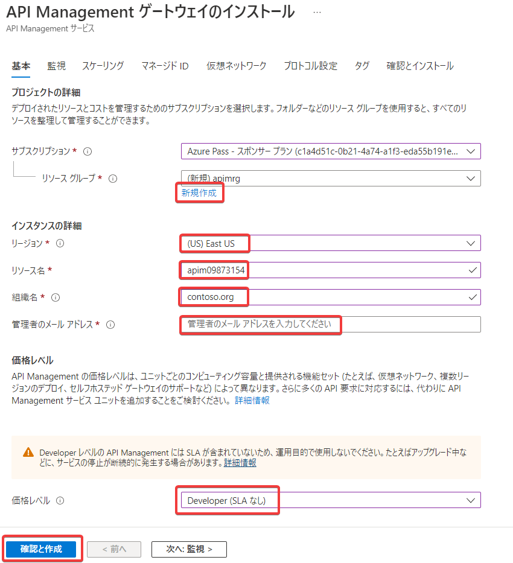
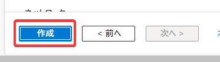

# ハンズオン: API Managementインスタンスの作成

※デプロイが完了するまでの待ち時間が40分ほどかかるので注意。

※トレーニング開始時に作成したMicrosoftアカウントのメールアドレス、または、普段お使いのメールアドレスをご準備ください

Azure portalで「API Management」を検索。「API Management サービス」を選択。

作成

- リソースグループ: 新規作成、「apimrg」
- リージョン: (US) East US
- リソース名: apim(乱数)
- Organization name: contoso.org （適当でよい）
  - ここで指定した名前は、「開発者ポータル」で表示されたり、サービスから送信されるメールに記入されたりする。
- 管理者のメールアドレス: トレーニング開始時に作成したMicrosoftアカウントのメールアドレス、または、普段お使いのメールアドレスを指定
  - 有効なメールアドレスを入力する必要がある
  - ここで指定したメールアドレスへ、サービスからの通知メール（API Managementリソース作成完了の通知など）が送られる
- 価格レベル: Developer (SLA なし)
- 確認と作成

作成

※デプロイが完了するまでの待ち時間が40分ほどかかるので注意。
