# ハンズオン: API Management内にAPIを作成する

バックエンドとして[天気予報API](https://weather.tsukumijima.net/)を利用。

- [東京(場所コード:130010)](https://weather.tsukumijima.net/api/forecast/city/130010)
- [大阪(場所コード:270000)](https://weather.tsukumijima.net/api/forecast/city/270000)
- [場所コード（「一次細分区域」id）の一覧](https://weather.tsukumijima.net/primary_area.xml)

※「東京」などにアクセスして動作を確認。

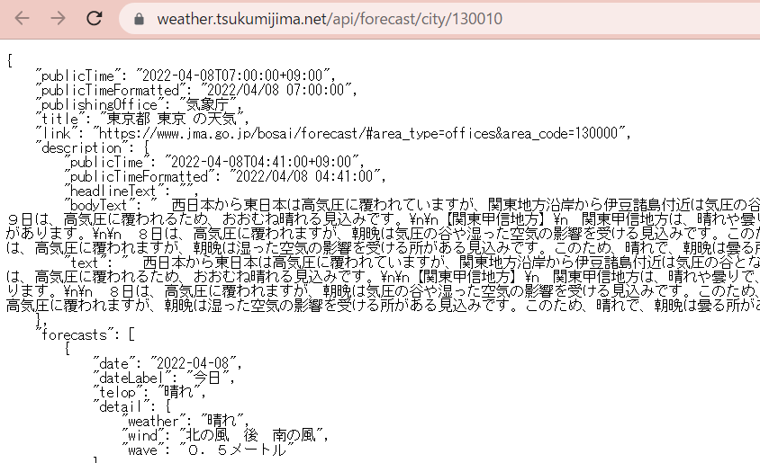

（作成したリソース）に移動。

Azure portal＞API Management＞ apim(乱数)

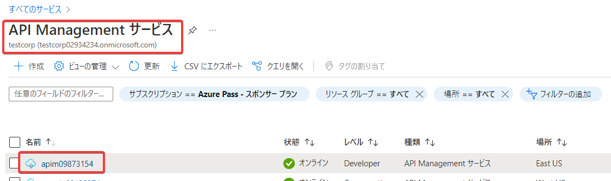

画面左メニューの「API」をクリック

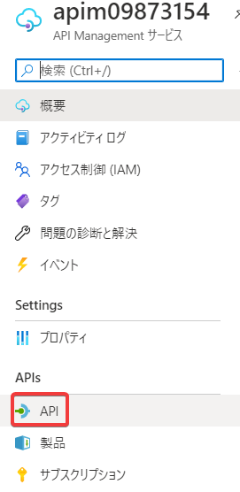

Azure portalからAPI Managmentインスタンスを作成した場合「Echo API」というサンプルが登録されているが、不要なので削除する。

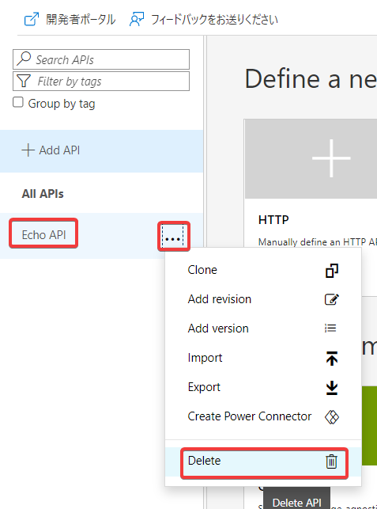

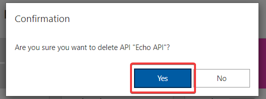

Add APIをクリック

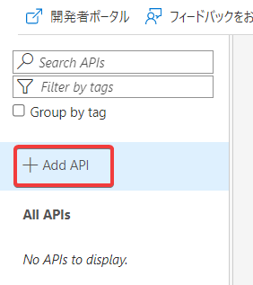

- HTTP

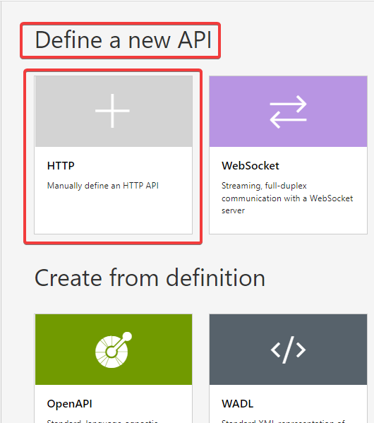

- Display name: tenki
- Name: tenki
- Web service URL: 
  - 上記で調べた天気予報APIのURL
  - 「東京」の場合: https://weather.tsukumijima.net/api/forecast/city/130010
- Createをクリック

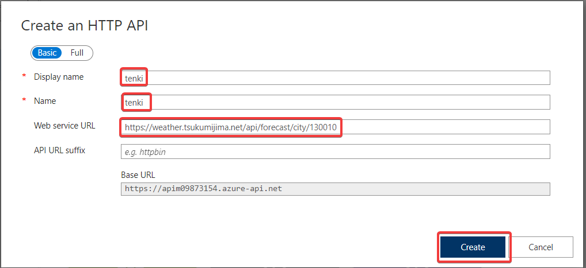

tenkiというAPIが追加される

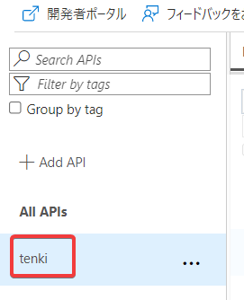

- All APIsの下のtenkiをクリック
- Add operationをクリック
  - Display name: tokyo
  - Name: tokyo
  - URL: GET, /
  - Saveをクリック

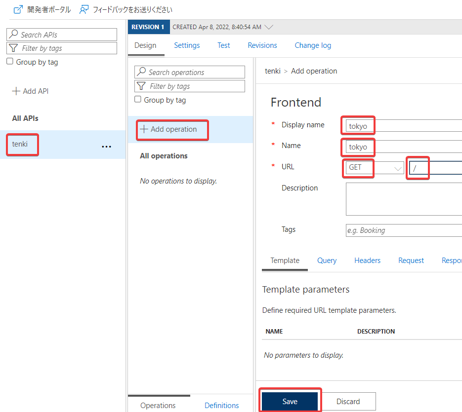

「tokyo」というオペレーションが追加される

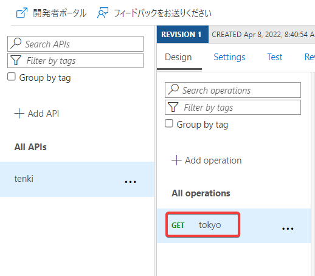

- All APIsの下のtenkiの脇の「...」をクリック
- Add Versionをクリック

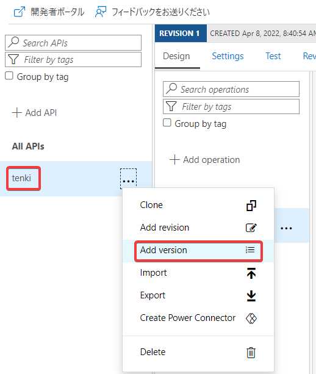

- Version identifier: v1
- Full API version name: tenki-v1

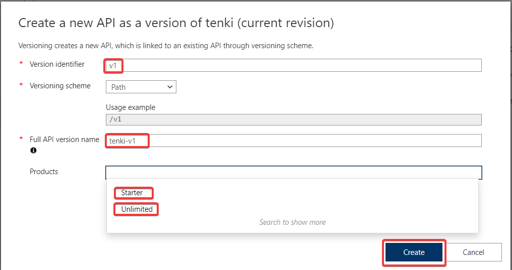

- Products: StarterとUnlimitedを選択

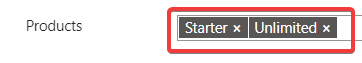

- Createをクリック

All API の tenki の下に、Originalと、v1が表示される

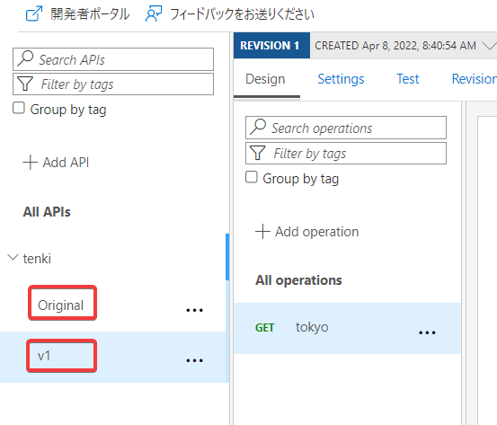

